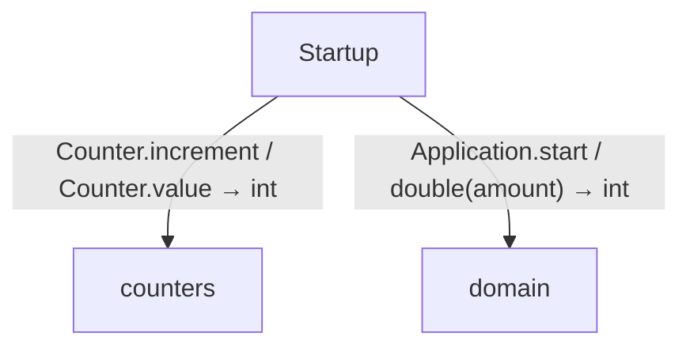
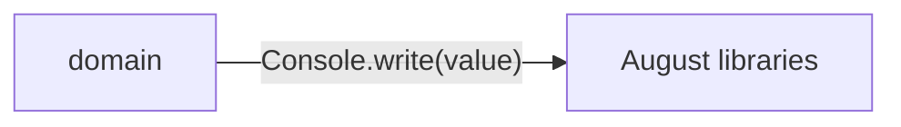

<!-- Generated by aug spec. Edit the August source, then regenerate. -->

# Project diagrams

Start here to see what moves between the application’s folders. Each arrow names an operation’s inputs and the result it returns to its caller. Open a folder for the next level of detail. Expand the contract list for complete types and dependency links.

## Data flow

### Package boundaries

domain package calls

Data crossing these boundaries (6 contracts)

| From | To | Operation and inputs | Result |
| --- | --- | --- | --- |
| domain | August libraries | [Console.write](../august/0.23.0/io/contracts.aug.md#symbol-Console.write) · value: string · interface dispatch | void |
| Startup | counters | [Counter.increment](../../counters.aug.md#symbol-Counter.increment) · interface dispatch | void |
| Startup | counters | [Counter.value](../../counters.aug.md#symbol-Counter.value) · interface dispatch | int |
| Startup | domain | [Application.start](../../domain/app.aug.md#symbol-Application.start) · interface dispatch | void |
| Startup | domain | [Fruit](../../domain/models.aug.md#symbol-Fruit) · code: int, name: string · value construction | Fruit |
| Startup | domain | [double](../../domain/numbers.aug.md#symbol-double) · amount: int | int |

## Open a folder

| Folder | Read |
| --- | --- |
| domain | [Folder data flow](folders/domain/index.md) |

## Open a module

| Module | Read |
| --- | --- |
| counters.aug | [Flow and sequences](../../counters.aug.diagrams.md) · [Explanation](../../counters.aug.md) |
| domain/app.aug | [Flow and sequences](../../domain/app.aug.diagrams.md) · [Explanation](../../domain/app.aug.md) |
| domain/export.aug | [Flow and sequences](../../domain/export.aug.diagrams.md) · [Explanation](../../domain/export.aug.md) |
| domain/models.aug | [Flow and sequences](../../domain/models.aug.diagrams.md) · [Explanation](../../domain/models.aug.md) |
| domain/numbers.aug | [Flow and sequences](../../domain/numbers.aug.diagrams.md) · [Explanation](../../domain/numbers.aug.md) |
| main.aug | [Flow and sequences](../../main.aug.diagrams.md) · [Explanation](../../main.aug.md) |

These are static call boundaries, not a request trace. Interface implementations and foreign internals stop at their checked contracts. Dotted arrows defer a callback or browser action. Imports alone do not imply a call.
