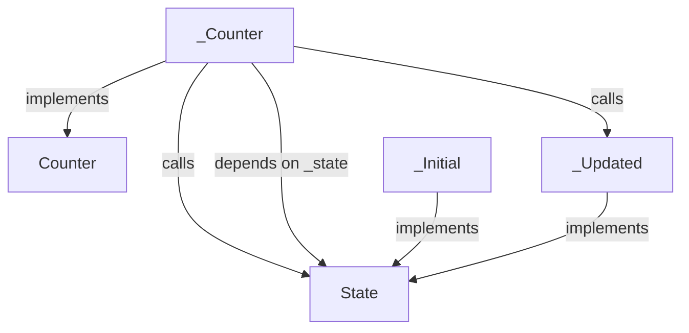
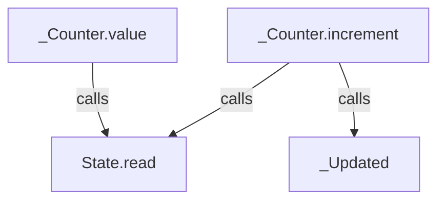
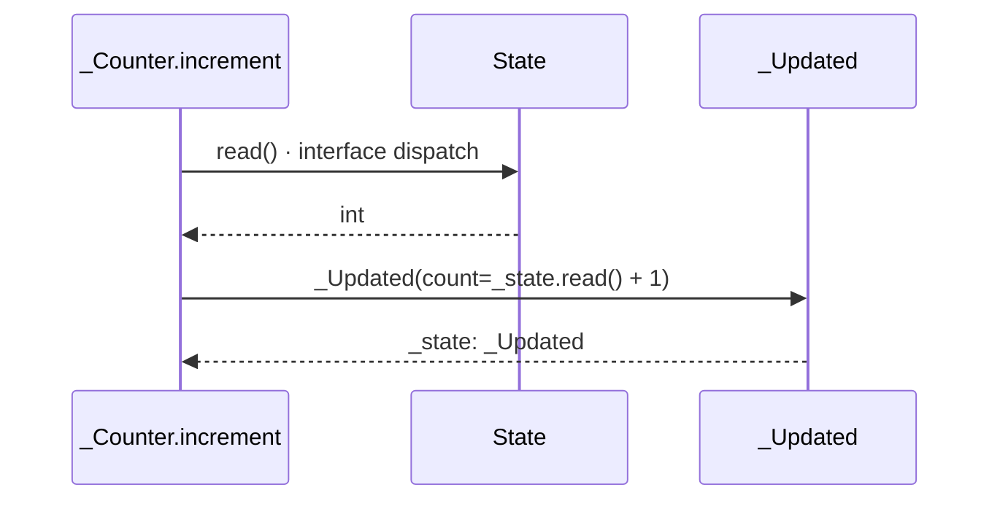
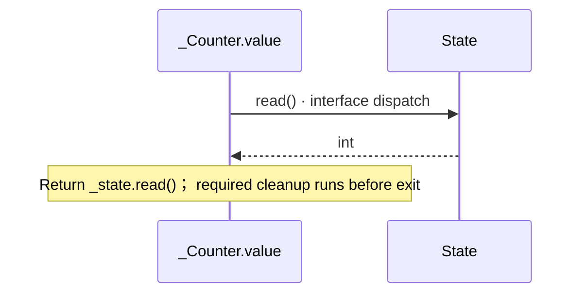

<!-- Generated by aug spec. Edit the August source, then regenerate. -->

# counters.aug diagrams

[Project overview](.aug-spec/diagrams/index.md) · [Compiled explanation](counters.aug.md)

## Class interactions

Call relationships

## Sequences

Call arrows identify checked targets; loop and branch frames determine when they run. Open that target’s module to follow its implementation. Branches describe alternatives; loops describe repeated work. Native calls and interface dispatch stop at their declared contracts. Exit notes end that path; enclosing recovery and cleanup remain visible.

### State.read

[Source](counters.aug#L4)

Interface contract; implementation selected at runtime. [Explanation](counters.aug.md).

### \_Initial constructor

[Source](counters.aug#L5)

[Explanation](counters.aug.md).

### \_Initial.read

[Source](counters.aug#L6)

Return 0; required cleanup runs before exit. [Explanation](counters.aug.md).

### \_Updated constructor

[Source](counters.aug#L8)

Receive fields: count. [Explanation](counters.aug.md).

### \_Updated.read

[Source](counters.aug#L9)

Return count; required cleanup runs before exit. [Explanation](counters.aug.md).

### Counter.increment

[Source](counters.aug#L13)

Interface contract; implementation selected at runtime. [Explanation](counters.aug.md).

### Counter.value

[Source](counters.aug#L14)

Interface contract; implementation selected at runtime. [Explanation](counters.aug.md).

### \_Counter constructor

[Source](counters.aug#L15)

Receive fields: injected \_state. [Explanation](counters.aug.md).

### \_Counter.increment

[Source](counters.aug#L16)

### \_Counter.value

[Source](counters.aug#L18)

## Called contracts

- [Counter](counters.aug.diagrams.md) — counters.aug
- [State](counters.aug.diagrams.md) — counters.aug
- [State.read](counters.aug.diagrams.md#sequence-State.read) — counters.aug
- [\_Updated](counters.aug.diagrams.md#sequence-_Updated-20-constructor) — counters.aug
