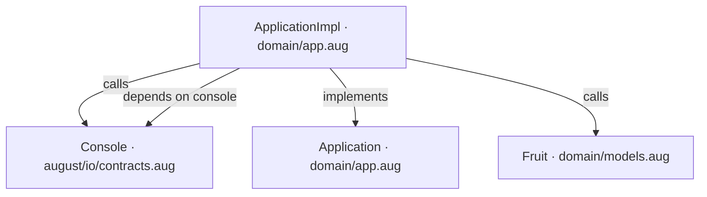
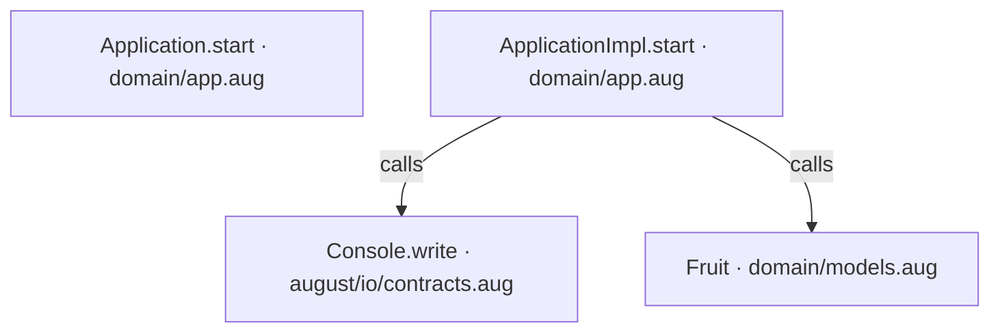
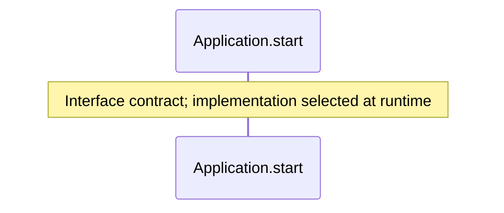
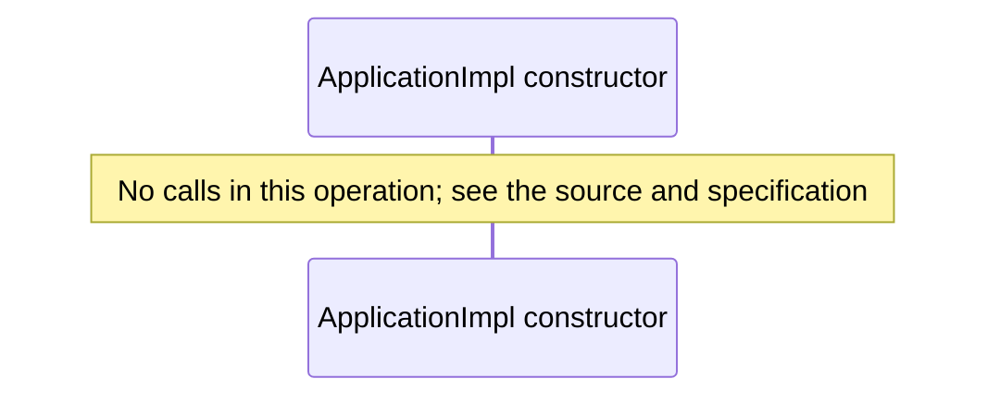
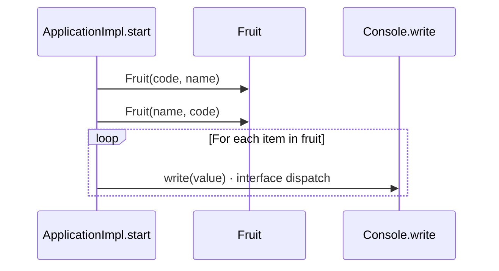

<!-- Generated by aug spec. Edit the August source, then regenerate. -->

# domain/app.aug diagrams

[Project overview](../.aug-spec/diagrams/index.md) · [Compiled explanation](app.aug.md)

## Class interactions

## API calls

## Sequences

Call arrows identify checked targets; loop and branch frames determine when they run. Open that target’s module to follow its implementation. Branches describe alternatives; loops describe repeated work. Native calls and interface dispatch stop at their declared contracts. Exit notes end that path; enclosing recovery and cleanup remain visible.

### Application.start

[Source](app.aug#L7)

### ApplicationImpl constructor

[Source](app.aug#L9)

### ApplicationImpl.start

[Source](app.aug#L10)

## Called contracts

- [Console.write](../.aug-spec/august/0.23.0/io/contracts.aug.diagrams.md#sequence-Console.write) — august/io/contracts.aug
- [Application](app.aug.diagrams.md) — domain/app.aug
- [Fruit](models.aug.diagrams.md#sequence-Fruit-20-constructor) — domain/models.aug
