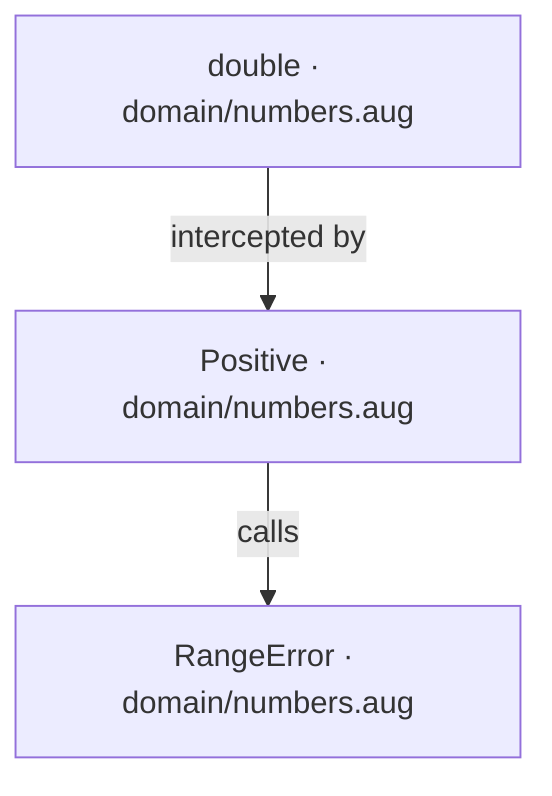
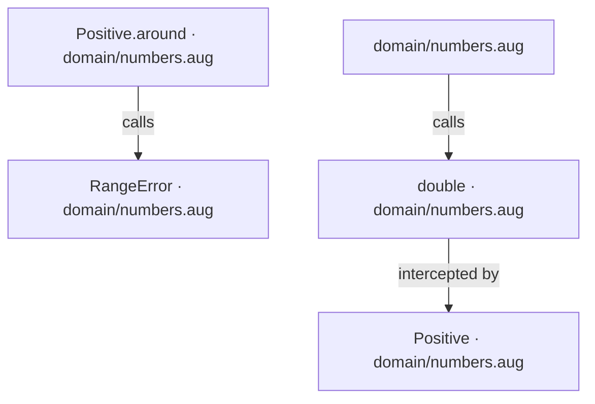
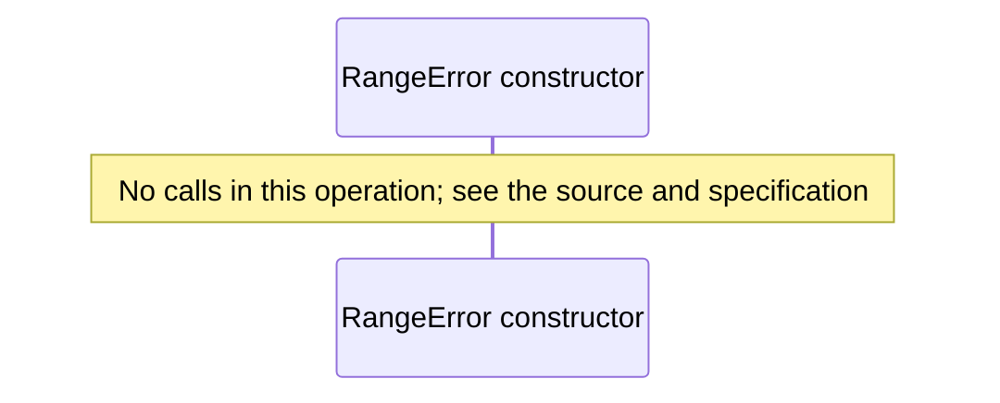
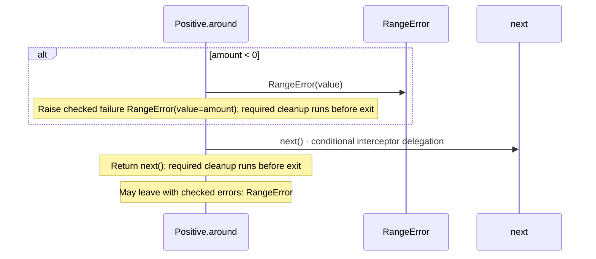
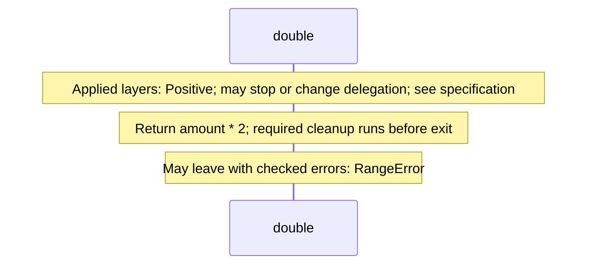

<!-- Generated by aug spec. Edit the August source, then regenerate. -->

# domain/numbers.aug diagrams

[Project overview](../.aug-spec/diagrams/index.md) · [Compiled explanation](numbers.aug.md)

## Class interactions

## API calls

## Sequences

Call arrows identify checked targets; loop and branch frames determine when they run. Open that target’s module to follow its implementation. Branches describe alternatives; loops describe repeated work. Native calls and interface dispatch stop at their declared contracts. Exit notes end that path; enclosing recovery and cleanup remain visible.

### RangeError constructor

[Source](numbers.aug#L3)

### Positive.around

[Source](numbers.aug#L7)

### double

[Source](numbers.aug#L18)

## Called contracts

- [Positive](numbers.aug.diagrams.md) — domain/numbers.aug
- [RangeError](numbers.aug.diagrams.md#sequence-RangeError-20-constructor) — domain/numbers.aug
- [double](numbers.aug.diagrams.md#sequence-double) — domain/numbers.aug
