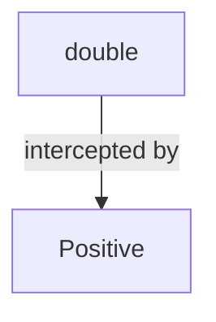
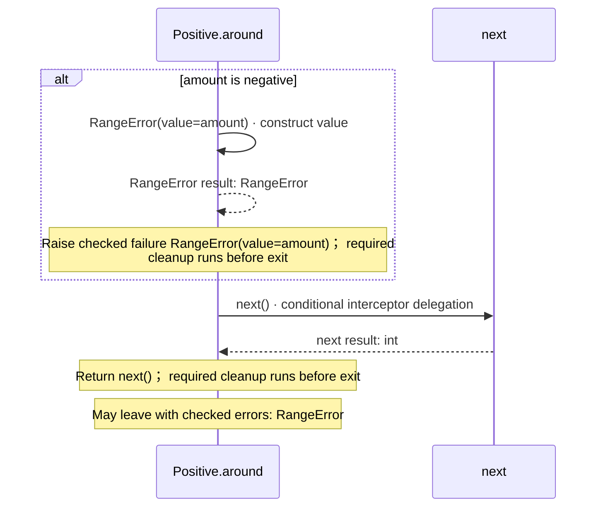

<!-- Generated by aug spec. Edit the August source, then regenerate. -->

# domain/numbers.aug diagrams

[Project overview](../.aug-spec/diagrams/index.md) · [Compiled explanation](numbers.aug.md)

## Class interactions

## Sequences

Call arrows identify checked targets; loop and branch frames determine when they run. Open that target’s module to follow its implementation. Branches describe alternatives; loops describe repeated work. Native calls and interface dispatch stop at their declared contracts. Exit notes end that path; enclosing recovery and cleanup remain visible.

### RangeError constructor

[Source](numbers.aug#L3)

Raised when an input is outside the operation's domain. It implements `Error`.

It takes `value` as an integer, kept read-only.

Receive fields: value. [Explanation](numbers.aug.md).

### Positive.around

[Source](numbers.aug#L7)

It takes `amount` as an integer.

Failures can raise [`RangeError`](numbers.aug.md#symbol-RangeError).

### double

[Source](numbers.aug#L18)

Double a nonnegative amount.

It takes `amount` as an integer.

It returns `int` — Twice the amount, with defined integer wrapping. Failures can raise [`RangeError`](numbers.aug.md#symbol-RangeError) (A validation layer rejected a negative input).

Layers run in the declared order. Call [`Positive.around`](numbers.aug.md#symbol-Positive.around).

Applied layers: Positive; may stop or change delegation; see specification. Return amount \* 2; required cleanup runs before exit. May leave with checked errors: RangeError. [Explanation](numbers.aug.md).

## Called contracts

- [Positive](numbers.aug.diagrams.md) — domain/numbers.aug
- [RangeError](numbers.aug.diagrams.md#sequence-RangeError-20-constructor) — domain/numbers.aug
- [double](numbers.aug.diagrams.md#sequence-double) — domain/numbers.aug
