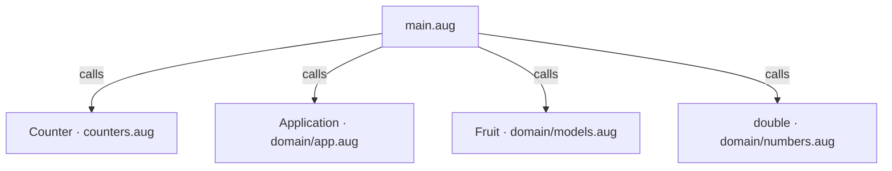
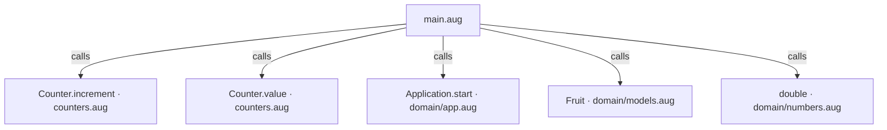
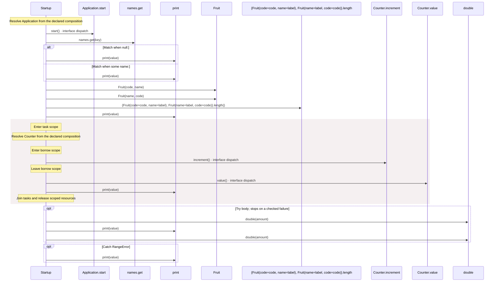

<!-- Generated by aug spec. Edit the August source, then regenerate. -->

# main.aug diagrams

[Project overview](.aug-spec/diagrams/index.md) · [Compiled explanation](main.aug.md)

## Class interactions

## API calls

## Sequences

Call arrows identify checked targets; loop and branch frames determine when they run. Open that target’s module to follow its implementation. Branches describe alternatives; loops describe repeated work. Native calls and interface dispatch stop at their declared contracts. Exit notes end that path; enclosing recovery and cleanup remain visible.

### Startup

[Source](main.aug#L8)

## Called contracts

- [Counter.increment](counters.aug.diagrams.md#sequence-Counter.increment) — counters.aug
- [Counter.value](counters.aug.diagrams.md#sequence-Counter.value) — counters.aug
- [Application.start](domain/app.aug.diagrams.md#sequence-Application.start) — domain/app.aug
- [Fruit](domain/models.aug.diagrams.md#sequence-Fruit-20-constructor) — domain/models.aug
- [double](domain/numbers.aug.diagrams.md#sequence-double) — domain/numbers.aug
