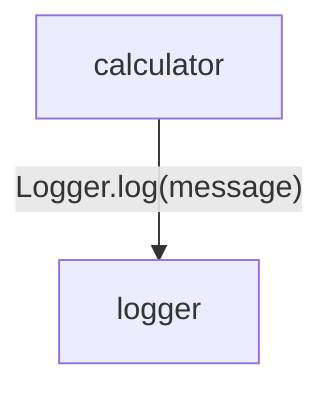
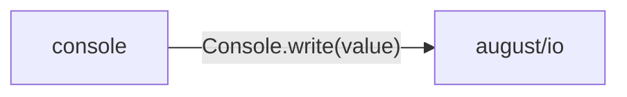

<!-- Generated by aug spec. Edit the August source, then regenerate. -->

# logging data flow

[Project overview](../../index.md)

This view opens the logging folder one level deeper. Each arrow shows the called operation and the data it returns to its caller. Calls inside a file stay in that file’s sequence view.

### Package boundaries

console package calls

Data crossing these boundaries (2 contracts)

| From | To | Operation and inputs | Result |
| --- | --- | --- | --- |
| calculator | logger | [Logger.log](../../../../logging/logger.aug.md#symbol-Logger.log) · message: string · interface dispatch | void |
| console | august/io | [Console.write](../../../august/1.0.0/io/contracts.aug.md#symbol-Console.write) · value: string · interface dispatch | void |

## Files in this folder

| Module | Read |
| --- | --- |
| logging/console.aug | [Flow and sequences](../../../../logging/console.aug.diagrams.md) · [Explanation](../../../../logging/console.aug.md) |
| logging/export.aug | [Flow and sequences](../../../../logging/export.aug.diagrams.md) · [Explanation](../../../../logging/export.aug.md) |
| logging/logger.aug | [Flow and sequences](../../../../logging/logger.aug.diagrams.md) · [Explanation](../../../../logging/logger.aug.md) |
