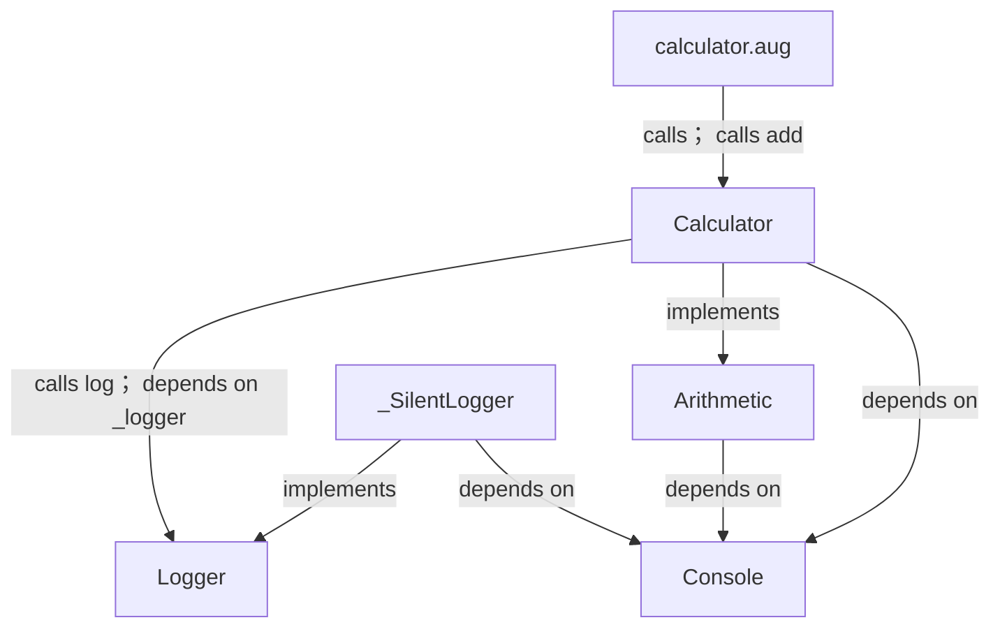
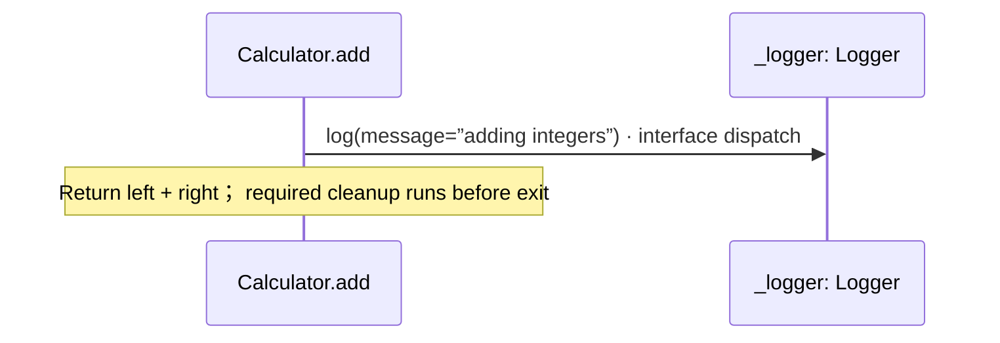
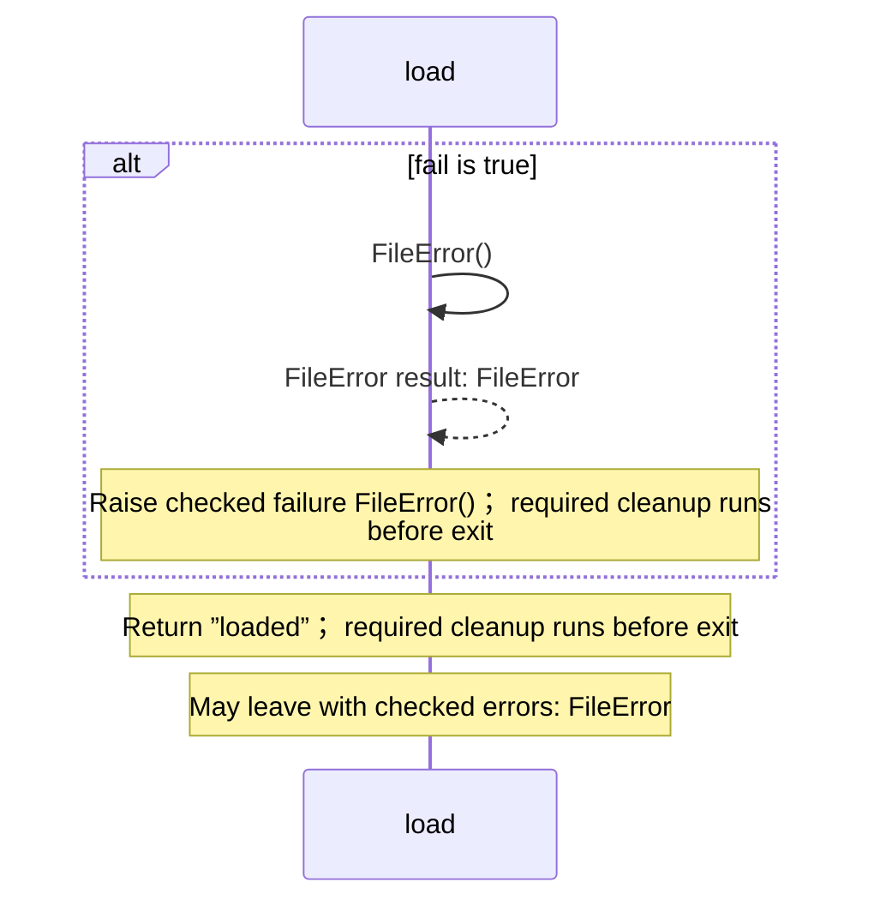

<!-- Generated by aug spec. Edit the August source, then regenerate. -->

# calculator.aug diagrams

[Project overview](.aug-spec/diagrams/index.md) · [Compiled explanation](calculator.aug.md)

## Class interactions

## Sequences

Call arrows identify checked targets; loop and branch frames determine when they run. Open that target’s module to follow its implementation. Branches describe alternatives; loops describe repeated work. Native calls and interface dispatch stop at their declared contracts. Exit notes end that path; enclosing recovery and cleanup remain visible.

### Arithmetic.add

[Source](calculator.aug#L6)

It takes `left` and `right` as integers. It gets `console` ([`Console`](.aug-spec/august/1.0.0/io/contracts.aug.md#symbol-Console)) from dependency injection.

It returns `int`. It can call [`Console.write`](.aug-spec/august/1.0.0/io/contracts.aug.md#symbol-Console.write).

Interface contract; implementation selected at runtime. [Explanation](calculator.aug.md).

### Calculator constructor

[Source](calculator.aug#L9)

Uses the selected logger to describe each addition. It implements [`Arithmetic`](calculator.aug.md#symbol-Arithmetic).

The `_logger` dependency is injected as [`Logger`](logging/logger.aug.md#symbol-Logger) and stored read-only and privately.

Receive fields: injected \_logger. [Explanation](calculator.aug.md).

### Calculator.add

[Source](calculator.aug#L16)

Adds left and right, logging the operation.

It takes `left` and `right` as integers. It gets `console` ([`Console`](.aug-spec/august/1.0.0/io/contracts.aug.md#symbol-Console)) from dependency injection.

It returns `int` — Sum of the two integers. It can call [`Console.write`](.aug-spec/august/1.0.0/io/contracts.aug.md#symbol-Console.write).

### load

[Source](calculator.aug#L26)

Demonstrates a checked failure instead of a successful result.

It takes `fail` as a boolean.

Failures can raise `FileError` (when fail is true).

### \_SilentLogger constructor

[Source](calculator.aug#L33)

Test adapter: keeps calculator tests independent of console output. It implements [`Logger`](logging/logger.aug.md#symbol-Logger). It is private to this file.

[Explanation](calculator.aug.md).

### \_SilentLogger.log

[Source](calculator.aug#L34)

It takes `message` as a string. It gets `console` ([`Console`](.aug-spec/august/1.0.0/io/contracts.aug.md#symbol-Console)) from dependency injection.

It can call [`Console.write`](.aug-spec/august/1.0.0/io/contracts.aug.md#symbol-Console.write).

[Explanation](calculator.aug.md).

## Called contracts

- [Console](.aug-spec/august/1.0.0/io/contracts.aug.diagrams.md) — august/io/contracts.aug
- [Arithmetic](calculator.aug.diagrams.md) — calculator.aug
- [Calculator](calculator.aug.diagrams.md#sequence-Calculator-20-constructor) — calculator.aug
- [Calculator.add](calculator.aug.diagrams.md#sequence-Calculator.add) — calculator.aug
- [Logger](logging/logger.aug.diagrams.md) — logging/logger.aug
- [Logger.log](logging/logger.aug.diagrams.md#sequence-Logger.log) — logging/logger.aug
