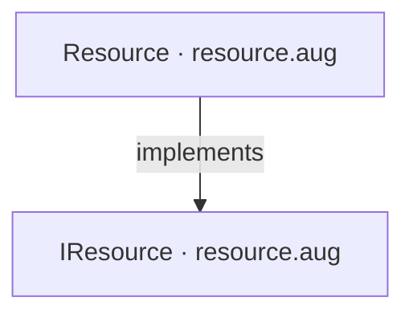
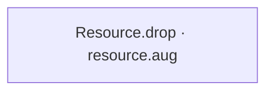
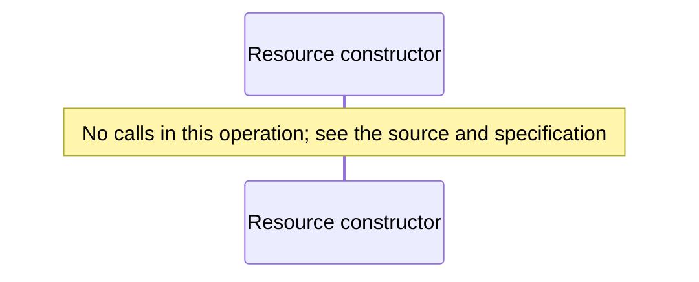
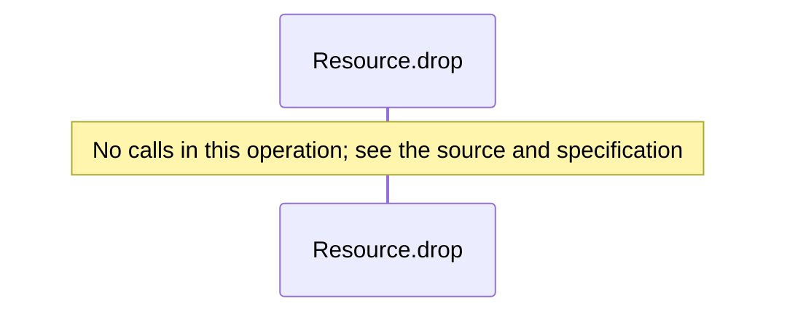

<!-- Generated by aug spec. Edit the August source, then regenerate. -->

# resource.aug diagrams

[Project overview](.aug-spec/diagrams/index.md) · [Compiled explanation](resource.aug.md)

## Class interactions

## API calls

## Sequences

Call arrows identify checked targets; loop and branch frames determine when they run. Open that target’s module to follow its implementation. Branches describe alternatives; loops describe repeated work. Native calls and interface dispatch stop at their declared contracts. Exit notes end that path; enclosing recovery and cleanup remain visible.

### Resource constructor

[Source](resource.aug#L2)

### Resource.drop

[Source](resource.aug#L3)

## Called contracts

- [IResource](resource.aug.diagrams.md) — resource.aug
