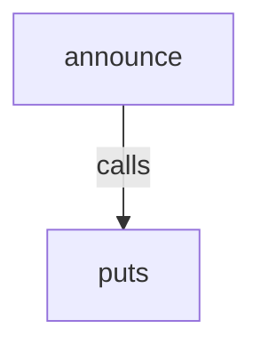
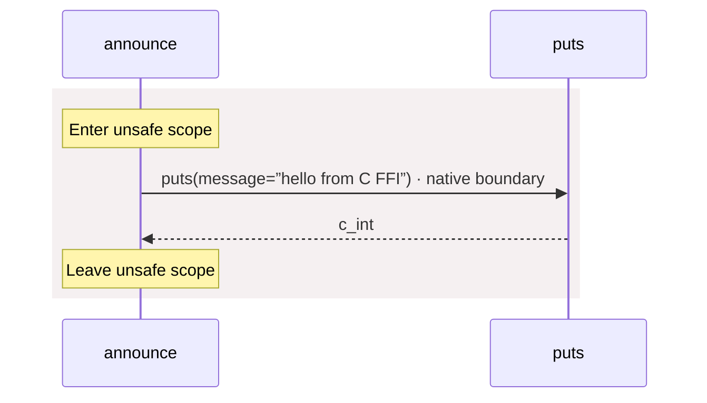

<!-- Generated by aug spec. Edit the August source, then regenerate. -->

# native.aug diagrams

[Project overview](.aug-spec/diagrams/index.md) · [Compiled explanation](native.aug.md)

Call relationships

## Sequences

Call arrows identify checked targets; loop and branch frames determine when they run. Open that target’s module to follow its implementation. Branches describe alternatives; loops describe repeated work. Native calls and interface dispatch stop at their declared contracts. Exit notes end that path; enclosing recovery and cleanup remain visible.

### puts

[Source](native.aug#L2)

Native implementation; only the declared contract is known. [Explanation](native.aug.md).

### announce

[Source](native.aug#L3)

## Called contracts

- [puts](native.aug.diagrams.md#sequence-puts) — native.aug
