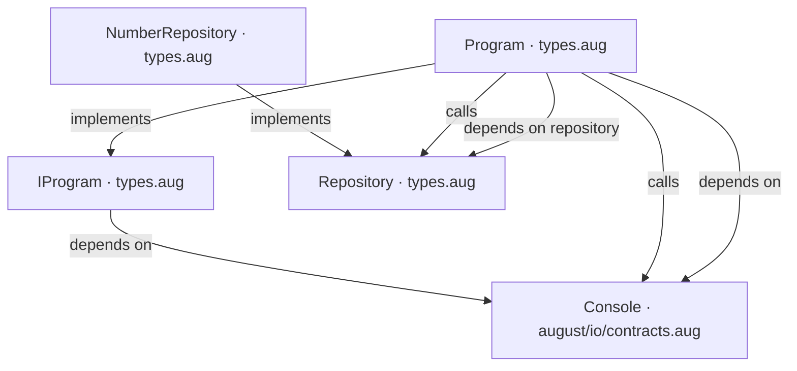
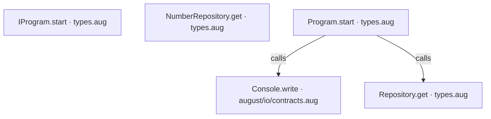
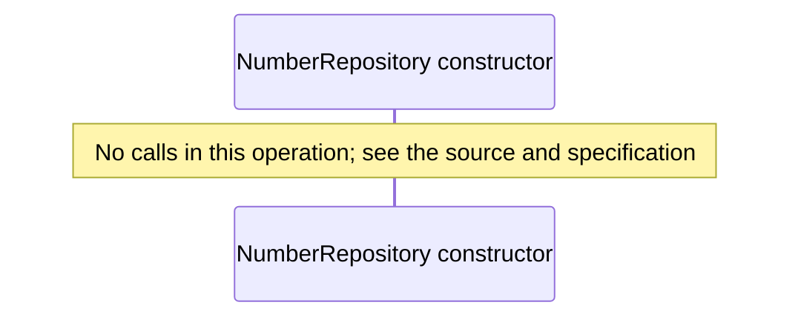
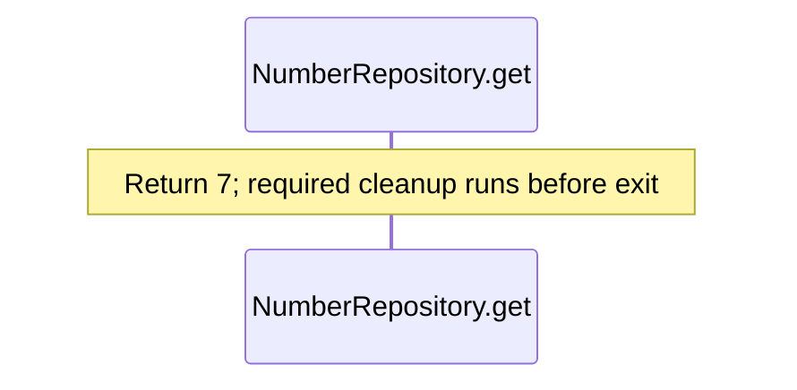
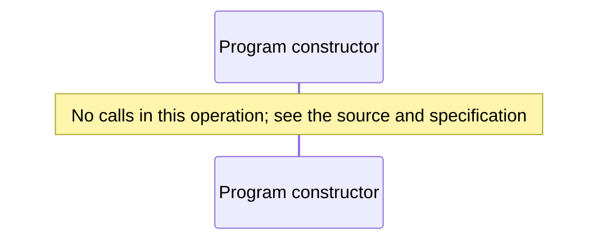
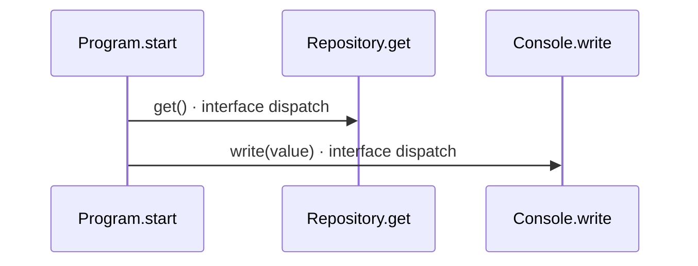
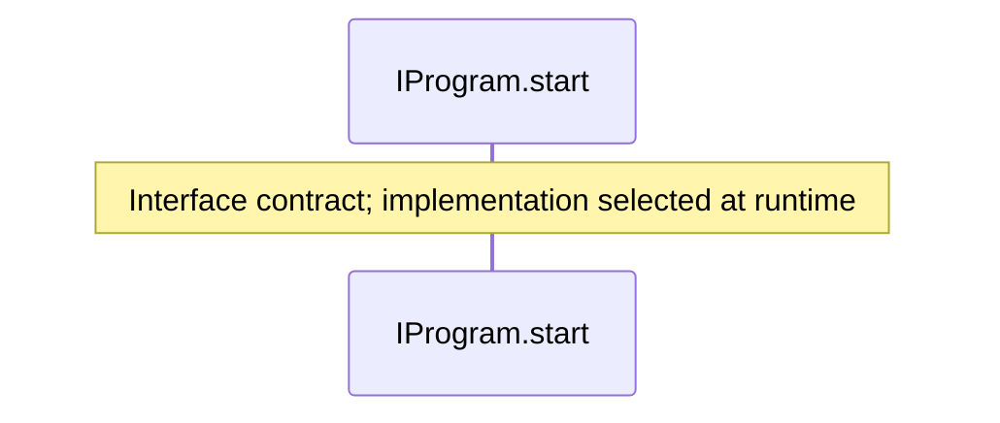

<!-- Generated by aug spec. Edit the August source, then regenerate. -->

# types.aug diagrams

[Project overview](.aug-spec/diagrams/index.md) · [Compiled explanation](types.aug.md)

## Class interactions

## API calls

## Sequences

Call arrows identify checked targets; loop and branch frames determine when they run. Open that target’s module to follow its implementation. Branches describe alternatives; loops describe repeated work. Native calls and interface dispatch stop at their declared contracts. Exit notes end that path; enclosing recovery and cleanup remain visible.

### Repository.get

[Source](types.aug#L4)

### NumberRepository constructor

[Source](types.aug#L6)

### NumberRepository.get

[Source](types.aug#L7)

### Program constructor

[Source](types.aug#L11)

### Program.start

[Source](types.aug#L12)

### IProgram.start

[Source](types.aug#L17)

## Called contracts

- [Console](.aug-spec/august/0.23.0/io/contracts.aug.diagrams.md) — august/io/contracts.aug
- [Console.write](.aug-spec/august/0.23.0/io/contracts.aug.diagrams.md#sequence-Console.write) — august/io/contracts.aug
- [IProgram](types.aug.diagrams.md) — types.aug
- [Repository](types.aug.diagrams.md) — types.aug
- [Repository.get](types.aug.diagrams.md#sequence-Repository.get) — types.aug
