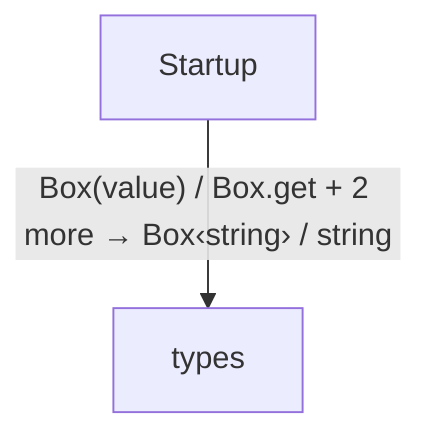

<!-- Generated by aug spec. Edit the August source, then regenerate. -->

# Project diagrams

Start here to see what moves between the application’s folders. Each arrow names an operation’s inputs and the result it returns to its caller. Open a folder for the next level of detail. Expand the contract list for complete types and dependency links.

## Data flow

Data crossing these boundaries (4 contracts)

| From | To | Operation and inputs | Result |
| --- | --- | --- | --- |
| Startup | types | [Box](../../types.aug.md#symbol-Box) · value: string | Box\<string\> |
| Startup | types | [Box.get](../../types.aug.md#symbol-Box.get) | string |
| Startup | types | [Formatter.format](../../types.aug.md#symbol-Formatter.format) · value: int · interface dispatch | string |
| Startup | types | [Formatter.title](../../types.aug.md#symbol-Formatter.title) · interface dispatch | string |

## Open a module

| Module | Read |
| --- | --- |
| main.aug | [Flow and sequences](../../main.aug.diagrams.md) · [Explanation](../../main.aug.md) |
| types.aug | [Flow and sequences](../../types.aug.diagrams.md) · [Explanation](../../types.aug.md) |

These are static call boundaries, not a request trace. Interface implementations and foreign internals stop at their checked contracts. Dotted arrows defer a callback or browser action. Imports alone do not imply a call.
