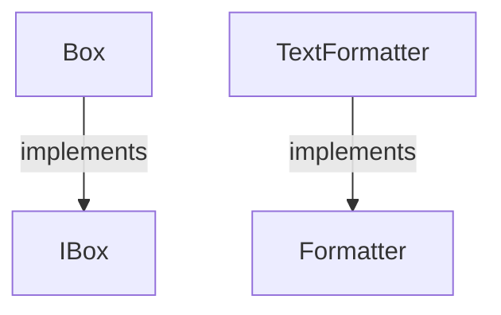

<!-- Generated by aug spec. Edit the August source, then regenerate. -->

# types.aug diagrams

[Project overview](.aug-spec/diagrams/index.md) · [Compiled explanation](types.aug.md)

## Class interactions

## Sequences

Call arrows identify checked targets; loop and branch frames determine when they run. Open that target’s module to follow its implementation. Branches describe alternatives; loops describe repeated work. Native calls and interface dispatch stop at their declared contracts. Exit notes end that path; enclosing recovery and cleanup remain visible.

### Formatter.format

[Source](types.aug#L3)

Interface contract; implementation selected at runtime. [Explanation](types.aug.md).

### Formatter.title

[Source](types.aug#L4)

Return "formatted"; required cleanup runs before exit. [Explanation](types.aug.md).

### TextFormatter constructor

[Source](types.aug#L8)

[Explanation](types.aug.md).

### TextFormatter.format

[Source](types.aug#L9)

Return "generic method called"; required cleanup runs before exit. [Explanation](types.aug.md).

### Box constructor

[Source](types.aug#L13)

Receive fields: value. [Explanation](types.aug.md).

### Box.get

[Source](types.aug#L14)

Return value; required cleanup runs before exit. [Explanation](types.aug.md).

### IBox.get

[Source](types.aug#L19)

Interface contract; implementation selected at runtime. [Explanation](types.aug.md).

## Called contracts

- [Formatter](types.aug.diagrams.md) — types.aug
- [IBox](types.aug.diagrams.md) — types.aug
