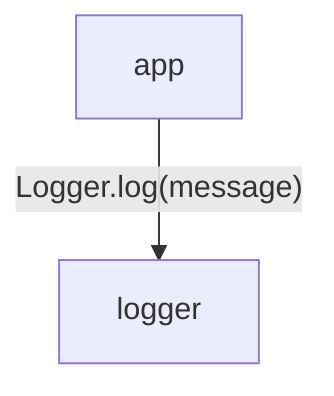
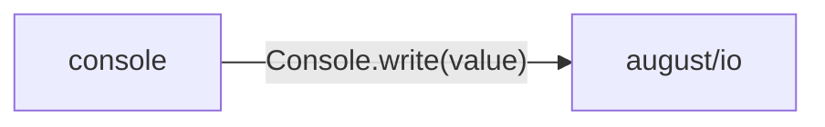

<!-- Generated by aug spec. Edit the August source, then regenerate. -->

# logging data flow

[Project overview](../../index.md)

This view opens the logging folder one level deeper. Each arrow shows the called operation and the data it returns to its caller. Calls inside a file stay in that file’s sequence view.

### Package boundaries

console package calls

### Follow the data

Each row opens the complete operations and call sites behind one pair of logical units. A grouped arrow records calls between those units; connected arrows need not belong to the same execution path.

| From | To | Operations | Read |
| --- | --- | --- | --- |
| app | logger | 1 | [Inputs, results and call sites](index.md#boundary-aacb87f500fc) |
| console | august/io | 1 | [Inputs, results and call sites](index.md#boundary-211d6d32ce6e) |

#### Data crossing these boundaries (2 contracts)

#### app → logger

1 operation, 1 site

**[Logger.log](../../../../logging/logger.aug.md#symbol-Logger.log)** · interface dispatch

Inputs: message: string. Result: void.

| Caller or entry | Evidence |
| --- | --- |
| Greeter.greet | [Call site](../../../../app/greeter.aug#L14) · [Caller explanation](../../../../app/greeter.aug.md#symbol-Greeter.greet) |

#### console → august/io

1 operation, 1 site

**[Console.write](../../../august/1.0.0/io/contracts.aug.md#symbol-Console.write)** · interface dispatch

Inputs: value: string. Result: void.

| Caller or entry | Evidence |
| --- | --- |
| ConsoleLogger.log | [Call site](../../../../logging/console.aug#L6) · [Caller explanation](../../../../logging/console.aug.md#symbol-ConsoleLogger.log) |

## What this folder exposes

### Exports

Export the declaration `Logger` from [`logger.aug`](../../../../logging/logger.aug.md#symbol-Logger). Export the declaration `ConsoleLogger` from [`console.aug`](../../../../logging/console.aug.md#symbol-ConsoleLogger).

## Files in this folder

| Module | Read |
| --- | --- |
| logging/console.aug | [Flow and sequences](../../../../logging/console.aug.diagrams.md) · [Explanation](../../../../logging/console.aug.md) |
| logging/export.aug | [Flow and sequences](../../../../logging/export.aug.diagrams.md) · [Explanation](../../../../logging/export.aug.md) |
| logging/logger.aug | [Flow and sequences](../../../../logging/logger.aug.diagrams.md) · [Explanation](../../../../logging/logger.aug.md) |
