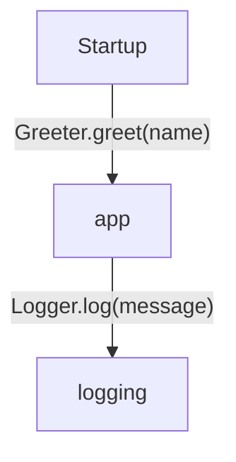
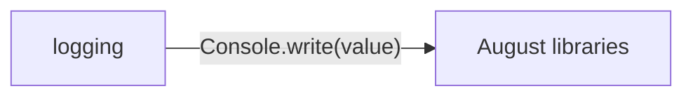

<!-- Generated by aug spec. Edit the August source, then regenerate. -->

# Project diagrams

Start here to see what moves between the application’s folders. Each arrow names an operation’s inputs and the result it returns to its caller. Open a folder for the next level of detail. Expand the contract list for complete types and dependency links.

## Data flow

### Package boundaries

logging package calls

Data crossing these boundaries (3 contracts)

| From | To | Operation and inputs | Result |
| --- | --- | --- | --- |
| app | logging | [Logger.log](../../logging/logger.aug.md) · message: string · interface dispatch | void |
| logging | August libraries | [Console.write](../august/0.23.0/io/contracts.aug.md) · value: string · interface dispatch | void |
| Startup | app | [Greeter.greet](../../app/greeter.aug.md) · name: string | void |

## Open a folder

| Folder | Read |
| --- | --- |
| logging | [Folder data flow](folders/logging/index.md) |

## Open a module

| Module | Read |
| --- | --- |
| app/export.aug | [Flow and sequences](../../app/export.aug.diagrams.md) · [Explanation](../../app/export.aug.md) |
| app/greeter.aug | [Flow and sequences](../../app/greeter.aug.diagrams.md) · [Explanation](../../app/greeter.aug.md) |
| logging/console.aug | [Flow and sequences](../../logging/console.aug.diagrams.md) · [Explanation](../../logging/console.aug.md) |
| logging/export.aug | [Flow and sequences](../../logging/export.aug.diagrams.md) · [Explanation](../../logging/export.aug.md) |
| logging/logger.aug | [Flow and sequences](../../logging/logger.aug.diagrams.md) · [Explanation](../../logging/logger.aug.md) |
| main.aug | [Flow and sequences](../../main.aug.diagrams.md) · [Explanation](../../main.aug.md) |

These are static call boundaries, not a request trace. Interface implementations and foreign internals stop at their checked contracts. Dotted arrows defer a callback or browser action. Imports alone do not imply a call.
