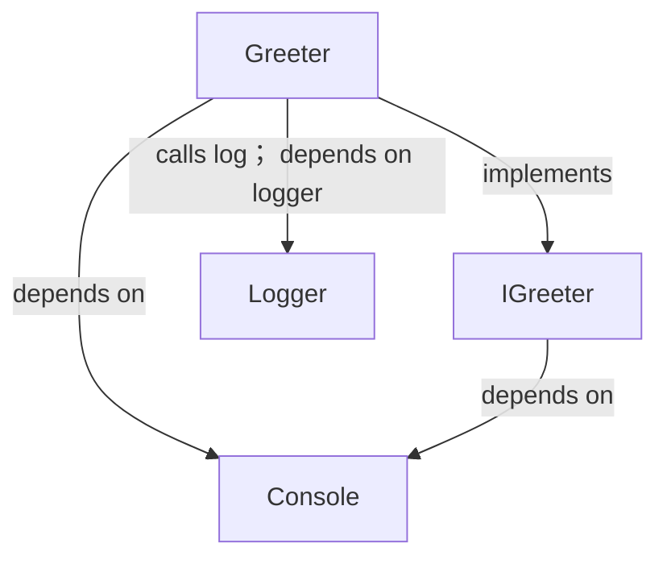
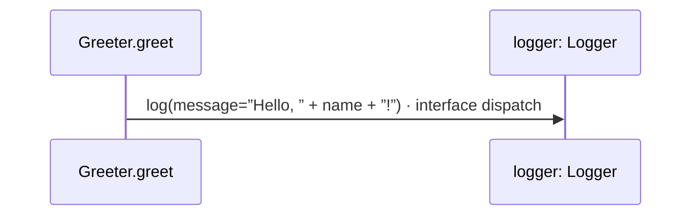

<!-- Generated by aug spec. Edit the August source, then regenerate. -->

# app/greeter.aug diagrams

[Project overview](../.aug-spec/diagrams/index.md) · [Compiled explanation](greeter.aug.md)

## Class interactions

## Sequences

Call arrows identify checked targets; loop and branch frames determine when they run. Open that target’s module to follow its implementation. Branches describe alternatives; loops describe repeated work. Native calls and interface dispatch stop at their declared contracts. Exit notes end that path; enclosing recovery and cleanup remain visible.

### Greeter constructor

[Source](greeter.aug#L8)

Receive fields: injected logger. [Explanation](greeter.aug.md).

### Greeter.greet

[Source](greeter.aug#L13)

### IGreeter.greet

[Source](greeter.aug#L22)

Interface contract; implementation selected at runtime. [Explanation](greeter.aug.md).

## Called contracts

- [IGreeter](greeter.aug.diagrams.md) — app/greeter.aug
- [Console](../.aug-spec/august/1.0.0/io/contracts.aug.diagrams.md) — august/io/contracts.aug
- [Logger.log](../logging/logger.aug.diagrams.md#sequence-Logger.log) — logging/logger.aug
