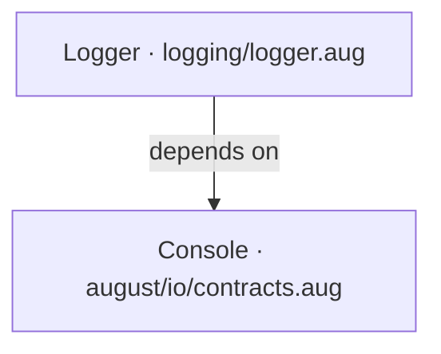
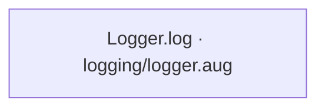
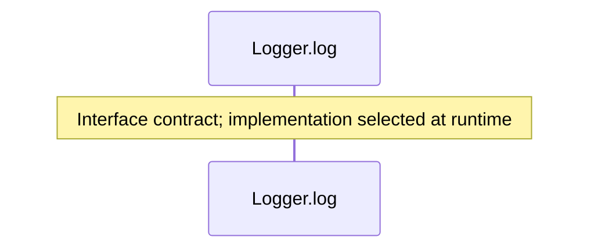

<!-- Generated by aug spec. Edit the August source, then regenerate. -->

# logging/logger.aug diagrams

[Project overview](../.aug-spec/diagrams/index.md) · [Compiled explanation](logger.aug.md)

## Class interactions

## API calls

## Sequences

Call arrows identify checked targets; loop and branch frames determine when they run. Open that target’s module to follow its implementation. Branches describe alternatives; loops describe repeated work. Native calls and interface dispatch stop at their declared contracts. Exit notes end that path; enclosing recovery and cleanup remain visible.

### Logger.log

[Source](logger.aug#L9)

## Called contracts

- [Console](../.aug-spec/august/0.23.0/io/contracts.aug.diagrams.md) — august/io/contracts.aug
