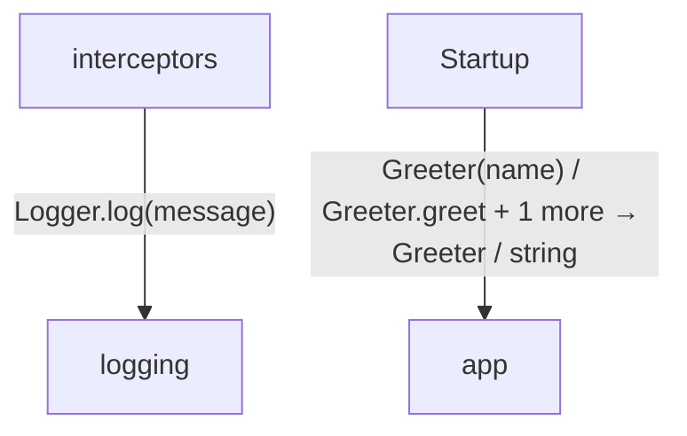
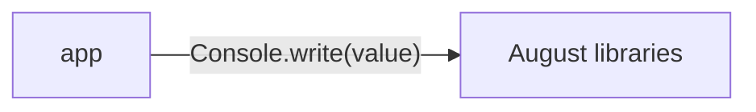
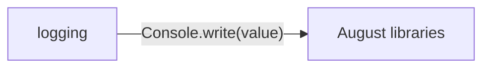

<!-- Generated by aug spec. Edit the August source, then regenerate. -->

# Project diagrams

Start here to see what moves between the application’s folders. Each arrow names an operation’s inputs and the result it returns to its caller. Open a folder for the next level of detail. Expand the contract list for complete types and dependency links.

## Data flow

### Package boundaries

app package calls

logging package calls

Data crossing these boundaries (6 contracts)

| From | To | Operation and inputs | Result |
| --- | --- | --- | --- |
| app | August libraries | [Console.write](../august/0.23.0/io/contracts.aug.md#symbol-Console.write) · value: int · interface dispatch | void |
| interceptors | logging | [Logger.log](../../logging.aug.md#symbol-Logger.log) · message: string · interface dispatch | void |
| logging | August libraries | [Console.write](../august/0.23.0/io/contracts.aug.md#symbol-Console.write) · value: string · interface dispatch | void |
| Startup | app | [Greeter](../../app.aug.md#symbol-Greeter) · name: string | Greeter |
| Startup | app | [Greeter.greet](../../app.aug.md#symbol-Greeter.greet) | string |
| Startup | app | [describe](../../app.aug.md#symbol-describe) · x: int, label: string | string |

## Open a module

| Module | Read |
| --- | --- |
| app.aug | [Flow and sequences](../../app.aug.diagrams.md) · [Explanation](../../app.aug.md) |
| interceptors.aug | [Flow and sequences](../../interceptors.aug.diagrams.md) · [Explanation](../../interceptors.aug.md) |
| logging.aug | [Flow and sequences](../../logging.aug.diagrams.md) · [Explanation](../../logging.aug.md) |
| main.aug | [Flow and sequences](../../main.aug.diagrams.md) · [Explanation](../../main.aug.md) |

These are static call boundaries, not a request trace. Interface implementations and foreign internals stop at their checked contracts. Dotted arrows defer a callback or browser action. Imports alone do not imply a call.
