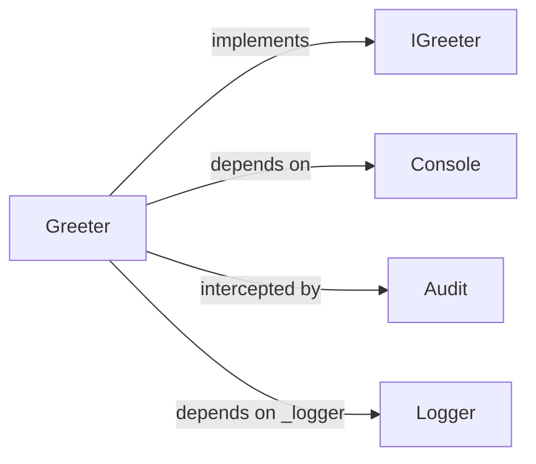
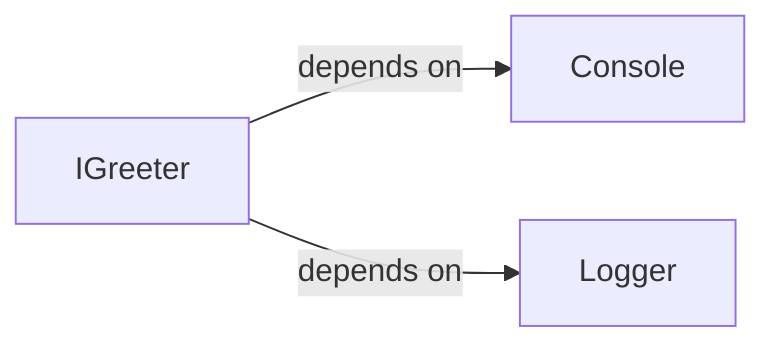
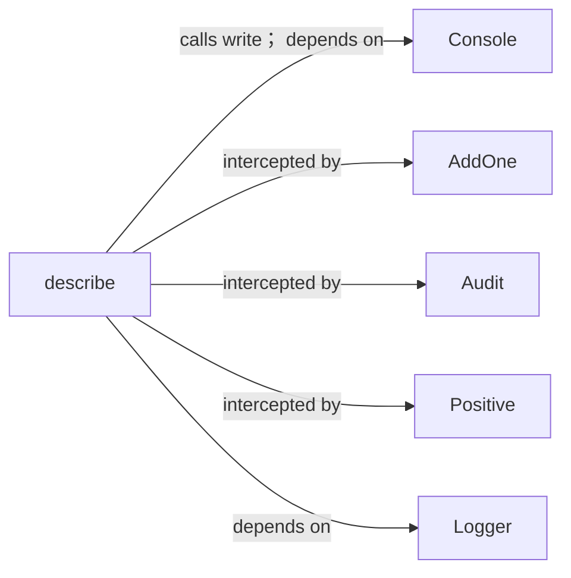
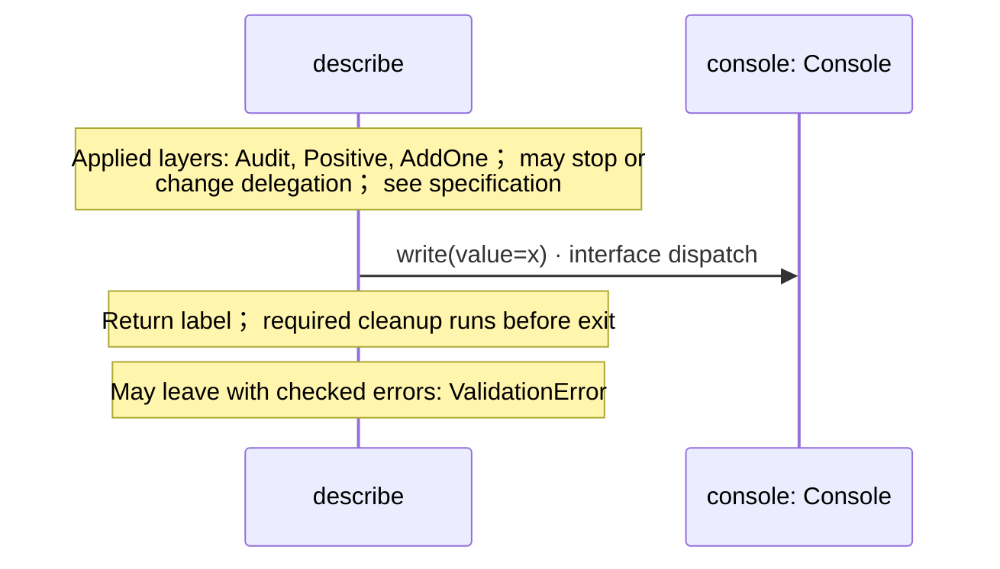

<!-- Generated by aug spec. Edit the August source, then regenerate. -->

# app.aug diagrams

[Project overview](.aug-spec/diagrams/index.md) · [Compiled explanation](app.aug.md)

## Class interactions

### Greeter

### IGreeter

### describe

## Sequences

Call arrows identify checked targets; loop and branch frames determine when they run. Open that target’s module to follow its implementation. Branches describe alternatives; loops describe repeated work. Native calls and interface dispatch stop at their declared contracts. Exit notes end that path; enclosing recovery and cleanup remain visible.

### describe

[Source](app.aug#L15)

Prints a number and returns its label.

It takes `x` as an integer and `label` as a string. It gets `logger` ([`Logger`](logging.aug.md#symbol-Logger)) and `console` ([`Console`](.aug-spec/august/1.0.0/io/contracts.aug.md#symbol-Console)) from dependency injection.

It can call [`Console.write`](.aug-spec/august/1.0.0/io/contracts.aug.md#symbol-Console.write). Failures can raise `ValidationError`.

Layers run in the declared order. Call [`Audit.around`](interceptors.aug.md#symbol-Audit.around). Call [`Positive.around`](interceptors.aug.md#symbol-Positive.around). Map `x` to `y`. Call [`AddOne.around`](interceptors.aug.md#symbol-AddOne.around). Map `x` to `y`.

### IGreeter.greet

[Source](app.aug#L20)

It gets `logger` ([`Logger`](logging.aug.md#symbol-Logger)) and `console` ([`Console`](.aug-spec/august/1.0.0/io/contracts.aug.md#symbol-Console)) from dependency injection.

It returns `string`. It can call [`Console.write`](.aug-spec/august/1.0.0/io/contracts.aug.md#symbol-Console.write).

Interface contract; implementation selected at runtime. [Explanation](app.aug.md).

### Greeter constructor

[Source](app.aug#L23)

Construction stores its inputs; startup is visible in the greet call. It implements [`IGreeter`](app.aug.md#symbol-IGreeter).

It takes `name` as a string, kept read-only. It gets `_logger` ([`Logger`](logging.aug.md#symbol-Logger)), kept read-only and private as `_logger` from dependency injection.

Receive fields: injected \_logger, name. [Explanation](app.aug.md).

### Greeter.greet

[Source](app.aug#L26)

Method annotations wrap each method invocation separately.

It gets `logger` ([`Logger`](logging.aug.md#symbol-Logger)) and `console` ([`Console`](.aug-spec/august/1.0.0/io/contracts.aug.md#symbol-Console)) from dependency injection.

It can call [`Console.write`](.aug-spec/august/1.0.0/io/contracts.aug.md#symbol-Console.write).

Layers run in the declared order. Call [`Audit.around`](interceptors.aug.md#symbol-Audit.around).

Applied layers: Audit; may stop or change delegation; see specification. Return "Hello, " + name + "!"; required cleanup runs before exit. [Explanation](app.aug.md).

## Called contracts

- [IGreeter](app.aug.diagrams.md) — app.aug
- [Console](.aug-spec/august/1.0.0/io/contracts.aug.diagrams.md) — august/io/contracts.aug
- [Console.write](.aug-spec/august/1.0.0/io/contracts.aug.diagrams.md#sequence-Console.write) — august/io/contracts.aug
- [AddOne](interceptors.aug.diagrams.md) — interceptors.aug
- [Audit](interceptors.aug.diagrams.md) — interceptors.aug
- [Positive](interceptors.aug.diagrams.md) — interceptors.aug
- [Logger](logging.aug.diagrams.md) — logging.aug
