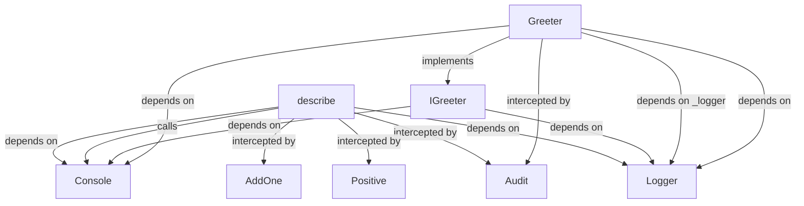
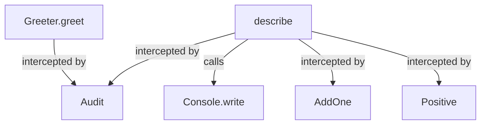
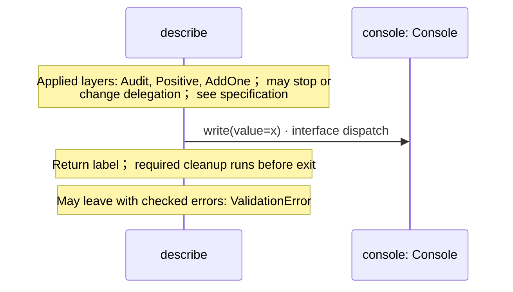

<!-- Generated by aug spec. Edit the August source, then regenerate. -->

# app.aug diagrams

[Project overview](.aug-spec/diagrams/index.md) · [Compiled explanation](app.aug.md)

## Class interactions

Call relationships

## Sequences

Call arrows identify checked targets; loop and branch frames determine when they run. Open that target’s module to follow its implementation. Branches describe alternatives; loops describe repeated work. Native calls and interface dispatch stop at their declared contracts. Exit notes end that path; enclosing recovery and cleanup remain visible.

### describe

[Source](app.aug#L15)

### IGreeter.greet

[Source](app.aug#L20)

Interface contract; implementation selected at runtime. [Explanation](app.aug.md).

### Greeter constructor

[Source](app.aug#L23)

Receive fields: injected \_logger, name. [Explanation](app.aug.md).

### Greeter.greet

[Source](app.aug#L26)

Applied layers: Audit; may stop or change delegation; see specification. Return "Hello, " + name + "!"; required cleanup runs before exit. [Explanation](app.aug.md).

## Called contracts

- [IGreeter](app.aug.diagrams.md) — app.aug
- [Console](.aug-spec/august/0.23.0/io/contracts.aug.diagrams.md) — august/io/contracts.aug
- [Console.write](.aug-spec/august/0.23.0/io/contracts.aug.diagrams.md#sequence-Console.write) — august/io/contracts.aug
- [AddOne](interceptors.aug.diagrams.md) — interceptors.aug
- [Audit](interceptors.aug.diagrams.md) — interceptors.aug
- [Positive](interceptors.aug.diagrams.md) — interceptors.aug
- [Logger](logging.aug.diagrams.md) — logging.aug
