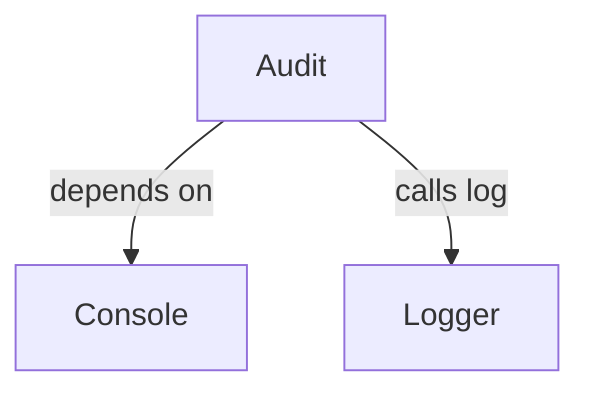
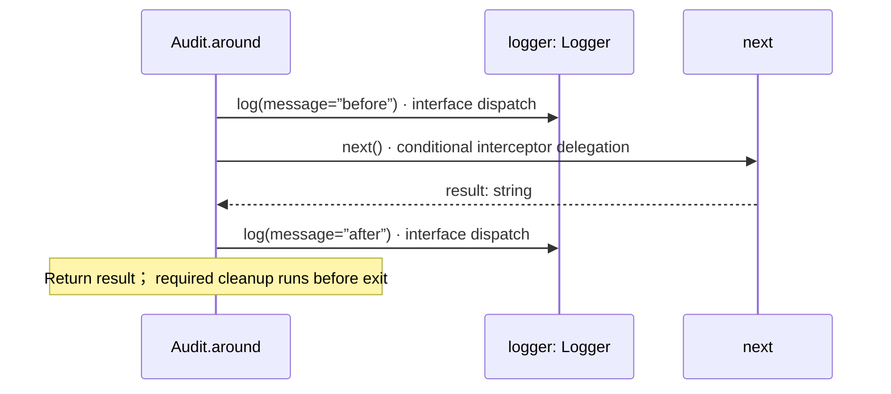
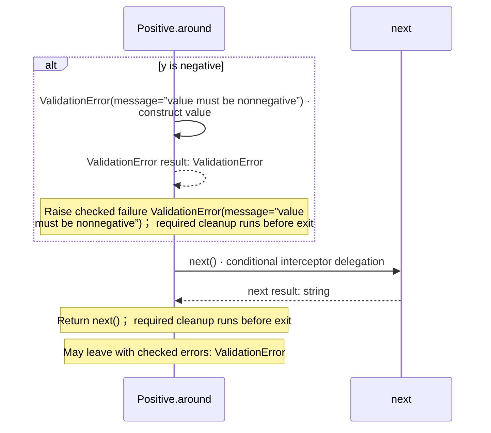
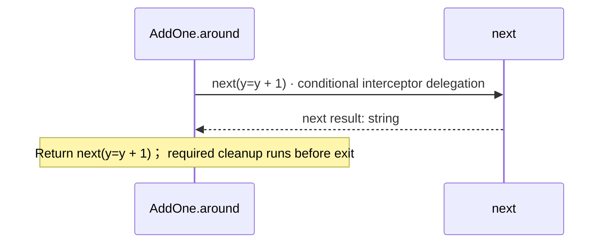

<!-- Generated by aug spec. Edit the August source, then regenerate. -->

# interceptors.aug diagrams

[Project overview](.aug-spec/diagrams/index.md) · [Compiled explanation](interceptors.aug.md)

## Class interactions

## Sequences

Call arrows identify checked targets; loop and branch frames determine when they run. Open that target’s module to follow its implementation. Branches describe alternatives; loops describe repeated work. Native calls and interface dispatch stop at their declared contracts. Exit notes end that path; enclosing recovery and cleanup remain visible.

### ValidationError constructor

[Source](interceptors.aug#L5)

Raised when a numeric input fails validation. It implements `Error`.

It takes `message` as a string, kept read-only.

Receive fields: message. [Explanation](interceptors.aug.md).

### Audit.around

[Source](interceptors.aug#L15)

Wrap a call without changing its result.

It gets `console` ([`Console`](.aug-spec/august/1.0.0/io/contracts.aug.md#symbol-Console)) from dependency injection.

It can call [`Console.write`](.aug-spec/august/1.0.0/io/contracts.aug.md#symbol-Console.write).

### Positive.around

[Source](interceptors.aug#L28)

It takes `y` as an integer.

Failures can raise [`ValidationError`](interceptors.aug.md#symbol-ValidationError) (when the selected value is negative).

### AddOne.around

[Source](interceptors.aug#L38)

It takes `y` as an integer.

## Called contracts

- [Console](.aug-spec/august/1.0.0/io/contracts.aug.diagrams.md) — august/io/contracts.aug
- [ValidationError](interceptors.aug.diagrams.md#sequence-ValidationError-20-constructor) — interceptors.aug
- [Logger.log](logging.aug.diagrams.md#sequence-Logger.log) — logging.aug
