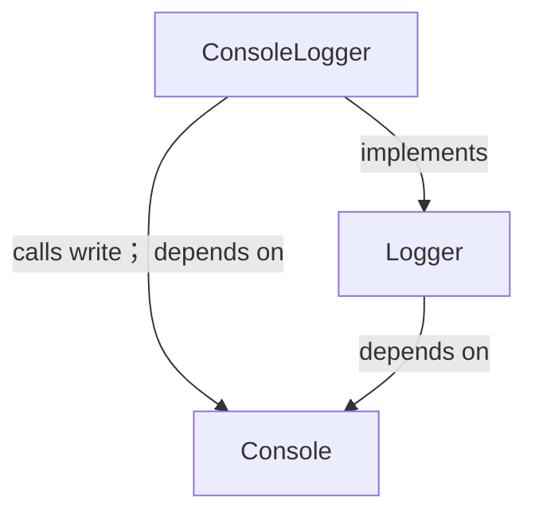
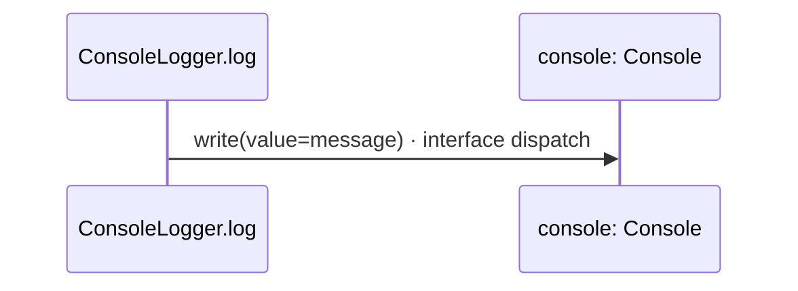

<!-- Generated by aug spec. Edit the August source, then regenerate. -->

# logging.aug diagrams

[Project overview](.aug-spec/diagrams/index.md) · [Compiled explanation](logging.aug.md)

## Class interactions

## Sequences

Call arrows identify checked targets; loop and branch frames determine when they run. Open that target’s module to follow its implementation. Branches describe alternatives; loops describe repeated work. Native calls and interface dispatch stop at their declared contracts. Exit notes end that path; enclosing recovery and cleanup remain visible.

### Logger.log

[Source](logging.aug#L6)

It takes `message` as a string (Text to display). It gets `console` ([`Console`](.aug-spec/august/1.0.0/io/contracts.aug.md#symbol-Console)) from dependency injection.

It can call [`Console.write`](.aug-spec/august/1.0.0/io/contracts.aug.md#symbol-Console.write).

Interface contract; implementation selected at runtime. [Explanation](logging.aug.md).

### ConsoleLogger constructor

[Source](logging.aug#L9)

Console logger shared by interceptor instances and the application. It implements [`Logger`](logging.aug.md#symbol-Logger).

[Explanation](logging.aug.md).

### ConsoleLogger.log

[Source](logging.aug#L10)

It takes `message` as a string. It gets `console` ([`Console`](.aug-spec/august/1.0.0/io/contracts.aug.md#symbol-Console)) from dependency injection.

It can call [`Console.write`](.aug-spec/august/1.0.0/io/contracts.aug.md#symbol-Console.write).

## Called contracts

- [Console](.aug-spec/august/1.0.0/io/contracts.aug.diagrams.md) — august/io/contracts.aug
- [Console.write](.aug-spec/august/1.0.0/io/contracts.aug.diagrams.md#sequence-Console.write) — august/io/contracts.aug
- [Logger](logging.aug.diagrams.md) — logging.aug
