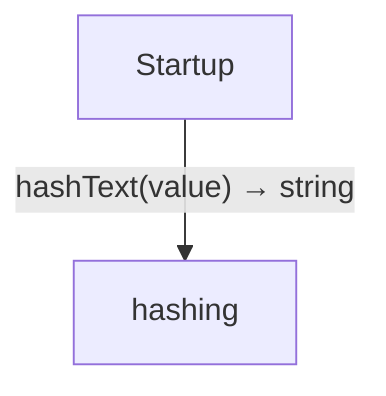
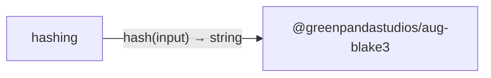

<!-- Generated by aug spec. Edit the August source, then regenerate. -->

# Project diagrams

Start here to see what moves between the application’s folders. Each arrow names an operation’s inputs and the result it returns to its caller. Open a folder for the next level of detail. Expand the contract list for complete types and dependency links.

## Data flow

### Package boundaries

hashing package calls

Data crossing these boundaries (2 contracts)

| From | To | Operation and inputs | Result |
| --- | --- | --- | --- |
| hashing | @greenpandastudios/aug-blake3 | [hash](../packages/%40greenpandastudios/aug-blake3/0.1.5/api.aug.md#symbol-hash) · input: Bytes | string |
| Startup | hashing | [hashText](../../hashing.aug.md#symbol-hashText) · value: string | string |

## Open a module

| Module | Read |
| --- | --- |
| hashing.aug | [Flow and sequences](../../hashing.aug.diagrams.md) · [Explanation](../../hashing.aug.md) |
| main.aug | [Flow and sequences](../../main.aug.diagrams.md) · [Explanation](../../main.aug.md) |

These are static call boundaries, not a request trace. Interface implementations and foreign internals stop at their checked contracts. Dotted arrows defer a callback or browser action. Imports alone do not imply a call.
