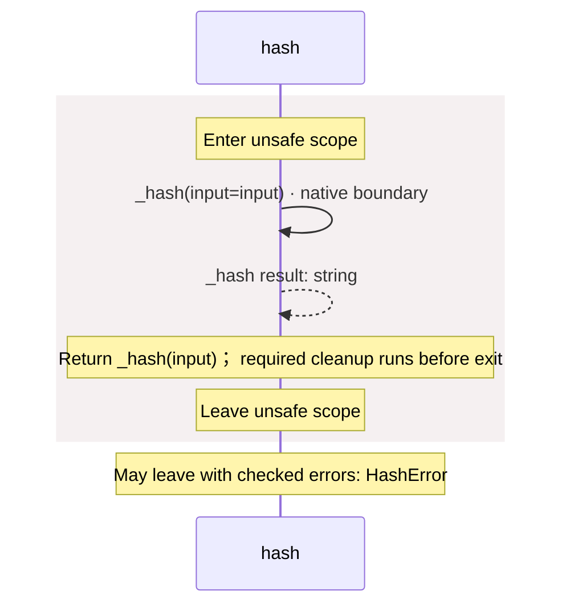

<!-- Generated by aug spec. Edit the August source, then regenerate. -->

# package/@greenpandastudios/aug-blake3@0.1.5/api.aug diagrams

[Project overview](../../../../diagrams/index.md) · [Compiled explanation](api.aug.md)

## Sequences

Call arrows identify checked targets; loop and branch frames determine when they run. Open that target’s module to follow its implementation. Branches describe alternatives; loops describe repeated work. Native calls and interface dispatch stop at their declared contracts. Exit notes end that path; enclosing recovery and cleanup remain visible.

### \_hash

[Source](api.aug#L4)

May leave with checked errors: HashError. Native implementation; only the declared contract is known. [Explanation](api.aug.md).

### hash

[Source](api.aug#L6)

## Called contracts

- [\_hash](api.aug.diagrams.md#sequence-_hash) — package/@greenpandastudios/aug-blake3@0.1.5/api.aug
