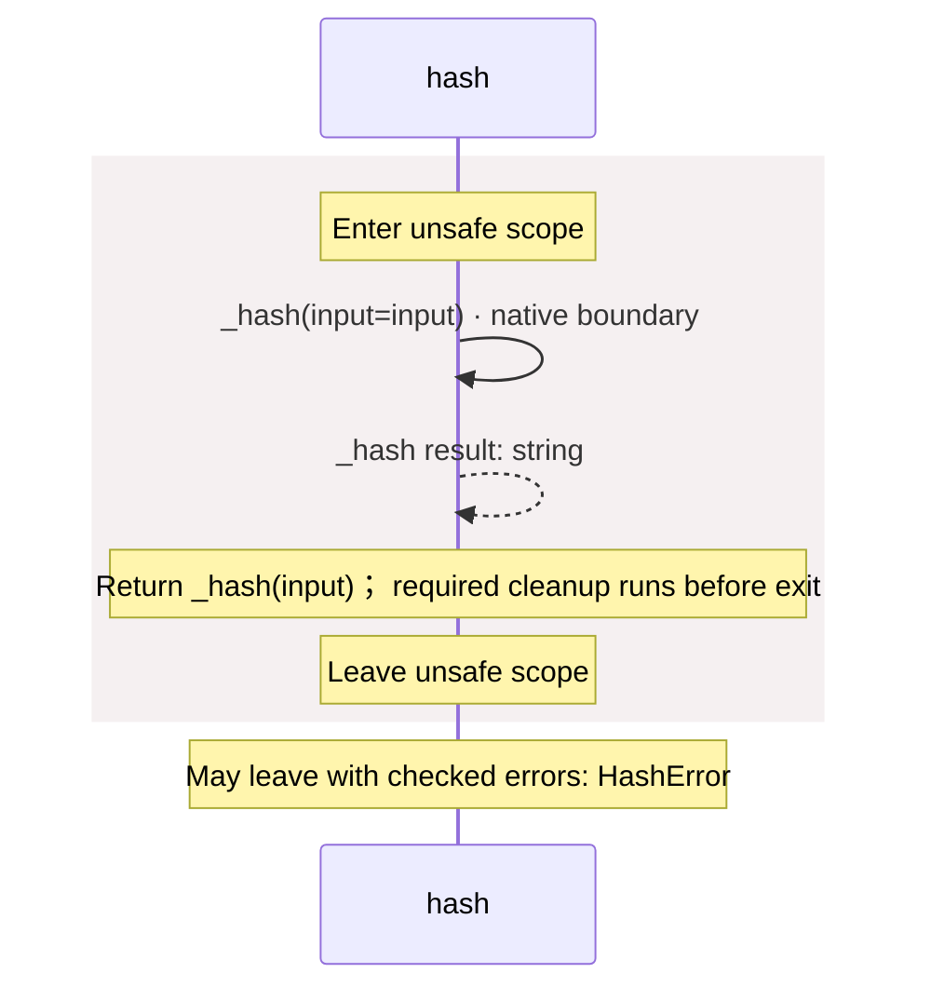

<!-- Generated by aug spec. Edit the August source, then regenerate. -->

# package/@greenpandastudios/aug-blake3@0.2.0/api.aug diagrams

[Project overview](../../../../diagrams/index.md) · [Compiled explanation](api.aug.md)

## Sequences

Call arrows identify checked targets; loop and branch frames determine when they run. Open that target’s module to follow its implementation. Branches describe alternatives; loops describe repeated work. Native calls and interface dispatch stop at their declared contracts. Exit notes end that path; enclosing recovery and cleanup remain visible.

### \_hash

[Source](api.aug#L4)

It is private to its defining scope.

It takes `input` as `Bytes`.

It returns `string`. Failures can raise [`HashError`](contracts.aug.md#symbol-HashError).

Native implementation: `@greenpandastudios/aug-blake3@0.2.0`, `1.8.7`. Supported targets: linux arm64 glibc 2.36+, linux x64 glibc 2.36+, macos arm64 14.0+. Binding contract: [`native.abi.json`](native.abi.json) (SHA-256 `3bf8dea97cde70a03021bf77ea08314d6d37fe7b4935ff16030b2ab929c21279`). It calls `aug_blake3_hash_v1` through the C ABI on the caller thread; a blocking native call blocks that thread. August copies the returned buffer, then calls `aug_blake3_text_release_v1` to release it. Its contract does not permit worker entry. The compiler checks the provider, descriptor digest, signature and ownership at August call sites. The native author promises not to retain inputs, enter August from foreign threads, or unwind across the C boundary; internal native workers may run. The compiler does not prove those promises.

May leave with checked errors: HashError. Native implementation; only the declared contract is known. [Explanation](api.aug.md).

### hash

[Source](api.aug#L6)

Return a lowercase 64-character BLAKE3 digest, computed by the Rust crate.

It takes `input` as `Bytes`.

Failures can raise [`HashError`](contracts.aug.md#symbol-HashError).

## Called contracts

- [\_hash](api.aug.diagrams.md#sequence-_hash) — package/@greenpandastudios/aug-blake3@0.2.0/api.aug
