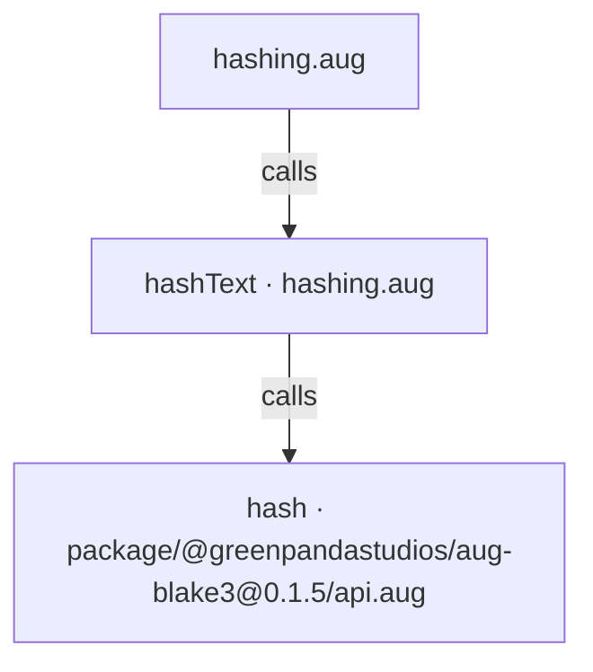
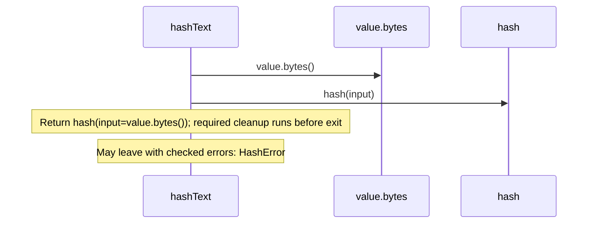

<!-- Generated by aug spec. Edit the August source, then regenerate. -->

# hashing.aug diagrams

[Project overview](.aug-spec/diagrams/index.md) · [Compiled explanation](hashing.aug.md)

## Class interactions

No relationships at this level.

## API calls

## Sequences

Call arrows identify checked targets; loop and branch frames determine when they run. Open that target’s module to follow its implementation. Branches describe alternatives; loops describe repeated work. Native calls and interface dispatch stop at their declared contracts. Exit notes end that path; enclosing recovery and cleanup remain visible.

### hashText

[Source](hashing.aug#L5)

## Called contracts

- [hashText](hashing.aug.diagrams.md#sequence-hashText) — hashing.aug
- [hash](.aug-spec/packages/%40greenpandastudios/aug-blake3/0.1.5/api.aug.diagrams.md#sequence-hash) — package/@greenpandastudios/aug-blake3@0.1.5/api.aug
