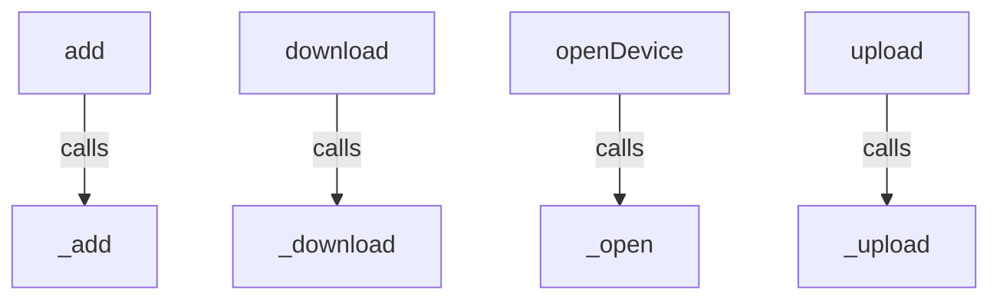
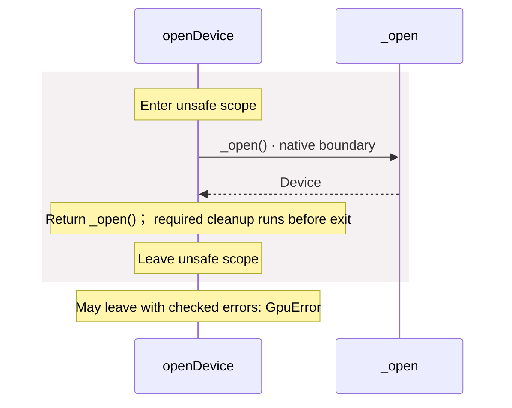
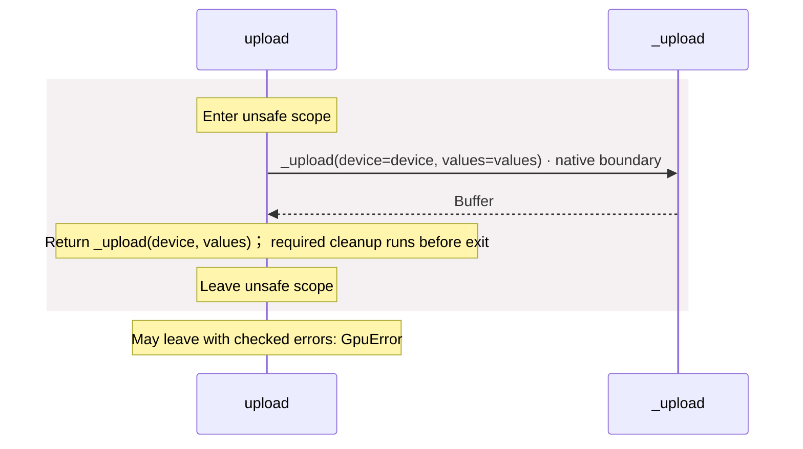
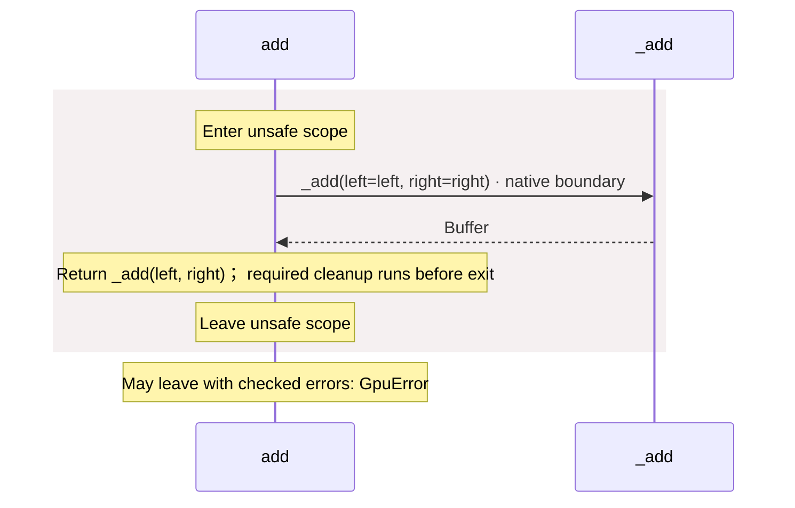
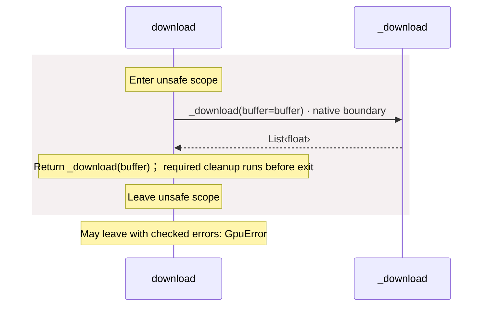

<!-- Generated by aug spec. Edit the August source, then regenerate. -->

# package/@greenpandastudios/aug-gpu@0.1.1/api.aug diagrams

[Project overview](../../../../diagrams/index.md) · [Compiled explanation](api.aug.md)

Call relationships

## Sequences

Call arrows identify checked targets; loop and branch frames determine when they run. Open that target’s module to follow its implementation. Branches describe alternatives; loops describe repeated work. Native calls and interface dispatch stop at their declared contracts. Exit notes end that path; enclosing recovery and cleanup remain visible.

### \_open

[Source](api.aug#L5)

May leave with checked errors: GpuError. Native implementation; only the declared contract is known. [Explanation](api.aug.md).

### \_upload

[Source](api.aug#L6)

May leave with checked errors: GpuError. Native implementation; only the declared contract is known. [Explanation](api.aug.md).

### \_add

[Source](api.aug#L7)

May leave with checked errors: GpuError. Native implementation; only the declared contract is known. [Explanation](api.aug.md).

### \_download

[Source](api.aug#L8)

May leave with checked errors: GpuError. Native implementation; only the declared contract is known. [Explanation](api.aug.md).

### \_live

[Source](api.aug#L9)

Native implementation; only the declared contract is known. [Explanation](api.aug.md).

### openDevice

[Source](api.aug#L11)

### upload

[Source](api.aug#L15)

### add

[Source](api.aug#L19)

### download

[Source](api.aug#L23)

## Called contracts

- [\_add](api.aug.diagrams.md#sequence-_add) — package/@greenpandastudios/aug-gpu@0.1.1/api.aug
- [\_download](api.aug.diagrams.md#sequence-_download) — package/@greenpandastudios/aug-gpu@0.1.1/api.aug
- [\_open](api.aug.diagrams.md#sequence-_open) — package/@greenpandastudios/aug-gpu@0.1.1/api.aug
- [\_upload](api.aug.diagrams.md#sequence-_upload) — package/@greenpandastudios/aug-gpu@0.1.1/api.aug
