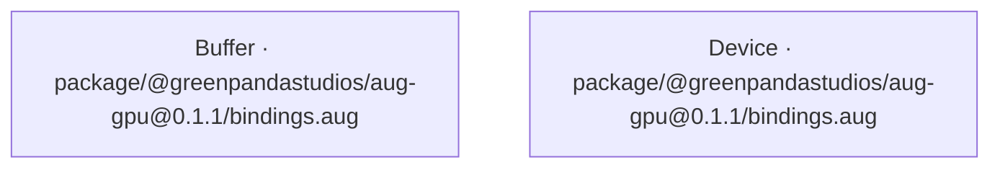

<!-- Generated by aug spec. Edit the August source, then regenerate. -->

# package/@greenpandastudios/aug-gpu@0.1.1/bindings.aug diagrams

[Project overview](../../../../diagrams/index.md) · [Compiled explanation](bindings.aug.md)

## Class interactions

## API calls

No relationships at this level.

## Sequences

Call arrows identify checked targets; loop and branch frames determine when they run. Open that target’s module to follow its implementation. Branches describe alternatives; loops describe repeated work. Native calls and interface dispatch stop at their declared contracts. Exit notes end that path; enclosing recovery and cleanup remain visible.

This module declares no executable operations.
