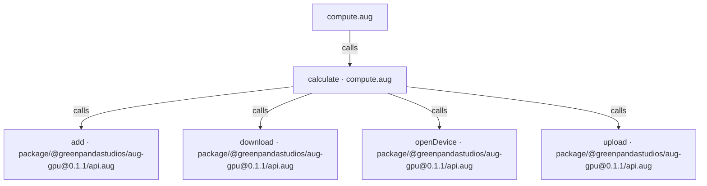
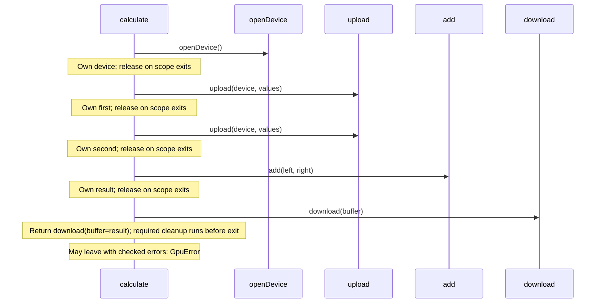

<!-- Generated by aug spec. Edit the August source, then regenerate. -->

# compute.aug diagrams

[Project overview](.aug-spec/diagrams/index.md) · [Compiled explanation](compute.aug.md)

## Class interactions

No relationships at this level.

## API calls

## Sequences

Call arrows identify checked targets; loop and branch frames determine when they run. Open that target’s module to follow its implementation. Branches describe alternatives; loops describe repeated work. Native calls and interface dispatch stop at their declared contracts. Exit notes end that path; enclosing recovery and cleanup remain visible.

### calculate

[Source](compute.aug#L5)

## Called contracts

- [calculate](compute.aug.diagrams.md#sequence-calculate) — compute.aug
- [add](.aug-spec/packages/%40greenpandastudios/aug-gpu/0.1.1/api.aug.diagrams.md#sequence-add) — package/@greenpandastudios/aug-gpu@0.1.1/api.aug
- [download](.aug-spec/packages/%40greenpandastudios/aug-gpu/0.1.1/api.aug.diagrams.md#sequence-download) — package/@greenpandastudios/aug-gpu@0.1.1/api.aug
- [openDevice](.aug-spec/packages/%40greenpandastudios/aug-gpu/0.1.1/api.aug.diagrams.md#sequence-openDevice) — package/@greenpandastudios/aug-gpu@0.1.1/api.aug
- [upload](.aug-spec/packages/%40greenpandastudios/aug-gpu/0.1.1/api.aug.diagrams.md#sequence-upload) — package/@greenpandastudios/aug-gpu@0.1.1/api.aug
