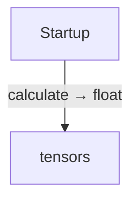
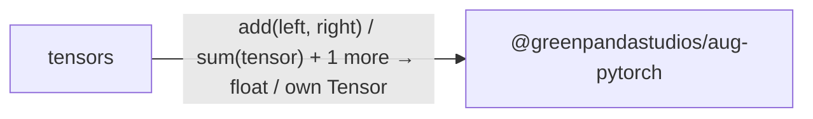

<!-- Generated by aug spec. Edit the August source, then regenerate. -->

# Project diagrams

Start with how the application begins, then follow data between its folders. Open an operation to see its decisions, calls, failures and cleanup. Its explanation supplies the exact contract and linked dependencies.

This view includes 2 application source files. Package and interface boundaries show checked contracts; their runtime implementations are not expanded. The views describe the checked program, not desired requirements or a recorded execution.

## Where execution begins

### Startup

It prints [`calculate`](../../tensors.aug.md#symbol-calculate). If this work raises [`TensorError`](../packages/%40greenpandastudios/aug-pytorch/0.2.0/contracts.aug.md#symbol-TensorError) as `error`, it prints `error.message`. [source](../../main.aug#L5-L8)

## Data flow

### Package boundaries

tensors package calls

### Follow the data

Each row opens the complete operations and call sites behind one pair of logical units. A grouped arrow records calls between those units; connected arrows need not belong to the same execution path.

| From | To | Operations | Read |
| --- | --- | --- | --- |
| Startup | tensors | 1 | [Inputs, results and call sites](index.md#boundary-79dca6bbff59) |
| tensors | @greenpandastudios/aug-pytorch | 4 | [Inputs, results and call sites](index.md#boundary-ab1b8e2f1416) |

#### Data crossing these boundaries (5 contracts)

#### Startup → tensors

1 operation, 1 site

**[calculate](../../tensors.aug.md#symbol-calculate)**

No caller-supplied inputs. Result: float.

| Caller or entry | Evidence |
| --- | --- |
| Startup | [Call site](../../main.aug#L6) · [Caller explanation](../../main.aug.md#startup) |

#### tensors → @greenpandastudios/aug-pytorch

4 operations, 9 sites

**[add](../packages/%40greenpandastudios/aug-pytorch/0.2.0/api.aug.md#symbol-add)**

Inputs: left: Tensor, right: Tensor. Result: own Tensor.

| Caller or entry | Evidence |
| --- | --- |
| calculate | [Call site](../../tensors.aug#L8) · [Caller explanation](../../tensors.aug.md#symbol-calculate) |
| test calculate | [Call site](../../tensors.aug#L16) · [Caller explanation](../../tensors.aug.md#symbol-test%20calculate) |

**[sum](../packages/%40greenpandastudios/aug-pytorch/0.2.0/api.aug.md#symbol-sum)**

Inputs: tensor: Tensor. Result: float.

| Caller or entry | Evidence |
| --- | --- |
| calculate | [Call site](../../tensors.aug#L9) · [Caller explanation](../../tensors.aug.md#symbol-calculate) |
| test calculate | [Call site](../../tensors.aug#L22) · [Caller explanation](../../tensors.aug.md#symbol-test%20calculate) |

**[tensor](../packages/%40greenpandastudios/aug-pytorch/0.2.0/api.aug.md#symbol-tensor)**

Inputs: values: List\<float\>. Result: own Tensor.

| Caller or entry | Evidence |
| --- | --- |
| calculate | [Call site](../../tensors.aug#L6) · [Caller explanation](../../tensors.aug.md#symbol-calculate) |
| calculate | [Call site](../../tensors.aug#L7) · [Caller explanation](../../tensors.aug.md#symbol-calculate) |
| test calculate | [Call site](../../tensors.aug#L14) · [Caller explanation](../../tensors.aug.md#symbol-test%20calculate) |
| test calculate | [Call site](../../tensors.aug#L15) · [Caller explanation](../../tensors.aug.md#symbol-test%20calculate) |

**[values](../packages/%40greenpandastudios/aug-pytorch/0.2.0/api.aug.md#symbol-values)**

Inputs: tensor: Tensor. Result: List\<float\>.

| Caller or entry | Evidence |
| --- | --- |
| test calculate | [Call site](../../tensors.aug#L17) · [Caller explanation](../../tensors.aug.md#symbol-test%20calculate) |

## Open a module

| Module | Read |
| --- | --- |
| main.aug | [Flow and sequences](../../main.aug.diagrams.md) · [Explanation](../../main.aug.md) |
| tensors.aug | [Flow and sequences](../../tensors.aug.diagrams.md) · [Explanation](../../tensors.aug.md) |

These are static call boundaries, not a request trace. Interface implementations and foreign internals stop at their checked contracts. Dotted arrows defer a callback or browser action. Imports alone do not imply a call.
