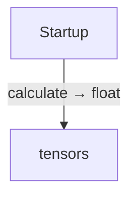
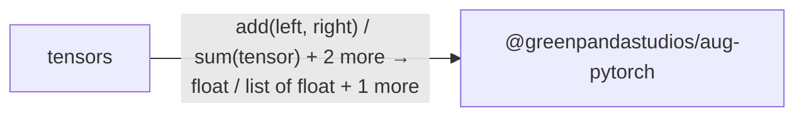

<!-- Generated by aug spec. Edit the August source, then regenerate. -->

# Project diagrams

Start here to see what moves between the application’s folders. Each arrow names an operation’s inputs and the result it returns to its caller. Open a folder for the next level of detail. Expand the contract list for complete types and dependency links.

## Data flow

### Package boundaries

tensors package calls

Data crossing these boundaries (5 contracts)

| From | To | Operation and inputs | Result |
| --- | --- | --- | --- |
| Startup | tensors | [calculate](../../tensors.aug.md#symbol-calculate) | float |
| tensors | @greenpandastudios/aug-pytorch | [add](../packages/%40greenpandastudios/aug-pytorch/0.1.6/api.aug.md#symbol-add) · left: Tensor, right: Tensor | own Tensor |
| tensors | @greenpandastudios/aug-pytorch | [sum](../packages/%40greenpandastudios/aug-pytorch/0.1.6/api.aug.md#symbol-sum) · tensor: Tensor | float |
| tensors | @greenpandastudios/aug-pytorch | [tensor](../packages/%40greenpandastudios/aug-pytorch/0.1.6/api.aug.md#symbol-tensor) · values: List\<float\> | own Tensor |
| tensors | @greenpandastudios/aug-pytorch | [values](../packages/%40greenpandastudios/aug-pytorch/0.1.6/api.aug.md#symbol-values) · tensor: Tensor | List\<float\> |

## Open a module

| Module | Read |
| --- | --- |
| main.aug | [Flow and sequences](../../main.aug.diagrams.md) · [Explanation](../../main.aug.md) |
| tensors.aug | [Flow and sequences](../../tensors.aug.diagrams.md) · [Explanation](../../tensors.aug.md) |

These are static call boundaries, not a request trace. Interface implementations and foreign internals stop at their checked contracts. Dotted arrows defer a callback or browser action. Imports alone do not imply a call.
