<!-- Generated by aug spec. Edit the August source, then regenerate. -->

# package/@greenpandastudios/aug-pytorch@0.1.6/api.aug diagrams

[Project overview](../../../../diagrams/index.md) · [Compiled explanation](api.aug.md)

## Class interactions

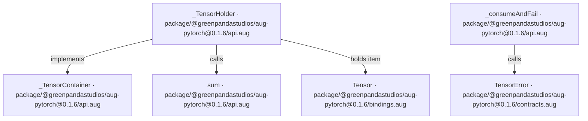

## API calls

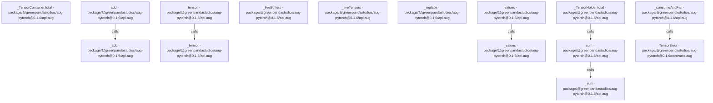

## Sequences

Call arrows identify checked targets; loop and branch frames determine when they run. Open that target’s module to follow its implementation. Branches describe alternatives; loops describe repeated work. Native calls and interface dispatch stop at their declared contracts. Exit notes end that path; enclosing recovery and cleanup remain visible.

### \_tensor

[Source](api.aug#L5)

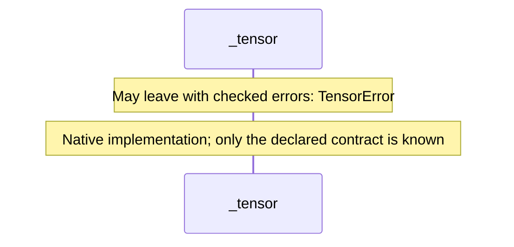

### \_add

[Source](api.aug#L6)

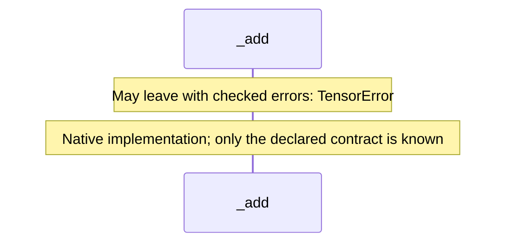

### \_sum

[Source](api.aug#L7)

### \_values

[Source](api.aug#L8)

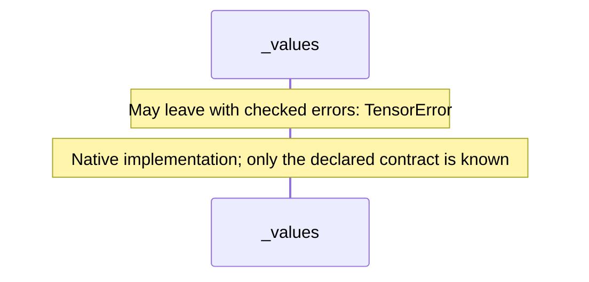

### tensor

[Source](api.aug#L10)

### add

[Source](api.aug#L14)

### sum

[Source](api.aug#L18)

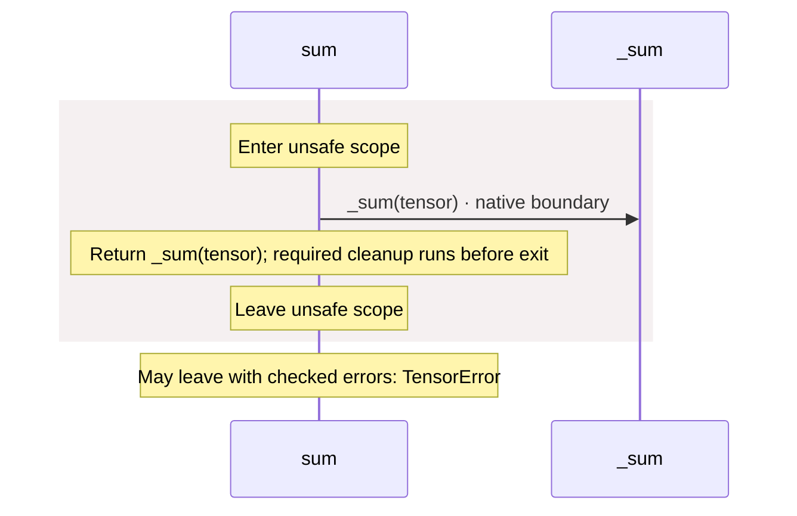

### values

[Source](api.aug#L22)

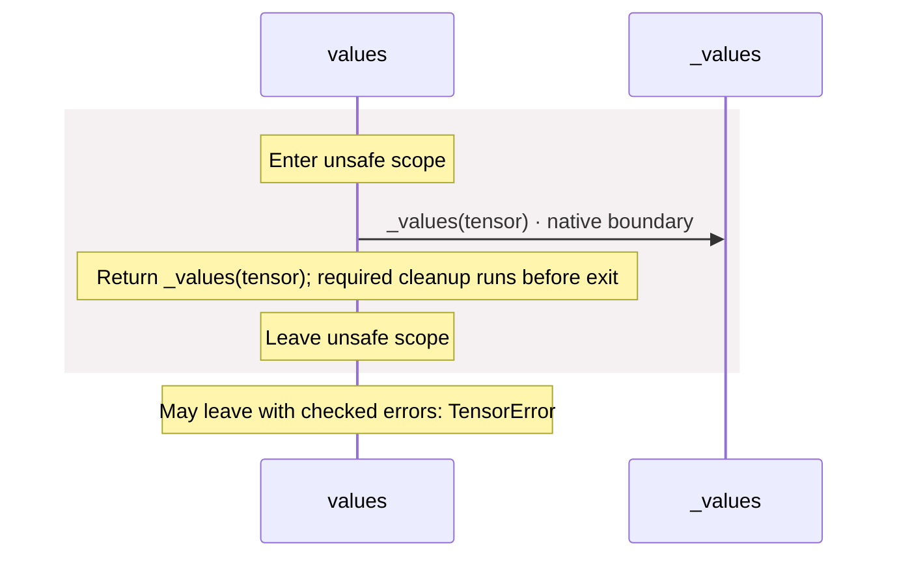

### \_liveTensors

[Source](api.aug#L26)

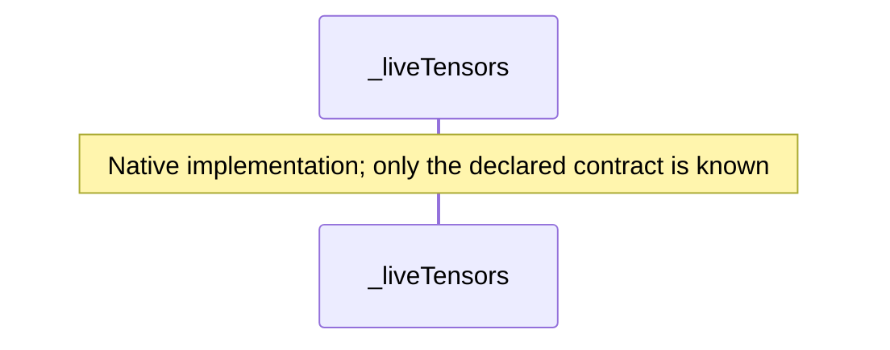

### \_liveBuffers

[Source](api.aug#L27)

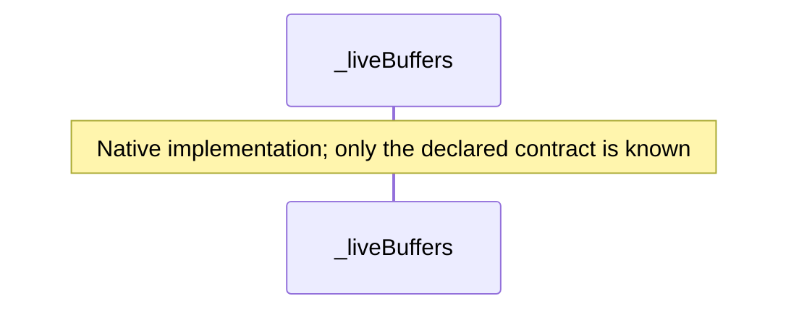

### \_consumeAndFail

[Source](api.aug#L29)

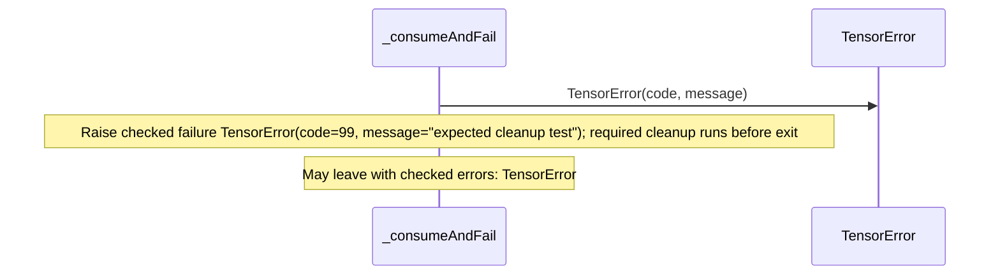

### \_TensorContainer.total

[Source](api.aug#L33)

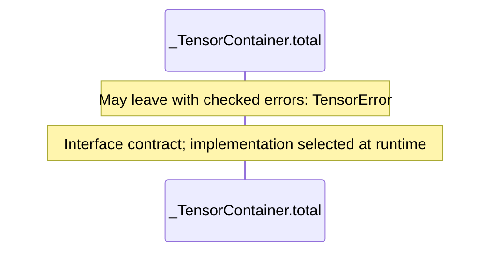

### \_TensorHolder constructor

[Source](api.aug#L34)

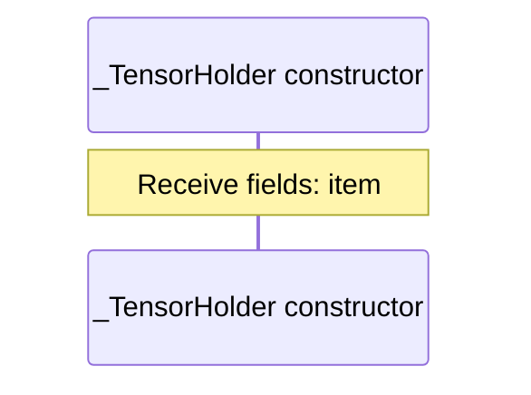

### \_TensorHolder.total

[Source](api.aug#L35)

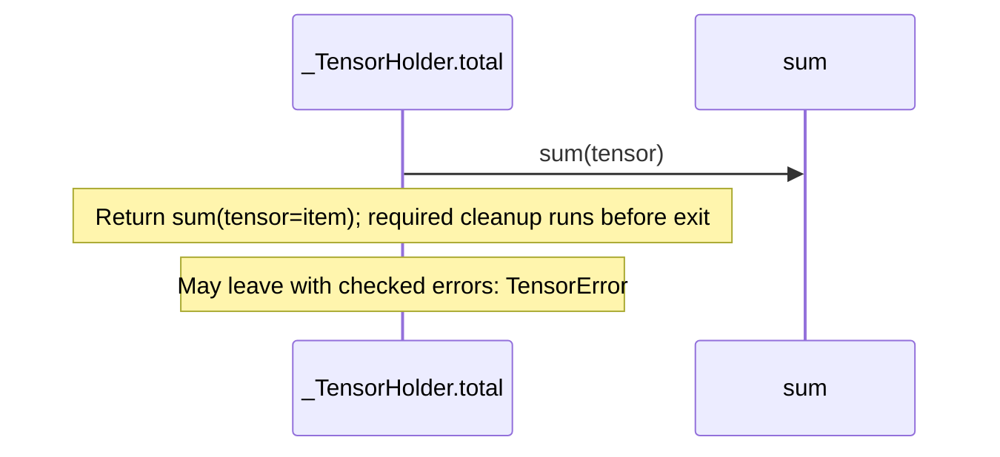

### \_replace

[Source](api.aug#L37)

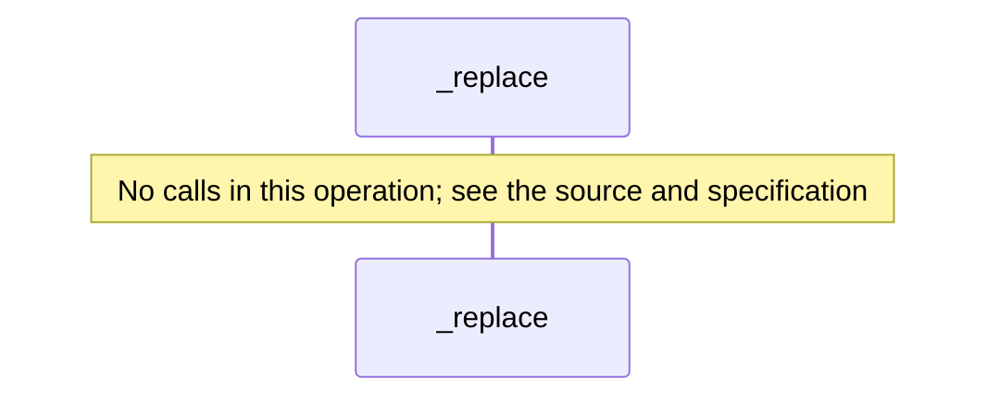

## Called contracts

- [\_TensorContainer](api.aug.diagrams.md) — package/@greenpandastudios/aug-pytorch@0.1.6/api.aug
- [\_add](api.aug.diagrams.md#sequence-_add) — package/@greenpandastudios/aug-pytorch@0.1.6/api.aug
- [\_sum](api.aug.diagrams.md#sequence-_sum) — package/@greenpandastudios/aug-pytorch@0.1.6/api.aug
- [\_tensor](api.aug.diagrams.md#sequence-_tensor) — package/@greenpandastudios/aug-pytorch@0.1.6/api.aug
- [\_values](api.aug.diagrams.md#sequence-_values) — package/@greenpandastudios/aug-pytorch@0.1.6/api.aug
- [sum](api.aug.diagrams.md#sequence-sum) — package/@greenpandastudios/aug-pytorch@0.1.6/api.aug
- [TensorError](contracts.aug.diagrams.md#sequence-TensorError-20-constructor) — package/@greenpandastudios/aug-pytorch@0.1.6/contracts.aug
