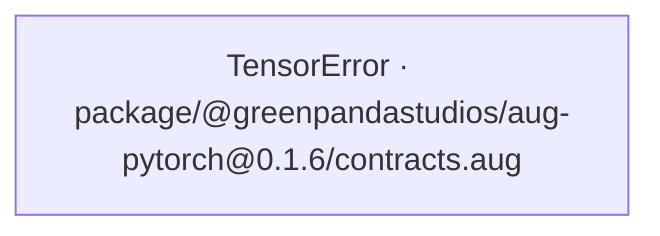
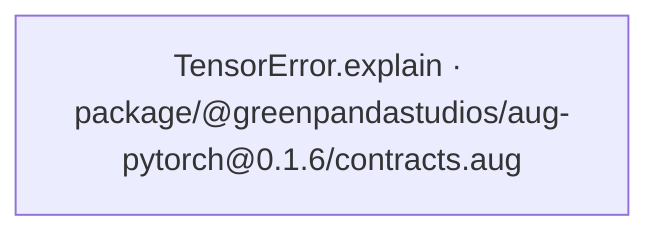
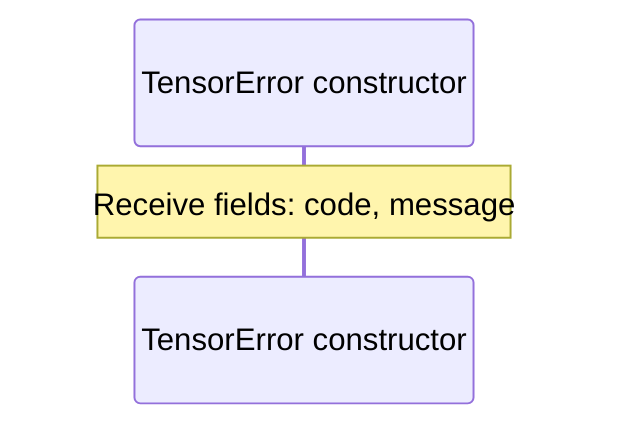
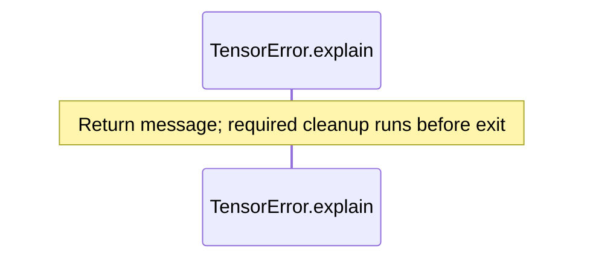

<!-- Generated by aug spec. Edit the August source, then regenerate. -->

# package/@greenpandastudios/aug-pytorch@0.1.6/contracts.aug diagrams

[Project overview](../../../../diagrams/index.md) · [Compiled explanation](contracts.aug.md)

## Class interactions

## API calls

## Sequences

Call arrows identify checked targets; loop and branch frames determine when they run. Open that target’s module to follow its implementation. Branches describe alternatives; loops describe repeated work. Native calls and interface dispatch stop at their declared contracts. Exit notes end that path; enclosing recovery and cleanup remain visible.

### TensorError constructor

[Source](contracts.aug#L3)

### TensorError.explain

[Source](contracts.aug#L5)

