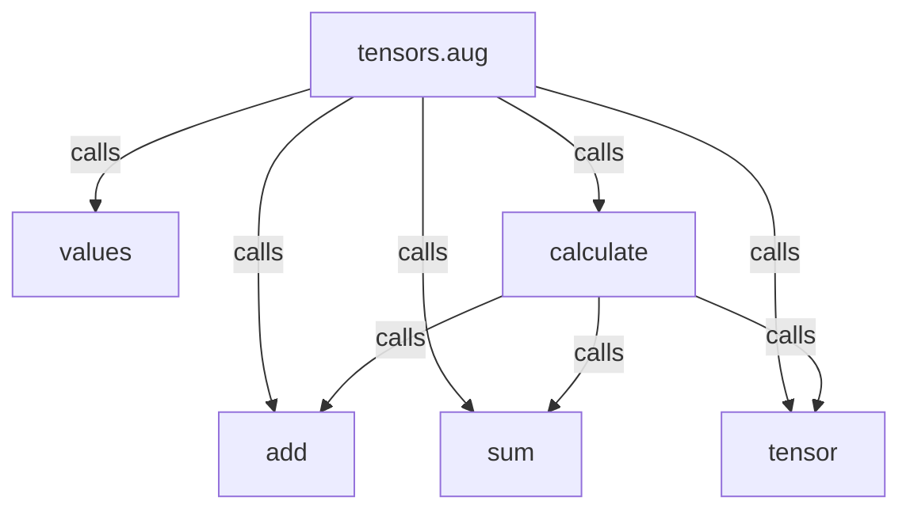
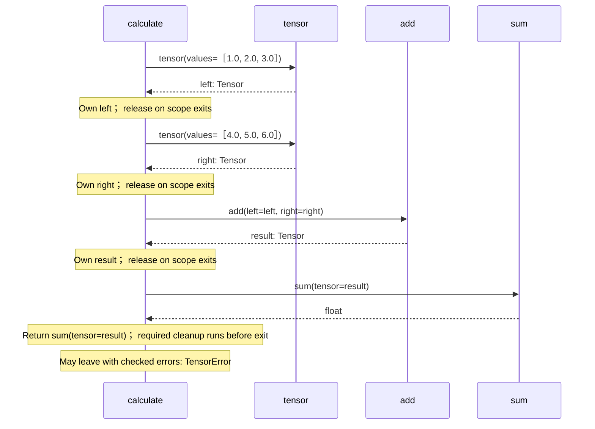

<!-- Generated by aug spec. Edit the August source, then regenerate. -->

# tensors.aug diagrams

[Project overview](.aug-spec/diagrams/index.md) · [Compiled explanation](tensors.aug.md)

Call relationships

## Sequences

Call arrows identify checked targets; loop and branch frames determine when they run. Open that target’s module to follow its implementation. Branches describe alternatives; loops describe repeated work. Native calls and interface dispatch stop at their declared contracts. Exit notes end that path; enclosing recovery and cleanup remain visible.

### calculate

[Source](tensors.aug#L5)

## Called contracts

- [add](.aug-spec/packages/%40greenpandastudios/aug-pytorch/0.1.6/api.aug.diagrams.md#sequence-add) — package/@greenpandastudios/aug-pytorch@0.1.6/api.aug
- [sum](.aug-spec/packages/%40greenpandastudios/aug-pytorch/0.1.6/api.aug.diagrams.md#sequence-sum) — package/@greenpandastudios/aug-pytorch@0.1.6/api.aug
- [tensor](.aug-spec/packages/%40greenpandastudios/aug-pytorch/0.1.6/api.aug.diagrams.md#sequence-tensor) — package/@greenpandastudios/aug-pytorch@0.1.6/api.aug
- [values](.aug-spec/packages/%40greenpandastudios/aug-pytorch/0.1.6/api.aug.diagrams.md#sequence-values) — package/@greenpandastudios/aug-pytorch@0.1.6/api.aug
- [calculate](tensors.aug.diagrams.md#sequence-calculate) — tensors.aug
