<!-- Generated by aug spec. Edit the August source, then regenerate. -->

# package/@greenpandastudios/aug-sqlite@0.1.5/api.aug diagrams

[Project overview](../../../../diagrams/index.md) · [Compiled explanation](api.aug.md)

## Class interactions

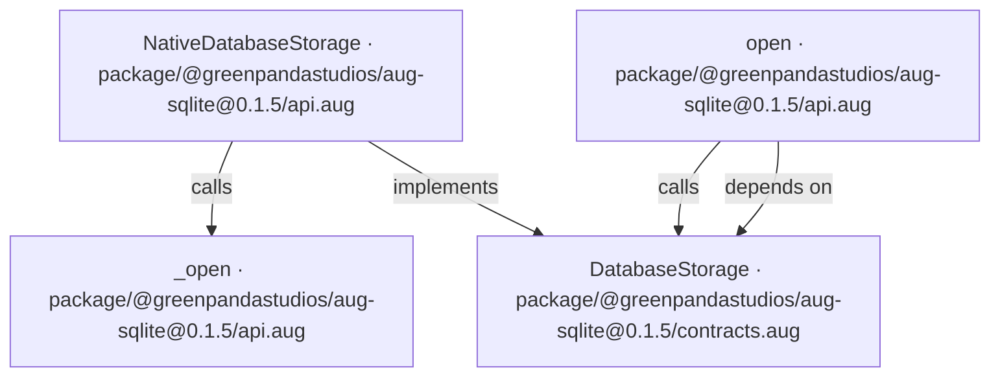

## API calls

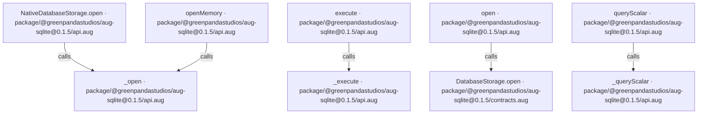

## Sequences

Call arrows identify checked targets; loop and branch frames determine when they run. Open that target’s module to follow its implementation. Branches describe alternatives; loops describe repeated work. Native calls and interface dispatch stop at their declared contracts. Exit notes end that path; enclosing recovery and cleanup remain visible.

### \_open

[Source](api.aug#L5)

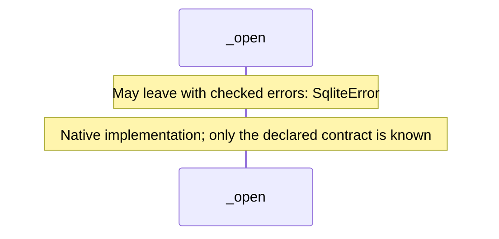

### \_execute

[Source](api.aug#L6)

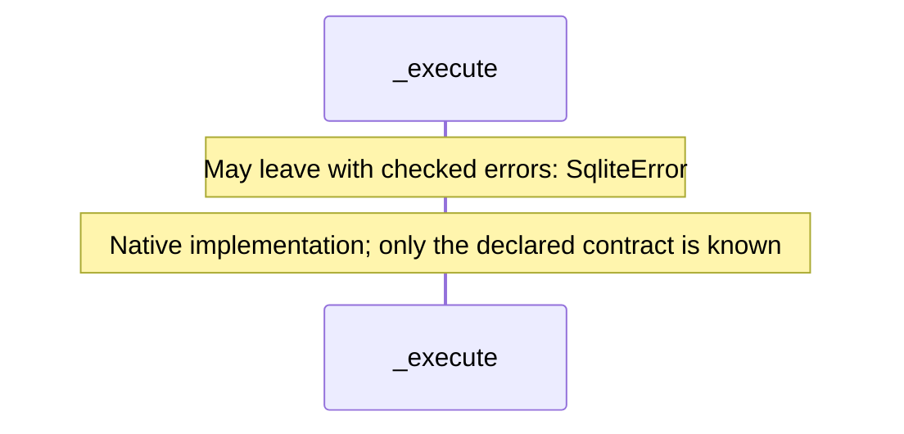

### \_queryScalar

[Source](api.aug#L7)

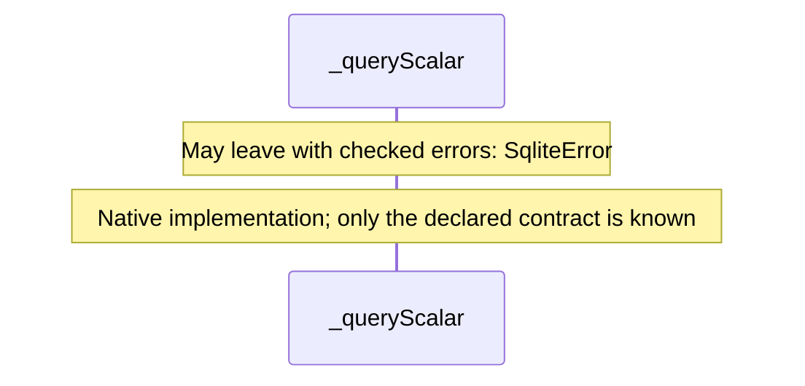

### NativeDatabaseStorage constructor

[Source](api.aug#L9)

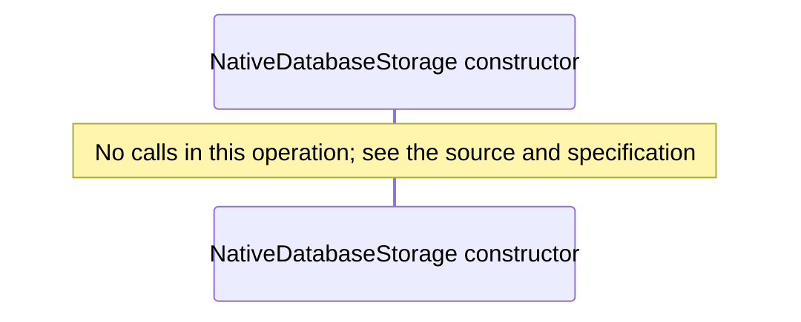

### NativeDatabaseStorage.open

[Source](api.aug#L10)

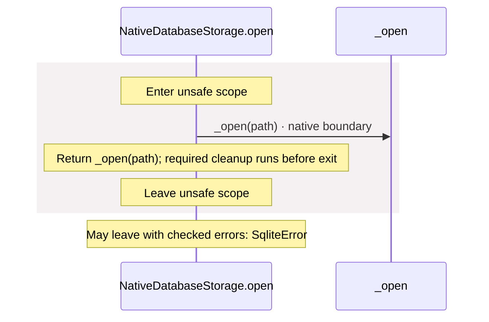

### open

[Source](api.aug#L13)

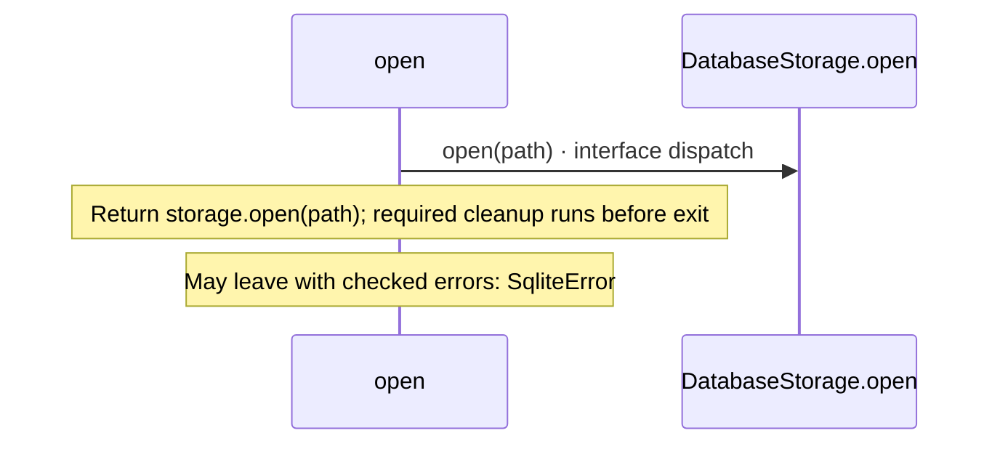

### openMemory

[Source](api.aug#L16)

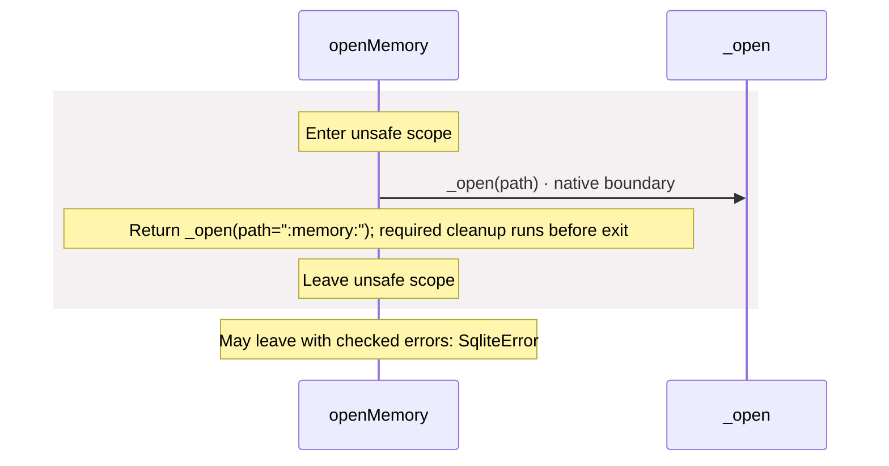

### execute

[Source](api.aug#L20)

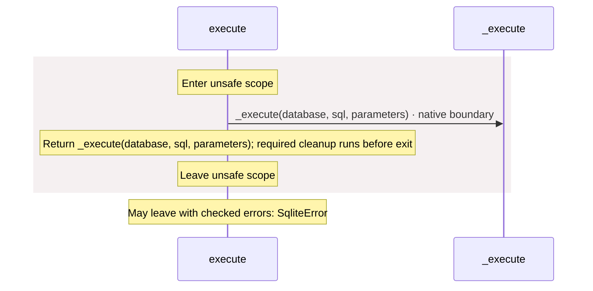

### queryScalar

[Source](api.aug#L24)

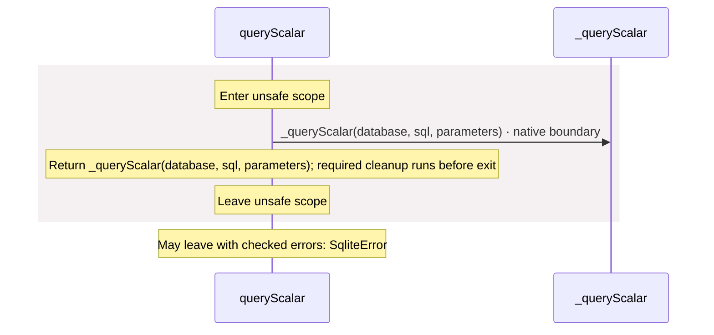

## Called contracts

- [\_execute](api.aug.diagrams.md#sequence-_execute) — package/@greenpandastudios/aug-sqlite@0.1.5/api.aug
- [\_open](api.aug.diagrams.md#sequence-_open) — package/@greenpandastudios/aug-sqlite@0.1.5/api.aug
- [\_queryScalar](api.aug.diagrams.md#sequence-_queryScalar) — package/@greenpandastudios/aug-sqlite@0.1.5/api.aug
- [DatabaseStorage](contracts.aug.diagrams.md) — package/@greenpandastudios/aug-sqlite@0.1.5/contracts.aug
- [DatabaseStorage.open](contracts.aug.diagrams.md#sequence-DatabaseStorage.open) — package/@greenpandastudios/aug-sqlite@0.1.5/contracts.aug
