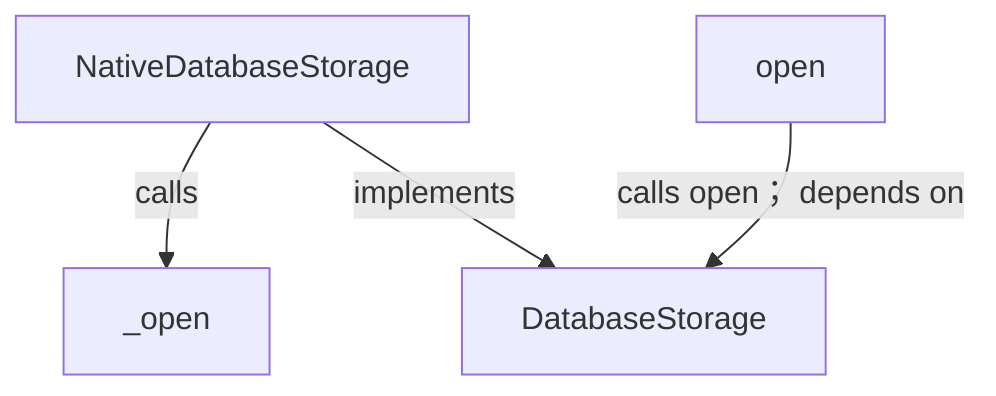
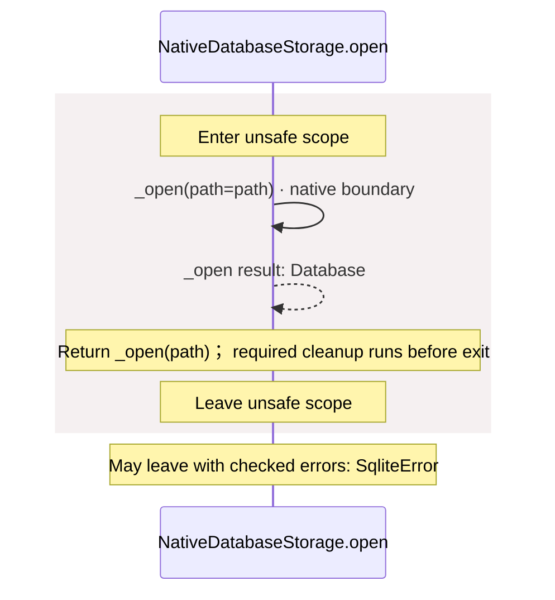
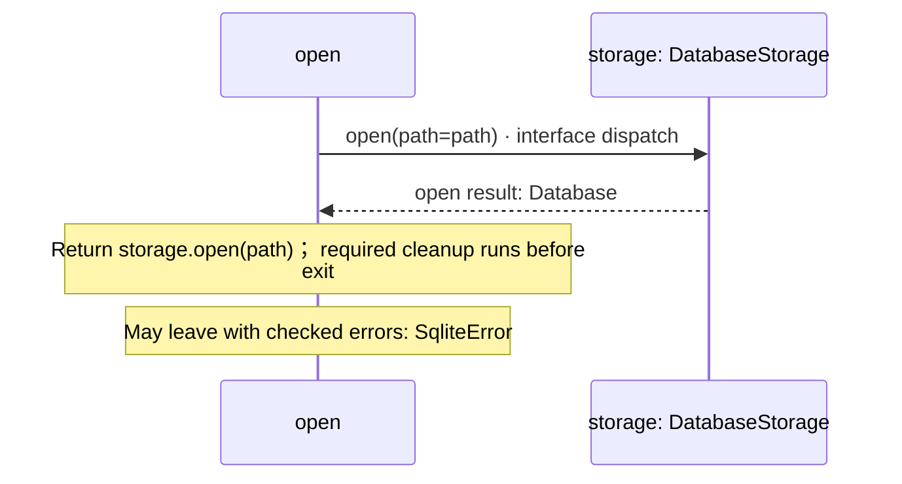
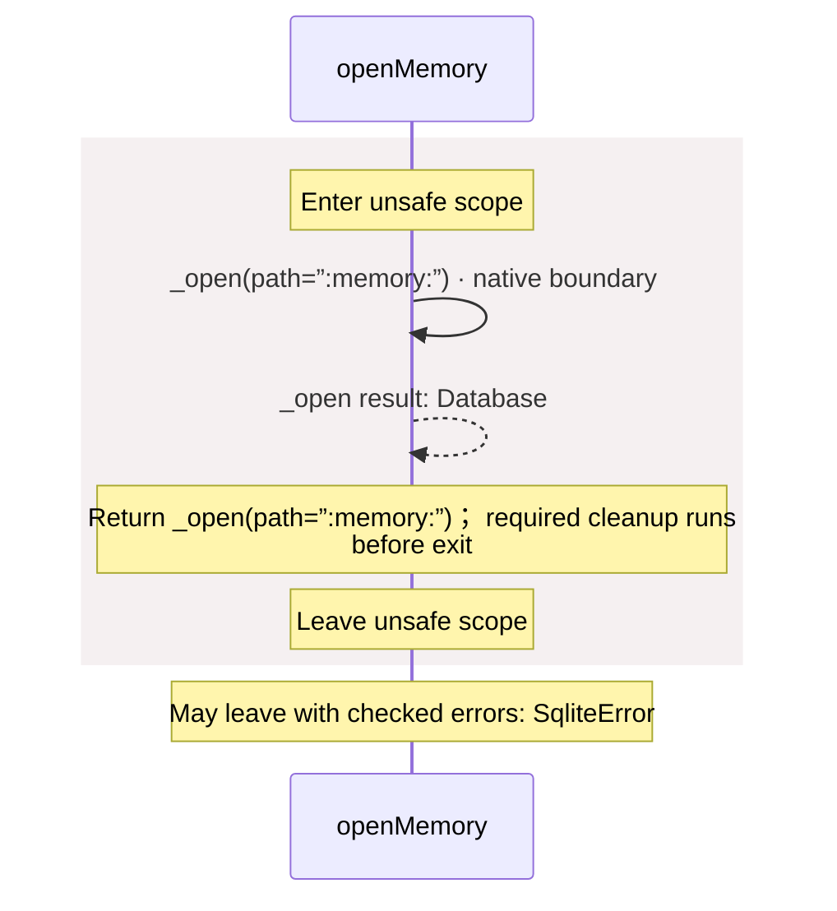
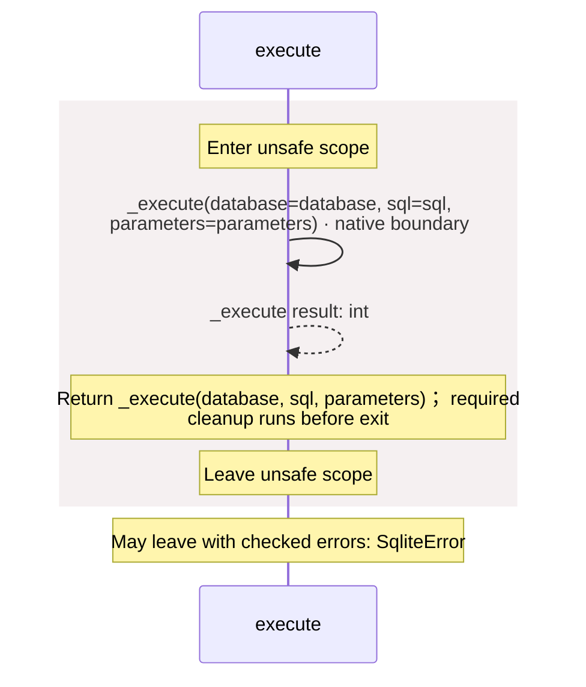
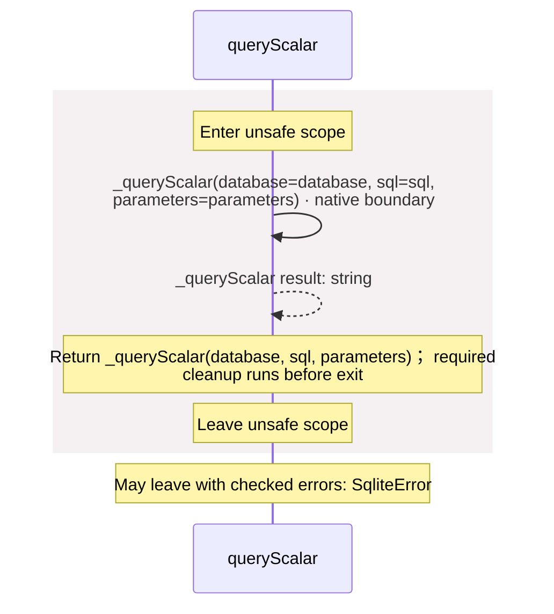

<!-- Generated by aug spec. Edit the August source, then regenerate. -->

# package/@greenpandastudios/aug-sqlite@0.2.0/api.aug diagrams

[Project overview](../../../../diagrams/index.md) · [Compiled explanation](api.aug.md)

## Class interactions

## Sequences

Call arrows identify checked targets; loop and branch frames determine when they run. Open that target’s module to follow its implementation. Branches describe alternatives; loops describe repeated work. Native calls and interface dispatch stop at their declared contracts. Exit notes end that path; enclosing recovery and cleanup remain visible.

### \_open

[Source](api.aug#L5)

It is private to its defining scope.

It takes `path` as a string.

It returns ownership of [`Database`](bindings.aug.md#symbol-Database). Failures can raise [`SqliteError`](contracts.aug.md#symbol-SqliteError).

Native implementation: `@greenpandastudios/aug-sqlite@0.2.0`, `3.53.4`. Supported targets: linux arm64 glibc 2.36+, linux x64 glibc 2.36+, macos arm64 14.0+. Binding contract: [`native.abi.json`](native.abi.json) (SHA-256 `3c75c2925c85f1b83db06ee00fa04f1d2d37c9fd6edca0d074ce89b4647ffffb`). It calls `aug_sqlite_open_v1` through the C ABI on the caller thread; a blocking native call blocks that thread. The caller owns the returned handle. Its contract does not permit worker entry. The compiler checks the provider, descriptor digest, signature and ownership at August call sites. The native author promises not to retain inputs, enter August from foreign threads, or unwind across the C boundary; internal native workers may run. The compiler does not prove those promises.

May leave with checked errors: SqliteError. Native implementation; only the declared contract is known. [Explanation](api.aug.md).

### \_execute

[Source](api.aug#L6)

It is private to its defining scope.

It takes `database` as [`Database`](bindings.aug.md#symbol-Database) with permission to mutate it during the call, `sql` as a string, and `parameters` as `List<string>`.

It returns `int`. It may change `database`. Failures can raise [`SqliteError`](contracts.aug.md#symbol-SqliteError).

Native implementation: `@greenpandastudios/aug-sqlite@0.2.0`, `3.53.4`. Supported targets: linux arm64 glibc 2.36+, linux x64 glibc 2.36+, macos arm64 14.0+. Binding contract: [`native.abi.json`](native.abi.json) (SHA-256 `3c75c2925c85f1b83db06ee00fa04f1d2d37c9fd6edca0d074ce89b4647ffffb`). It calls `aug_sqlite_execute_v1` through the C ABI on the caller thread; a blocking native call blocks that thread. `database` lends mutable access for this call. Its contract does not permit worker entry. The compiler checks the provider, descriptor digest, signature and ownership at August call sites. The native author promises not to retain inputs, enter August from foreign threads, or unwind across the C boundary; internal native workers may run. The compiler does not prove those promises.

May leave with checked errors: SqliteError. Native implementation; only the declared contract is known. [Explanation](api.aug.md).

### \_queryScalar

[Source](api.aug#L7)

It is private to its defining scope.

It takes `database` as [`Database`](bindings.aug.md#symbol-Database), `sql` as a string, and `parameters` as `List<string>`.

It returns `string`. Failures can raise [`SqliteError`](contracts.aug.md#symbol-SqliteError).

Native implementation: `@greenpandastudios/aug-sqlite@0.2.0`, `3.53.4`. Supported targets: linux arm64 glibc 2.36+, linux x64 glibc 2.36+, macos arm64 14.0+. Binding contract: [`native.abi.json`](native.abi.json) (SHA-256 `3c75c2925c85f1b83db06ee00fa04f1d2d37c9fd6edca0d074ce89b4647ffffb`). It calls `aug_sqlite_scalar_v1` through the C ABI on the caller thread; a blocking native call blocks that thread. `database` lends read access for this call. August copies the returned buffer, then calls `aug_sqlite_text_release_v1` to release it. Its contract does not permit worker entry. The compiler checks the provider, descriptor digest, signature and ownership at August call sites. The native author promises not to retain inputs, enter August from foreign threads, or unwind across the C boundary; internal native workers may run. The compiler does not prove those promises.

May leave with checked errors: SqliteError. Native implementation; only the declared contract is known. [Explanation](api.aug.md).

### NativeDatabaseStorage constructor

[Source](api.aug#L9)

Open a serialized connection. Use :memory: for an in-memory database. It implements [`DatabaseStorage`](contracts.aug.md#symbol-DatabaseStorage).

[Explanation](api.aug.md).

### NativeDatabaseStorage.open

[Source](api.aug#L10)

It takes `path` as a string.

It returns ownership of [`Database`](bindings.aug.md#symbol-Database). It can call [`DatabaseStorage.open`](contracts.aug.md#symbol-DatabaseStorage.open). Failures can raise [`SqliteError`](contracts.aug.md#symbol-SqliteError).

### open

[Source](api.aug#L13)

It takes `path` as a string. It gets `storage` ([`DatabaseStorage`](contracts.aug.md#symbol-DatabaseStorage)) from dependency injection.

It returns ownership of [`Database`](bindings.aug.md#symbol-Database). It can call [`DatabaseStorage.open`](contracts.aug.md#symbol-DatabaseStorage.open). Failures can raise [`SqliteError`](contracts.aug.md#symbol-SqliteError).

### openMemory

[Source](api.aug#L16)

Open an in-memory database without filesystem permission.

It returns ownership of [`Database`](bindings.aug.md#symbol-Database). Failures can raise [`SqliteError`](contracts.aug.md#symbol-SqliteError).

### execute

[Source](api.aug#L20)

Execute one parameterized statement. Return the number of changed rows.

It takes `database` as [`Database`](bindings.aug.md#symbol-Database) with permission to mutate it during the call, `sql` as a string, and `parameters` as `List<string>`.

It may change `database`. Failures can raise [`SqliteError`](contracts.aug.md#symbol-SqliteError).

### queryScalar

[Source](api.aug#L24)

Query one non-null text value with SELECT. Reject PRAGMAs, transactions, savepoints and writes before execution. Copy the result before finalization.

It takes `database` as [`Database`](bindings.aug.md#symbol-Database), `sql` as a string, and `parameters` as `List<string>`.

Failures can raise [`SqliteError`](contracts.aug.md#symbol-SqliteError).

## Called contracts

- [\_execute](api.aug.diagrams.md#sequence-_execute) — package/@greenpandastudios/aug-sqlite@0.2.0/api.aug
- [\_open](api.aug.diagrams.md#sequence-_open) — package/@greenpandastudios/aug-sqlite@0.2.0/api.aug
- [\_queryScalar](api.aug.diagrams.md#sequence-_queryScalar) — package/@greenpandastudios/aug-sqlite@0.2.0/api.aug
- [DatabaseStorage](contracts.aug.diagrams.md) — package/@greenpandastudios/aug-sqlite@0.2.0/contracts.aug
- [DatabaseStorage.open](contracts.aug.diagrams.md#sequence-DatabaseStorage.open) — package/@greenpandastudios/aug-sqlite@0.2.0/contracts.aug
