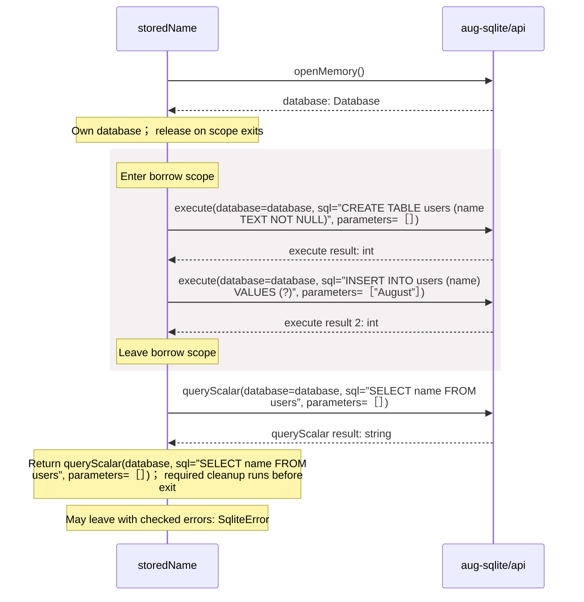

<!-- Generated by aug spec. Edit the August source, then regenerate. -->

# database.aug diagrams

[Project overview](.aug-spec/diagrams/index.md) · [Compiled explanation](database.aug.md)

## Sequences

Call arrows identify checked targets; loop and branch frames determine when they run. Open that target’s module to follow its implementation. Branches describe alternatives; loops describe repeated work. Native calls and interface dispatch stop at their declared contracts. Exit notes end that path; enclosing recovery and cleanup remain visible.

### storedName

[Source](database.aug#L5)

## Called contracts

- [storedName](database.aug.diagrams.md#sequence-storedName) — database.aug
- [execute](.aug-spec/packages/%40greenpandastudios/aug-sqlite/0.1.5/api.aug.diagrams.md#sequence-execute) — package/@greenpandastudios/aug-sqlite@0.1.5/api.aug
- [openMemory](.aug-spec/packages/%40greenpandastudios/aug-sqlite/0.1.5/api.aug.diagrams.md#sequence-openMemory) — package/@greenpandastudios/aug-sqlite@0.1.5/api.aug
- [queryScalar](.aug-spec/packages/%40greenpandastudios/aug-sqlite/0.1.5/api.aug.diagrams.md#sequence-queryScalar) — package/@greenpandastudios/aug-sqlite@0.1.5/api.aug
