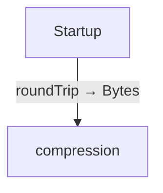
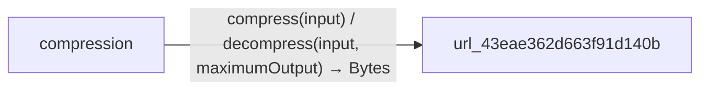

<!-- Generated by aug spec. Edit the August source, then regenerate. -->

# Project diagrams

Start here to see what moves between the application’s folders. Each arrow names an operation’s inputs and the result it returns to its caller. Open a folder for the next level of detail. Expand the contract list for complete types and dependency links.

## Data flow

### Package boundaries

compression package calls

Data crossing these boundaries (3 contracts)

| From | To | Operation and inputs | Result |
| --- | --- | --- | --- |
| compression | url\_43eae362d663f91d140b | [compress](../packages/%40greenpandastudios/aug-zlib/0.1.5/api.aug.md) · input: Bytes | Bytes |
| compression | url\_43eae362d663f91d140b | [decompress](../packages/%40greenpandastudios/aug-zlib/0.1.5/api.aug.md) · input: Bytes, maximumOutput: int | Bytes |
| Startup | compression | [roundTrip](../../compression.aug.md) | Bytes |

## Open a module

| Module | Read |
| --- | --- |
| compression.aug | [Flow and sequences](../../compression.aug.diagrams.md) · [Explanation](../../compression.aug.md) |
| main.aug | [Flow and sequences](../../main.aug.diagrams.md) · [Explanation](../../main.aug.md) |

These are static call boundaries, not a request trace. Interface implementations and foreign internals stop at their checked contracts. Dotted arrows defer a callback or browser action. Imports alone do not imply a call.
