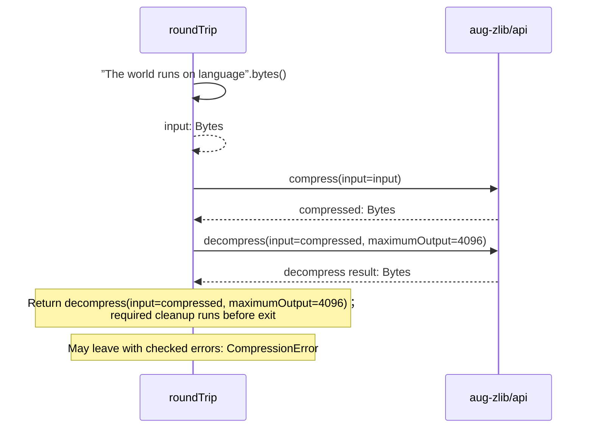

<!-- Generated by aug spec. Edit the August source, then regenerate. -->

# compression.aug diagrams

[Project overview](.aug-spec/diagrams/index.md) · [Compiled explanation](compression.aug.md)

## Sequences

Call arrows identify checked targets; loop and branch frames determine when they run. Open that target’s module to follow its implementation. Branches describe alternatives; loops describe repeated work. Native calls and interface dispatch stop at their declared contracts. Exit notes end that path; enclosing recovery and cleanup remain visible.

### roundTrip

[Source](compression.aug#L5)

## Called contracts

- [roundTrip](compression.aug.diagrams.md#sequence-roundTrip) — compression.aug
- [compress](.aug-spec/packages/%40greenpandastudios/aug-zlib/0.1.5/api.aug.diagrams.md#sequence-compress) — package/@greenpandastudios/aug-zlib@0.1.5/api.aug
- [decompress](.aug-spec/packages/%40greenpandastudios/aug-zlib/0.1.5/api.aug.diagrams.md#sequence-decompress) — package/@greenpandastudios/aug-zlib@0.1.5/api.aug
