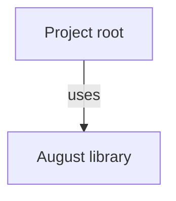
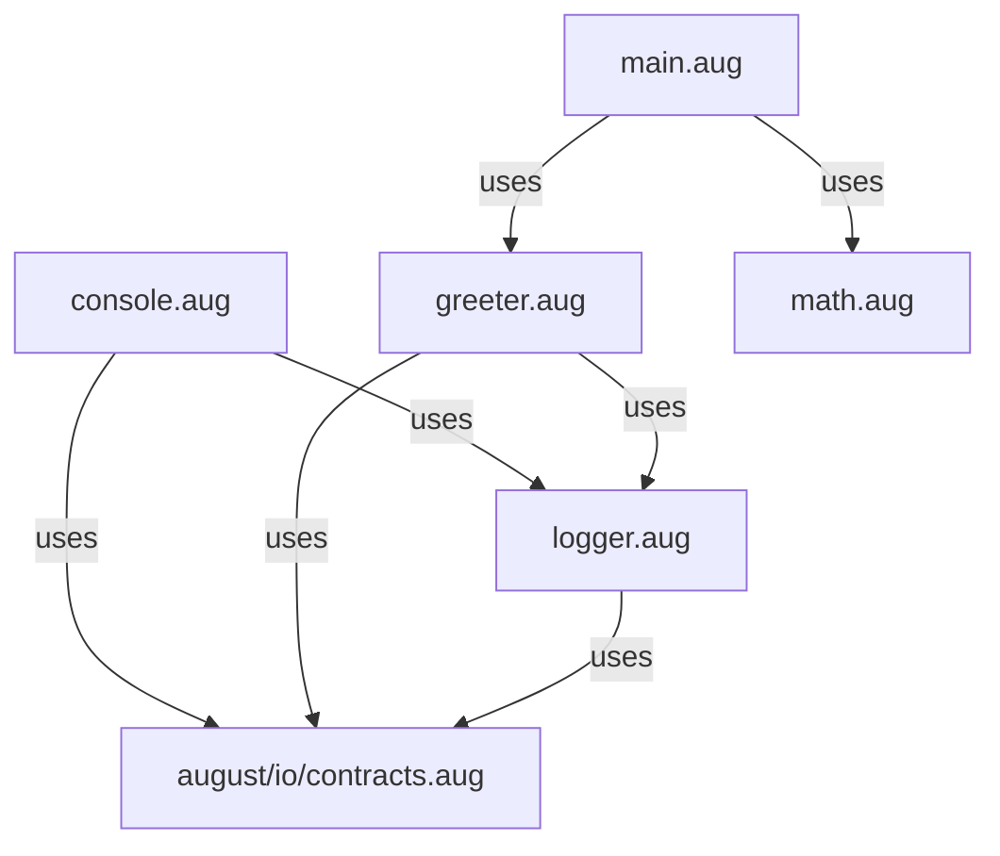

<!-- Generated by aug spec. Edit the August source, then regenerate. -->

# Project diagrams

Read the areas first, then open a module for its class interactions, API calls and sequences. Follow an operation to its specification and source.

These are checked static views. Arrows describe possible calls, not an execution trace. Interface implementations, callbacks and foreign internals are not guessed. Tests are described in the adjacent specifications.

## Areas

## Modules

## Open a module

| Module | Diagrams | Specification |
| --- | --- | --- |
| console.aug | [Interactions and sequences](../../console.aug.diagrams.md) | [Explanation](../../console.aug.md) |
| greeter.aug | [Interactions and sequences](../../greeter.aug.diagrams.md) | [Explanation](../../greeter.aug.md) |
| logger.aug | [Interactions and sequences](../../logger.aug.diagrams.md) | [Explanation](../../logger.aug.md) |
| main.aug | [Interactions and sequences](../../main.aug.diagrams.md) | [Explanation](../../main.aug.md) |
| math.aug | [Interactions and sequences](../../math.aug.diagrams.md) | [Explanation](../../math.aug.md) |
