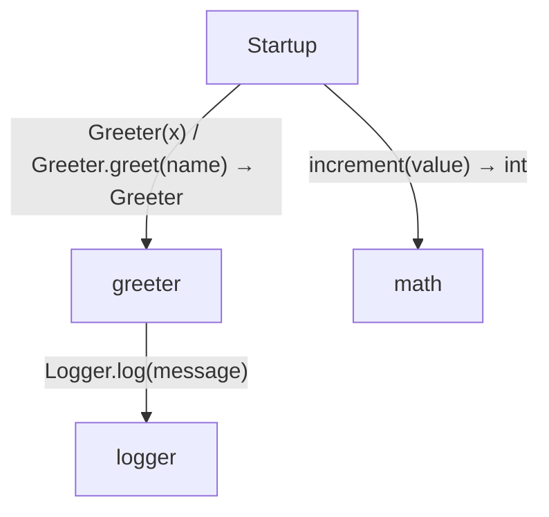
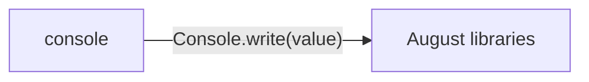

<!-- Generated by aug spec. Edit the August source, then regenerate. -->

# Project diagrams

Start here to see what moves between the application’s folders. Each arrow names an operation’s inputs and the result it returns to its caller. Open a folder for the next level of detail. Expand the contract list for complete types and dependency links.

## Data flow

### Package boundaries

console package calls

Data crossing these boundaries (5 contracts)

| From | To | Operation and inputs | Result |
| --- | --- | --- | --- |
| console | August libraries | [Console.write](../august/1.0.0/io/contracts.aug.md#symbol-Console.write) · value: string · interface dispatch | void |
| greeter | logger | [Logger.log](../../logger.aug.md#symbol-Logger.log) · message: string · interface dispatch | void |
| Startup | greeter | [Greeter](../../greeter.aug.md#symbol-Greeter) · x: int | Greeter |
| Startup | greeter | [Greeter.greet](../../greeter.aug.md#symbol-Greeter.greet) · name: string | void |
| Startup | math | [increment](../../math.aug.md#symbol-increment) · value: int | int |

## Open a module

| Module | Read |
| --- | --- |
| console.aug | [Flow and sequences](../../console.aug.diagrams.md) · [Explanation](../../console.aug.md) |
| greeter.aug | [Flow and sequences](../../greeter.aug.diagrams.md) · [Explanation](../../greeter.aug.md) |
| logger.aug | [Flow and sequences](../../logger.aug.diagrams.md) · [Explanation](../../logger.aug.md) |
| main.aug | [Flow and sequences](../../main.aug.diagrams.md) · [Explanation](../../main.aug.md) |
| math.aug | [Flow and sequences](../../math.aug.diagrams.md) · [Explanation](../../math.aug.md) |

These are static call boundaries, not a request trace. Interface implementations and foreign internals stop at their checked contracts. Dotted arrows defer a callback or browser action. Imports alone do not imply a call.
