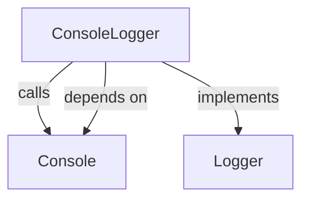
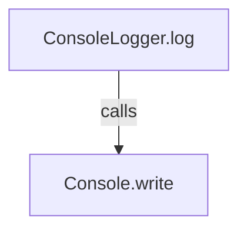
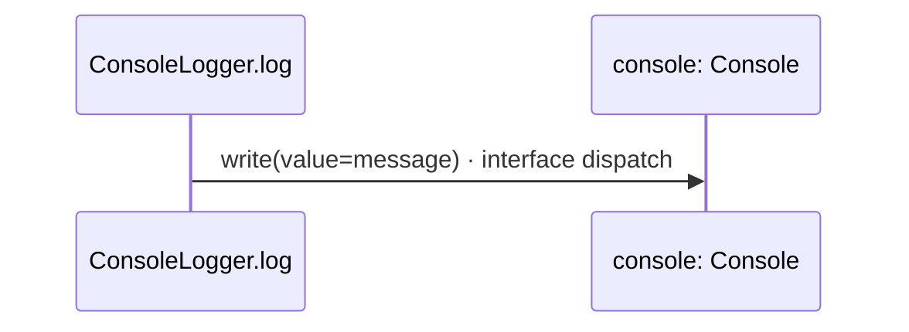

<!-- Generated by aug spec. Edit the August source, then regenerate. -->

# console.aug diagrams

[Project overview](.aug-spec/diagrams/index.md) · [Compiled explanation](console.aug.md)

## Class interactions

Call relationships

## Sequences

Call arrows identify checked targets; loop and branch frames determine when they run. Open that target’s module to follow its implementation. Branches describe alternatives; loops describe repeated work. Native calls and interface dispatch stop at their declared contracts. Exit notes end that path; enclosing recovery and cleanup remain visible.

### ConsoleLogger constructor

[Source](console.aug#L4)

[Explanation](console.aug.md).

### ConsoleLogger.log

[Source](console.aug#L5)

## Called contracts

- [Console](.aug-spec/august/0.23.0/io/contracts.aug.diagrams.md) — august/io/contracts.aug
- [Console.write](.aug-spec/august/0.23.0/io/contracts.aug.diagrams.md#sequence-Console.write) — august/io/contracts.aug
- [Logger](logger.aug.diagrams.md) — logger.aug
