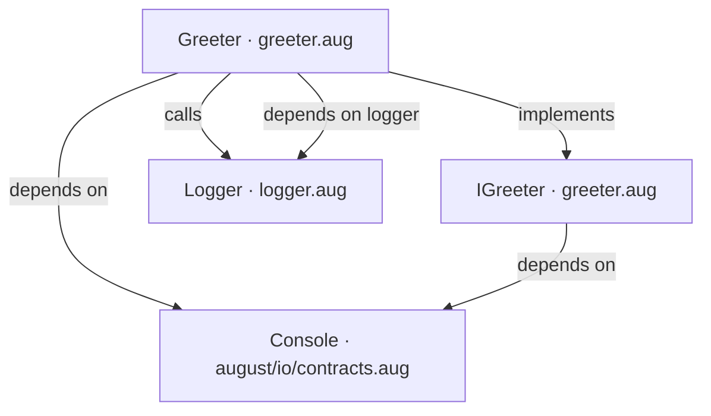
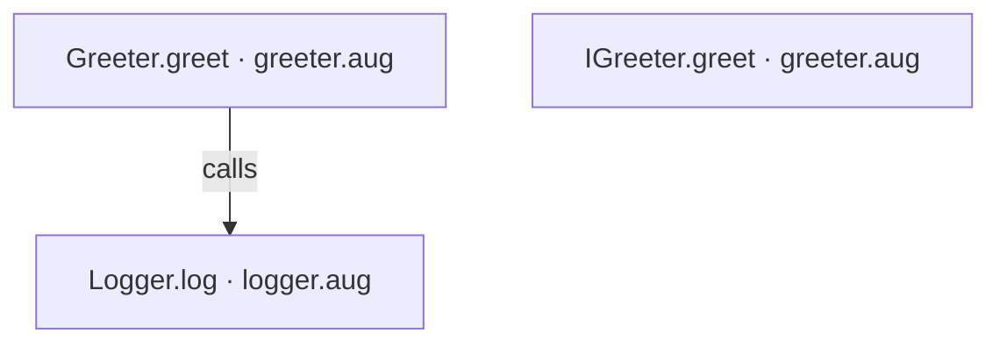
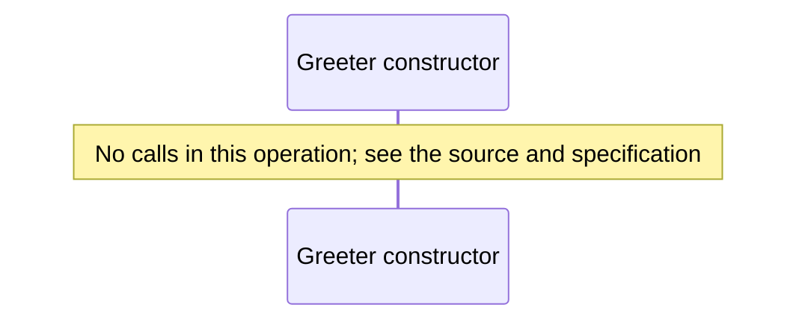
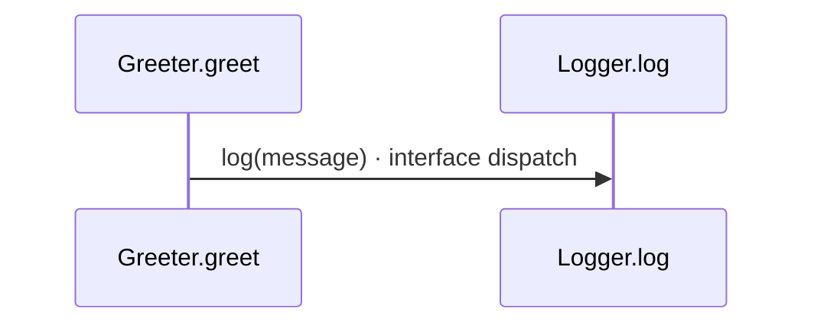
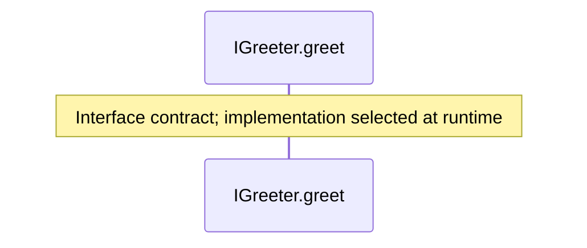

<!-- Generated by aug spec. Edit the August source, then regenerate. -->

# greeter.aug diagrams

[Project overview](.aug-spec/diagrams/index.md) · [Compiled explanation](greeter.aug.md)

## Class interactions

## API calls

## Sequences

Call arrows identify checked targets; loop and branch frames determine when they run. Open that target’s module to follow its implementation. Branches describe alternatives; loops describe repeated work. Native calls and interface dispatch stop at their declared contracts. Exit notes end that path; enclosing recovery and cleanup remain visible.

### Greeter constructor

[Source](greeter.aug#L4)

### Greeter.greet

[Source](greeter.aug#L5)

### IGreeter.greet

[Source](greeter.aug#L10)

## Called contracts

- [Console](.aug-spec/august/0.23.0/io/contracts.aug.diagrams.md) — august/io/contracts.aug
- [IGreeter](greeter.aug.diagrams.md) — greeter.aug
- [Logger.log](logger.aug.diagrams.md#sequence-Logger.log) — logger.aug
