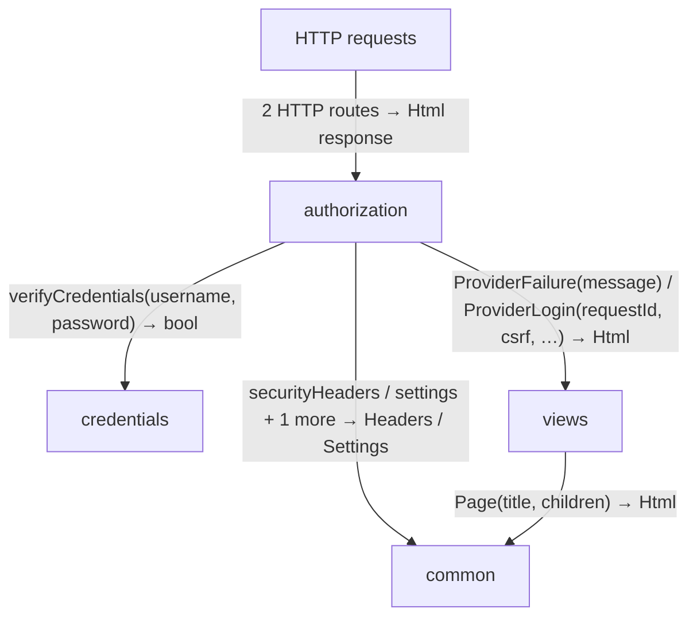
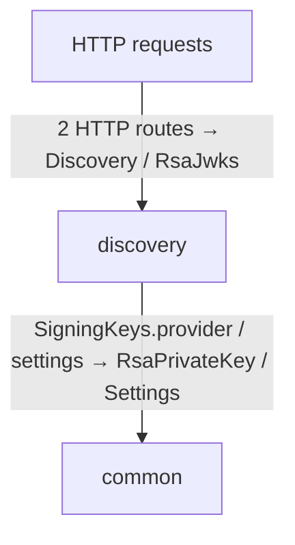
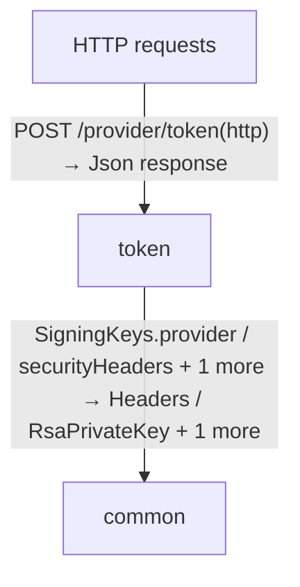
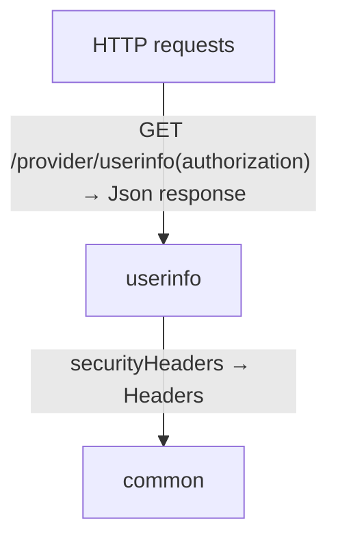
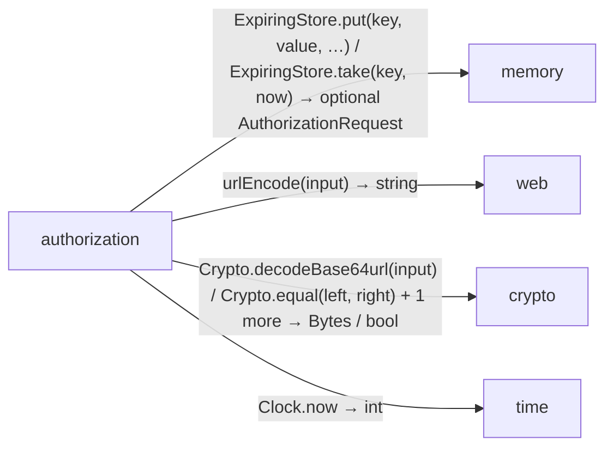
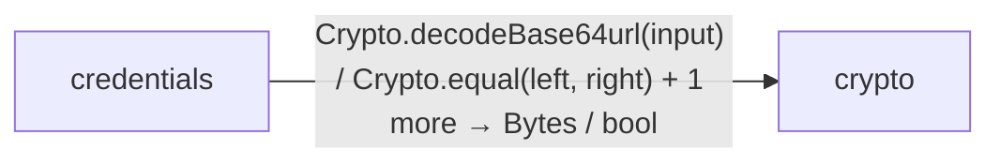
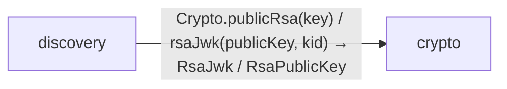
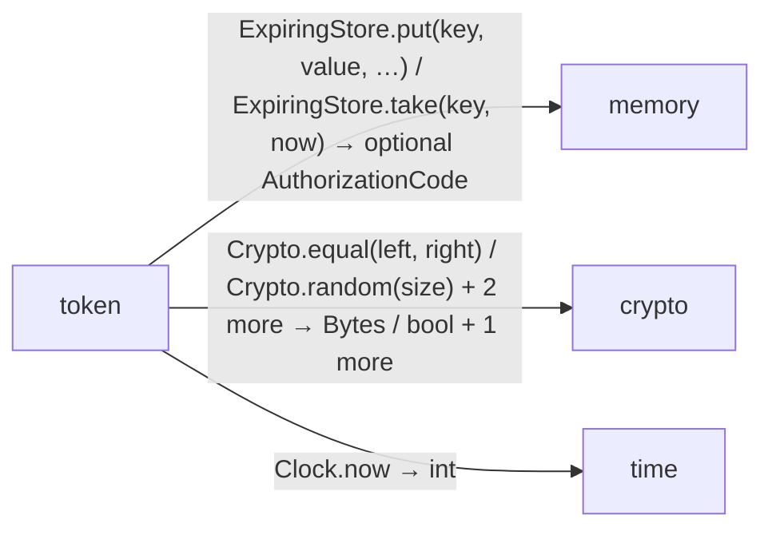
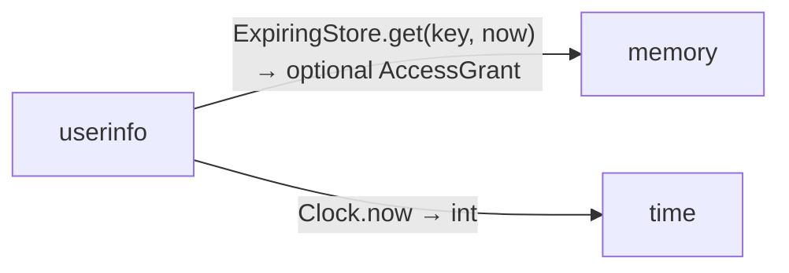

<!-- Generated by aug spec. Edit the August source, then regenerate. -->

# provider data flow

[Project overview](../../index.md)

This view opens the provider folder one level deeper. Each arrow shows the called operation and the data it returns to its caller. Calls inside a file stay in that file’s sequence view.

### authorization request flow

### discovery request flow

### token request flow

### userinfo request flow

### Package boundaries

authorization package calls

credentials package calls

discovery package calls

token package calls

userinfo package calls

### Follow the data

Each row opens the complete operations and call sites behind one pair of logical units. A grouped arrow records calls between those units; connected arrows need not belong to the same execution path.

| From | To | Operations | Read |
| --- | --- | --- | --- |
| HTTP requests | authorization | 2 | [Inputs, results and call sites](index.md#boundary-f284ddc14b35) |
| HTTP requests | discovery | 2 | [Inputs, results and call sites](index.md#boundary-d5e31773ee9e) |
| HTTP requests | token | 1 | [Inputs, results and call sites](index.md#boundary-43950ba19cd9) |
| HTTP requests | userinfo | 1 | [Inputs, results and call sites](index.md#boundary-2a457b6a5230) |
| client | contracts | 2 | [Inputs, results and call sites](index.md#boundary-c07a1079a00b) |
| authorization | common | 3 | [Inputs, results and call sites](index.md#boundary-e025c605bcf9) |
| authorization | memory | 3 | [Inputs, results and call sites](index.md#boundary-d69b612153ca) |
| authorization | web | 1 | [Inputs, results and call sites](index.md#boundary-d728919085d1) |
| authorization | crypto | 3 | [Inputs, results and call sites](index.md#boundary-10da6ae22ab5) |
| authorization | time | 1 | [Inputs, results and call sites](index.md#boundary-1f5e9371d670) |
| authorization | contracts | 3 | [Inputs, results and call sites](index.md#boundary-8d892e560a3f) |
| authorization | credentials | 1 | [Inputs, results and call sites](index.md#boundary-447618afade3) |
| authorization | views | 2 | [Inputs, results and call sites](index.md#boundary-f2004fedde81) |
| credentials | crypto | 3 | [Inputs, results and call sites](index.md#boundary-e690d8c4a6e7) |
| discovery | common | 2 | [Inputs, results and call sites](index.md#boundary-5a61a88aa885) |
| discovery | crypto | 3 | [Inputs, results and call sites](index.md#boundary-b9b053fb734e) |
| token | common | 3 | [Inputs, results and call sites](index.md#boundary-29c1da3ea87d) |
| token | memory | 2 | [Inputs, results and call sites](index.md#boundary-2bb31b97bec3) |
| token | crypto | 4 | [Inputs, results and call sites](index.md#boundary-ed5062e3a216) |
| token | time | 1 | [Inputs, results and call sites](index.md#boundary-f8fb399999a2) |
| token | contracts | 4 | [Inputs, results and call sites](index.md#boundary-a8fc6b5c1ba9) |
| userinfo | common | 1 | [Inputs, results and call sites](index.md#boundary-7c4faf1fcaf1) |
| userinfo | memory | 1 | [Inputs, results and call sites](index.md#boundary-74dadc8a2223) |
| userinfo | time | 1 | [Inputs, results and call sites](index.md#boundary-1cf0606016d3) |
| userinfo | contracts | 1 | [Inputs, results and call sites](index.md#boundary-55eacb4e151f) |
| views | common | 1 | [Inputs, results and call sites](index.md#boundary-22e2bbdb9f94) |

#### Data crossing these boundaries (52 contracts)

#### HTTP requests → authorization

2 operations, 2 sites

**[GET /provider/authorize](../../../../provider/authorization.aug.md#symbol-authorize)** · HTTP endpoint

Inputs: response\_type: string from query, client\_id: string from query, redirect\_uri: string from query, requestedScope: string from query, state: string from query, nonce: string from query, code\_challenge: string from query, code\_challenge\_method: string from query. Result: HttpResponse\<Html\>.

| Caller or entry | Evidence |
| --- | --- |
| HTTP requests | [Declaration](../../../../provider/authorization.aug#L12) · [Caller explanation](../../../../provider/authorization.aug.md#symbol-authorize) |

**[POST /provider/login](../../../../provider/authorization.aug.md#symbol-providerLogin)** · HTTP endpoint

Inputs: form: LoginForm from form, browser: optional string from cookie, origin: optional string from header. Result: HttpResponse\<Html\>.

| Caller or entry | Evidence |
| --- | --- |
| HTTP requests | [Declaration](../../../../provider/authorization.aug#L35) · [Caller explanation](../../../../provider/authorization.aug.md#symbol-providerLogin) |

#### HTTP requests → discovery

2 operations, 2 sites

**[GET /provider/.well-known/openid-configuration](../../../../provider/discovery.aug.md#symbol-discovery)** · HTTP endpoint

No caller-supplied inputs. Result: Discovery.

| Caller or entry | Evidence |
| --- | --- |
| HTTP requests | [Declaration](../../../../provider/discovery.aug#L7) · [Caller explanation](../../../../provider/discovery.aug.md#symbol-discovery) |

**[GET /provider/jwks](../../../../provider/discovery.aug.md#symbol-jwks)** · HTTP endpoint

No caller-supplied inputs. Result: RsaJwks.

| Caller or entry | Evidence |
| --- | --- |
| HTTP requests | [Declaration](../../../../provider/discovery.aug#L12) · [Caller explanation](../../../../provider/discovery.aug.md#symbol-jwks) |

#### HTTP requests → token

1 operation, 1 site

**[POST /provider/token](../../../../provider/token.aug.md#symbol-token)** · HTTP endpoint

Inputs: http: HttpRequest from request. Result: HttpResponse\<Json\>.

| Caller or entry | Evidence |
| --- | --- |
| HTTP requests | [Declaration](../../../../provider/token.aug#L12) · [Caller explanation](../../../../provider/token.aug.md#symbol-token) |

#### HTTP requests → userinfo

1 operation, 1 site

**[GET /provider/userinfo](../../../../provider/userinfo.aug.md#symbol-userinfo)** · HTTP endpoint

Inputs: authorization: optional string from header. Result: HttpResponse\<Json\>.

| Caller or entry | Evidence |
| --- | --- |
| HTTP requests | [Declaration](../../../../provider/userinfo.aug#L8) · [Caller explanation](../../../../provider/userinfo.aug.md#symbol-userinfo) |

#### client → contracts

2 operations, 4 sites

**[IdClaims](../../../../provider/contracts.aug.md#symbol-IdClaims)** · value construction

Inputs: iss: string, sub: string, aud: string, exp: int, iat: int, nonce: string, name: string. Result: IdClaims.

| Caller or entry | Evidence |
| --- | --- |
| test validateIdentity | [Call site](../../../../client/protocol.aug#L77) · [Caller explanation](../../../../client/protocol.aug.md#symbol-test%20validateIdentity) |
| test validateIdentity | [Call site](../../../../client/protocol.aug#L92) · [Caller explanation](../../../../client/protocol.aug.md#symbol-test%20validateIdentity) |
| test validateIdentity | [Call site](../../../../client/protocol.aug#L101) · [Caller explanation](../../../../client/protocol.aug.md#symbol-test%20validateIdentity) |

**[UserInfo](../../../../provider/contracts.aug.md#symbol-UserInfo)** · value construction

Inputs: sub: string, name: string. Result: UserInfo.

| Caller or entry | Evidence |
| --- | --- |
| me | [Call site](../../../../client/endpoints.aug#L22) · [Caller explanation](../../../../client/endpoints.aug.md#symbol-me) |

#### authorization → common

3 operations, 12 sites

**[securityHeaders](../../../../common/headers.aug.md#symbol-securityHeaders)**

No caller-supplied inputs. Result: Headers.

| Caller or entry | Evidence |
| --- | --- |
| authorize | [Call site](../../../../provider/authorization.aug#L31) · [Caller explanation](../../../../provider/authorization.aug.md#symbol-authorize) |
| providerLogin | [Call site](../../../../provider/authorization.aug#L39) · [Caller explanation](../../../../provider/authorization.aug.md#symbol-providerLogin) |
| providerLogin | [Call site](../../../../provider/authorization.aug#L42) · [Caller explanation](../../../../provider/authorization.aug.md#symbol-providerLogin) |
| providerLogin | [Call site](../../../../provider/authorization.aug#L46) · [Caller explanation](../../../../provider/authorization.aug.md#symbol-providerLogin) |
| providerLogin | [Call site](../../../../provider/authorization.aug#L49) · [Caller explanation](../../../../provider/authorization.aug.md#symbol-providerLogin) |
| providerLogin | [Call site](../../../../provider/authorization.aug#L51) · [Caller explanation](../../../../provider/authorization.aug.md#symbol-providerLogin) |
| providerLogin | [Call site](../../../../provider/authorization.aug#L57) · [Caller explanation](../../../../provider/authorization.aug.md#symbol-providerLogin) |
| providerLogin | [Call site](../../../../provider/authorization.aug#L60) · [Caller explanation](../../../../provider/authorization.aug.md#symbol-providerLogin) |

**[settings](../../../../common/settings.aug.md#symbol-settings)**

No caller-supplied inputs. Result: Settings.

| Caller or entry | Evidence |
| --- | --- |
| authorize | [Call site](../../../../provider/authorization.aug#L13) · [Caller explanation](../../../../provider/authorization.aug.md#symbol-authorize) |
| providerLogin | [Call site](../../../../provider/authorization.aug#L36) · [Caller explanation](../../../../provider/authorization.aug.md#symbol-providerLogin) |

**[withCookie](../../../../common/headers.aug.md#symbol-withCookie)**

Inputs: headers: Headers, name: string, value: string, path: string, maxAge: int, secure: bool. Result: Headers.

| Caller or entry | Evidence |
| --- | --- |
| authorize | [Call site](../../../../provider/authorization.aug#L31) · [Caller explanation](../../../../provider/authorization.aug.md#symbol-authorize) |
| providerLogin | [Call site](../../../../provider/authorization.aug#L57) · [Caller explanation](../../../../provider/authorization.aug.md#symbol-providerLogin) |

#### authorization → memory

3 operations, 3 sites

**[ExpiringStore.put](../../../packages/%40git/url_0eb7c89453c87681ed15/0.0.0-git.a39fc582565d4fca40be4f75fa304d71adc69301/store.aug.md#symbol-ExpiringStore.put)** · interface dispatch

Inputs: key: string, value: AuthorizationCode, expires: int, now: int. Result: void.

| Caller or entry | Evidence |
| --- | --- |
| providerLogin | [Call site](../../../../provider/authorization.aug#L55) · [Caller explanation](../../../../provider/authorization.aug.md#symbol-providerLogin) |

**[ExpiringStore.put](../../../packages/%40git/url_0eb7c89453c87681ed15/0.0.0-git.a39fc582565d4fca40be4f75fa304d71adc69301/store.aug.md#symbol-ExpiringStore.put)** · interface dispatch

Inputs: key: string, value: AuthorizationRequest, expires: int, now: int. Result: void.

| Caller or entry | Evidence |
| --- | --- |
| authorize | [Call site](../../../../provider/authorization.aug#L30) · [Caller explanation](../../../../provider/authorization.aug.md#symbol-authorize) |

**[ExpiringStore.take](../../../packages/%40git/url_0eb7c89453c87681ed15/0.0.0-git.a39fc582565d4fca40be4f75fa304d71adc69301/store.aug.md#symbol-ExpiringStore.take)** · interface dispatch

Inputs: key: string, now: int. Result: optional AuthorizationRequest.

| Caller or entry | Evidence |
| --- | --- |
| providerLogin | [Call site](../../../../provider/authorization.aug#L40) · [Caller explanation](../../../../provider/authorization.aug.md#symbol-providerLogin) |

#### authorization → web

1 operation, 2 sites

**[urlEncode](../../../packages/%40git/url_897efafd565158fc4908/0.0.0-git.a39fc582565d4fca40be4f75fa304d71adc69301/contracts.aug.md#symbol-urlEncode)**

Inputs: input: string. Result: string.

| Caller or entry | Evidence |
| --- | --- |
| providerLogin | [Call site](../../../../provider/authorization.aug#L56) · [Caller explanation](../../../../provider/authorization.aug.md#symbol-providerLogin) |
| providerLogin | [Call site](../../../../provider/authorization.aug#L56) · [Caller explanation](../../../../provider/authorization.aug.md#symbol-providerLogin) |

#### authorization → crypto

3 operations, 7 sites

**[Crypto.decodeBase64url](../../../packages/%40git/url_9ef654c66d34ab8f5527/0.0.0-git.b14a0f9aa41f1ce58bd51133bcdc424033e40d40/contracts.aug.md#symbol-Crypto.decodeBase64url)** · interface dispatch

Inputs: input: string. Result: Bytes.

| Caller or entry | Evidence |
| --- | --- |
| authorize | [Call site](../../../../provider/authorization.aug#L21) · [Caller explanation](../../../../provider/authorization.aug.md#symbol-authorize) |

**[Crypto.equal](../../../packages/%40git/url_9ef654c66d34ab8f5527/0.0.0-git.b14a0f9aa41f1ce58bd51133bcdc424033e40d40/contracts.aug.md#symbol-Crypto.equal)** · interface dispatch

Inputs: left: Bytes, right: Bytes. Result: bool.

| Caller or entry | Evidence |
| --- | --- |
| providerLogin | [Call site](../../../../provider/authorization.aug#L48) · [Caller explanation](../../../../provider/authorization.aug.md#symbol-providerLogin) |
| providerLogin | [Call site](../../../../provider/authorization.aug#L48) · [Caller explanation](../../../../provider/authorization.aug.md#symbol-providerLogin) |

**[Crypto.random](../../../packages/%40git/url_9ef654c66d34ab8f5527/0.0.0-git.b14a0f9aa41f1ce58bd51133bcdc424033e40d40/contracts.aug.md#symbol-Crypto.random)** · interface dispatch

Inputs: size: int. Result: Bytes.

| Caller or entry | Evidence |
| --- | --- |
| authorize | [Call site](../../../../provider/authorization.aug#L25) · [Caller explanation](../../../../provider/authorization.aug.md#symbol-authorize) |
| authorize | [Call site](../../../../provider/authorization.aug#L26) · [Caller explanation](../../../../provider/authorization.aug.md#symbol-authorize) |
| authorize | [Call site](../../../../provider/authorization.aug#L27) · [Caller explanation](../../../../provider/authorization.aug.md#symbol-authorize) |
| providerLogin | [Call site](../../../../provider/authorization.aug#L53) · [Caller explanation](../../../../provider/authorization.aug.md#symbol-providerLogin) |

#### authorization → time

1 operation, 3 sites

**[Clock.now](../../../packages/%40git/url_c092cd151499c4e1d8a1/0.0.0-git.a39fc582565d4fca40be4f75fa304d71adc69301/contracts.aug.md#symbol-Clock.now)** · interface dispatch

No caller-supplied inputs. Result: int.

| Caller or entry | Evidence |
| --- | --- |
| authorize | [Call site](../../../../provider/authorization.aug#L28) · [Caller explanation](../../../../provider/authorization.aug.md#symbol-authorize) |
| providerLogin | [Call site](../../../../provider/authorization.aug#L40) · [Caller explanation](../../../../provider/authorization.aug.md#symbol-providerLogin) |
| providerLogin | [Call site](../../../../provider/authorization.aug#L52) · [Caller explanation](../../../../provider/authorization.aug.md#symbol-providerLogin) |

#### authorization → contracts

3 operations, 7 sites

**[AuthorizationCode](../../../../provider/contracts.aug.md#symbol-AuthorizationCode)** · value construction

Inputs: clientId: string, redirectUri: string, challenge: string, nonce: string, subject: string, name: string, expires: int. Result: AuthorizationCode.

| Caller or entry | Evidence |
| --- | --- |
| providerLogin | [Call site](../../../../provider/authorization.aug#L54) · [Caller explanation](../../../../provider/authorization.aug.md#symbol-providerLogin) |

**[AuthorizationRequest](../../../../provider/contracts.aug.md#symbol-AuthorizationRequest)** · value construction

Inputs: clientId: string, redirectUri: string, state: string, nonce: string, challenge: string, browser: string, csrf: string, expires: int. Result: AuthorizationRequest.

| Caller or entry | Evidence |
| --- | --- |
| authorize | [Call site](../../../../provider/authorization.aug#L29) · [Caller explanation](../../../../provider/authorization.aug.md#symbol-authorize) |

**[LoginError](../../../../provider/contracts.aug.md#symbol-LoginError)** · value construction

No caller-supplied inputs. Result: LoginError.

| Caller or entry | Evidence |
| --- | --- |
| authorize | [Call site](../../../../provider/authorization.aug#L15) · [Caller explanation](../../../../provider/authorization.aug.md#symbol-authorize) |
| authorize | [Call site](../../../../provider/authorization.aug#L17) · [Caller explanation](../../../../provider/authorization.aug.md#symbol-authorize) |
| authorize | [Call site](../../../../provider/authorization.aug#L19) · [Caller explanation](../../../../provider/authorization.aug.md#symbol-authorize) |
| authorize | [Call site](../../../../provider/authorization.aug#L22) · [Caller explanation](../../../../provider/authorization.aug.md#symbol-authorize) |
| authorize | [Call site](../../../../provider/authorization.aug#L24) · [Caller explanation](../../../../provider/authorization.aug.md#symbol-authorize) |

#### authorization → credentials

1 operation, 1 site

**[verifyCredentials](../../../../provider/credentials.aug.md#symbol-verifyCredentials)**

Inputs: username: string, password: string. Result: bool.

| Caller or entry | Evidence |
| --- | --- |
| providerLogin | [Call site](../../../../provider/authorization.aug#L50) · [Caller explanation](../../../../provider/authorization.aug.md#symbol-providerLogin) |

#### authorization → views

2 operations, 7 sites

**[ProviderFailure](../../../../provider/views.aug.md#symbol-ProviderFailure)**

Inputs: message: string. Result: Html.

| Caller or entry | Evidence |
| --- | --- |
| providerLogin | [Call site](../../../../provider/authorization.aug#L39) · [Caller explanation](../../../../provider/authorization.aug.md#symbol-providerLogin) |
| providerLogin | [Call site](../../../../provider/authorization.aug#L42) · [Caller explanation](../../../../provider/authorization.aug.md#symbol-providerLogin) |
| providerLogin | [Call site](../../../../provider/authorization.aug#L46) · [Caller explanation](../../../../provider/authorization.aug.md#symbol-providerLogin) |
| providerLogin | [Call site](../../../../provider/authorization.aug#L49) · [Caller explanation](../../../../provider/authorization.aug.md#symbol-providerLogin) |
| providerLogin | [Call site](../../../../provider/authorization.aug#L51) · [Caller explanation](../../../../provider/authorization.aug.md#symbol-providerLogin) |
| providerLogin | [Call site](../../../../provider/authorization.aug#L60) · [Caller explanation](../../../../provider/authorization.aug.md#symbol-providerLogin) |

**[ProviderLogin](../../../../provider/views.aug.md#symbol-ProviderLogin)**

Inputs: requestId: string, csrf: string, message: string, submit: HttpAction. Result: Html.

| Caller or entry | Evidence |
| --- | --- |
| authorize | [Call site](../../../../provider/authorization.aug#L32) · [Caller explanation](../../../../provider/authorization.aug.md#symbol-authorize) |

#### credentials → crypto

3 operations, 4 sites

**[Crypto.decodeBase64url](../../../packages/%40git/url_9ef654c66d34ab8f5527/0.0.0-git.b14a0f9aa41f1ce58bd51133bcdc424033e40d40/contracts.aug.md#symbol-Crypto.decodeBase64url)** · interface dispatch

Inputs: input: string. Result: Bytes.

| Caller or entry | Evidence |
| --- | --- |
| verifyCredentials | [Call site](../../../../provider/credentials.aug#L8) · [Caller explanation](../../../../provider/credentials.aug.md#symbol-verifyCredentials) |

**[Crypto.equal](../../../packages/%40git/url_9ef654c66d34ab8f5527/0.0.0-git.b14a0f9aa41f1ce58bd51133bcdc424033e40d40/contracts.aug.md#symbol-Crypto.equal)** · interface dispatch

Inputs: left: Bytes, right: Bytes. Result: bool.

| Caller or entry | Evidence |
| --- | --- |
| verifyCredentials | [Call site](../../../../provider/credentials.aug#L9) · [Caller explanation](../../../../provider/credentials.aug.md#symbol-verifyCredentials) |
| verifyCredentials | [Call site](../../../../provider/credentials.aug#L10) · [Caller explanation](../../../../provider/credentials.aug.md#symbol-verifyCredentials) |

**[Crypto.passwordHash](../../../packages/%40git/url_9ef654c66d34ab8f5527/0.0.0-git.b14a0f9aa41f1ce58bd51133bcdc424033e40d40/contracts.aug.md#symbol-Crypto.passwordHash)** · interface dispatch

Inputs: password: Bytes, salt: Bytes, iterations: int. Result: Bytes.

| Caller or entry | Evidence |
| --- | --- |
| verifyCredentials | [Call site](../../../../provider/credentials.aug#L7) · [Caller explanation](../../../../provider/credentials.aug.md#symbol-verifyCredentials) |

#### discovery → common

2 operations, 2 sites

**[SigningKeys.provider](../../../../common/keys.aug.md#symbol-SigningKeys.provider)** · interface dispatch

No caller-supplied inputs. Result: RsaPrivateKey.

| Caller or entry | Evidence |
| --- | --- |
| jwks | [Call site](../../../../provider/discovery.aug#L13) · [Caller explanation](../../../../provider/discovery.aug.md#symbol-jwks) |

**[settings](../../../../common/settings.aug.md#symbol-settings)**

No caller-supplied inputs. Result: Settings.

| Caller or entry | Evidence |
| --- | --- |
| discovery | [Call site](../../../../provider/discovery.aug#L8) · [Caller explanation](../../../../provider/discovery.aug.md#symbol-discovery) |

#### discovery → crypto

3 operations, 3 sites

**[Crypto.publicRsa](../../../packages/%40git/url_9ef654c66d34ab8f5527/0.0.0-git.b14a0f9aa41f1ce58bd51133bcdc424033e40d40/contracts.aug.md#symbol-Crypto.publicRsa)** · interface dispatch

Inputs: key: RsaPrivateKey. Result: RsaPublicKey.

| Caller or entry | Evidence |
| --- | --- |
| jwks | [Call site](../../../../provider/discovery.aug#L13) · [Caller explanation](../../../../provider/discovery.aug.md#symbol-jwks) |

**[RsaJwks](../../../packages/%40git/url_9ef654c66d34ab8f5527/0.0.0-git.b14a0f9aa41f1ce58bd51133bcdc424033e40d40/jose.aug.md#symbol-RsaJwks)** · value construction

Inputs: keys: List\<RsaJwk\>. Result: RsaJwks.

| Caller or entry | Evidence |
| --- | --- |
| jwks | [Call site](../../../../provider/discovery.aug#L14) · [Caller explanation](../../../../provider/discovery.aug.md#symbol-jwks) |

**[rsaJwk](../../../packages/%40git/url_9ef654c66d34ab8f5527/0.0.0-git.b14a0f9aa41f1ce58bd51133bcdc424033e40d40/jose.aug.md#symbol-rsaJwk)**

Inputs: publicKey: RsaPublicKey, kid: string. Result: RsaJwk.

| Caller or entry | Evidence |
| --- | --- |
| jwks | [Call site](../../../../provider/discovery.aug#L14) · [Caller explanation](../../../../provider/discovery.aug.md#symbol-jwks) |

#### token → common

3 operations, 4 sites

**[SigningKeys.provider](../../../../common/keys.aug.md#symbol-SigningKeys.provider)** · interface dispatch

No caller-supplied inputs. Result: RsaPrivateKey.

| Caller or entry | Evidence |
| --- | --- |
| token | [Call site](../../../../provider/token.aug#L31) · [Caller explanation](../../../../provider/token.aug.md#symbol-token) |

**[securityHeaders](../../../../common/headers.aug.md#symbol-securityHeaders)**

No caller-supplied inputs. Result: Headers.

| Caller or entry | Evidence |
| --- | --- |
| \_oauthError | [Call site](../../../../provider/token.aug#L9) · [Caller explanation](../../../../provider/token.aug.md#symbol-_oauthError) |
| token | [Call site](../../../../provider/token.aug#L36) · [Caller explanation](../../../../provider/token.aug.md#symbol-token) |

**[settings](../../../../common/settings.aug.md#symbol-settings)**

No caller-supplied inputs. Result: Settings.

| Caller or entry | Evidence |
| --- | --- |
| token | [Call site](../../../../provider/token.aug#L13) · [Caller explanation](../../../../provider/token.aug.md#symbol-token) |

#### token → memory

2 operations, 2 sites

**[ExpiringStore.put](../../../packages/%40git/url_0eb7c89453c87681ed15/0.0.0-git.a39fc582565d4fca40be4f75fa304d71adc69301/store.aug.md#symbol-ExpiringStore.put)** · interface dispatch

Inputs: key: string, value: AccessGrant, expires: int, now: int. Result: void.

| Caller or entry | Evidence |
| --- | --- |
| token | [Call site](../../../../provider/token.aug#L34) · [Caller explanation](../../../../provider/token.aug.md#symbol-token) |

**[ExpiringStore.take](../../../packages/%40git/url_0eb7c89453c87681ed15/0.0.0-git.a39fc582565d4fca40be4f75fa304d71adc69301/store.aug.md#symbol-ExpiringStore.take)** · interface dispatch

Inputs: key: string, now: int. Result: optional AuthorizationCode.

| Caller or entry | Evidence |
| --- | --- |
| token | [Call site](../../../../provider/token.aug#L23) · [Caller explanation](../../../../provider/token.aug.md#symbol-token) |

#### token → crypto

4 operations, 4 sites

**[Crypto.equal](../../../packages/%40git/url_9ef654c66d34ab8f5527/0.0.0-git.b14a0f9aa41f1ce58bd51133bcdc424033e40d40/contracts.aug.md#symbol-Crypto.equal)** · interface dispatch

Inputs: left: Bytes, right: Bytes. Result: bool.

| Caller or entry | Evidence |
| --- | --- |
| token | [Call site](../../../../provider/token.aug#L28) · [Caller explanation](../../../../provider/token.aug.md#symbol-token) |

**[Crypto.random](../../../packages/%40git/url_9ef654c66d34ab8f5527/0.0.0-git.b14a0f9aa41f1ce58bd51133bcdc424033e40d40/contracts.aug.md#symbol-Crypto.random)** · interface dispatch

Inputs: size: int. Result: Bytes.

| Caller or entry | Evidence |
| --- | --- |
| token | [Call site](../../../../provider/token.aug#L32) · [Caller explanation](../../../../provider/token.aug.md#symbol-token) |

**[Crypto.sha256](../../../packages/%40git/url_9ef654c66d34ab8f5527/0.0.0-git.b14a0f9aa41f1ce58bd51133bcdc424033e40d40/contracts.aug.md#symbol-Crypto.sha256)** · interface dispatch

Inputs: input: Bytes. Result: Bytes.

| Caller or entry | Evidence |
| --- | --- |
| token | [Call site](../../../../provider/token.aug#L27) · [Caller explanation](../../../../provider/token.aug.md#symbol-token) |

**[signJwt](../../../packages/%40git/url_9ef654c66d34ab8f5527/0.0.0-git.b14a0f9aa41f1ce58bd51133bcdc424033e40d40/jose.aug.md#symbol-signJwt)**

Inputs: key: RsaPrivateKey, claims: Json, kid: string, tokenType: string. Result: string.

| Caller or entry | Evidence |
| --- | --- |
| token | [Call site](../../../../provider/token.aug#L31) · [Caller explanation](../../../../provider/token.aug.md#symbol-token) |

#### token → time

1 operation, 1 site

**[Clock.now](../../../packages/%40git/url_c092cd151499c4e1d8a1/0.0.0-git.a39fc582565d4fca40be4f75fa304d71adc69301/contracts.aug.md#symbol-Clock.now)** · interface dispatch

No caller-supplied inputs. Result: int.

| Caller or entry | Evidence |
| --- | --- |
| token | [Call site](../../../../provider/token.aug#L22) · [Caller explanation](../../../../provider/token.aug.md#symbol-token) |

#### token → contracts

4 operations, 4 sites

**[AccessGrant](../../../../provider/contracts.aug.md#symbol-AccessGrant)** · value construction

Inputs: subject: string, name: string, expires: int. Result: AccessGrant.

| Caller or entry | Evidence |
| --- | --- |
| token | [Call site](../../../../provider/token.aug#L33) · [Caller explanation](../../../../provider/token.aug.md#symbol-token) |

**[IdClaims](../../../../provider/contracts.aug.md#symbol-IdClaims)** · value construction

Inputs: iss: string, sub: string, aud: string, exp: int, iat: int, nonce: string, name: string. Result: IdClaims.

| Caller or entry | Evidence |
| --- | --- |
| token | [Call site](../../../../provider/token.aug#L30) · [Caller explanation](../../../../provider/token.aug.md#symbol-token) |

**[OAuthError](../../../../provider/contracts.aug.md#symbol-OAuthError)** · value construction

Inputs: error: string, error\_description: string. Result: OAuthError.

| Caller or entry | Evidence |
| --- | --- |
| \_oauthError | [Call site](../../../../provider/token.aug#L9) · [Caller explanation](../../../../provider/token.aug.md#symbol-_oauthError) |

**[TokenResponse](../../../../provider/contracts.aug.md#symbol-TokenResponse)** · value construction

Inputs: token\_type: string, access\_token: string, id\_token: string, expires\_in: int, scope: string. Result: TokenResponse.

| Caller or entry | Evidence |
| --- | --- |
| token | [Call site](../../../../provider/token.aug#L35) · [Caller explanation](../../../../provider/token.aug.md#symbol-token) |

#### userinfo → common

1 operation, 2 sites

**[securityHeaders](../../../../common/headers.aug.md#symbol-securityHeaders)**

No caller-supplied inputs. Result: Headers.

| Caller or entry | Evidence |
| --- | --- |
| userinfo | [Call site](../../../../provider/userinfo.aug#L23) · [Caller explanation](../../../../provider/userinfo.aug.md#symbol-userinfo) |
| userinfo | [Call site](../../../../provider/userinfo.aug#L26) · [Caller explanation](../../../../provider/userinfo.aug.md#symbol-userinfo) |

#### userinfo → memory

1 operation, 1 site

**[ExpiringStore.get](../../../packages/%40git/url_0eb7c89453c87681ed15/0.0.0-git.a39fc582565d4fca40be4f75fa304d71adc69301/store.aug.md#symbol-ExpiringStore.get)** · interface dispatch

Inputs: key: string, now: int. Result: optional AccessGrant.

| Caller or entry | Evidence |
| --- | --- |
| userinfo | [Call site](../../../../provider/userinfo.aug#L19) · [Caller explanation](../../../../provider/userinfo.aug.md#symbol-userinfo) |

#### userinfo → time

1 operation, 1 site

**[Clock.now](../../../packages/%40git/url_c092cd151499c4e1d8a1/0.0.0-git.a39fc582565d4fca40be4f75fa304d71adc69301/contracts.aug.md#symbol-Clock.now)** · interface dispatch

No caller-supplied inputs. Result: int.

| Caller or entry | Evidence |
| --- | --- |
| userinfo | [Call site](../../../../provider/userinfo.aug#L19) · [Caller explanation](../../../../provider/userinfo.aug.md#symbol-userinfo) |

#### userinfo → contracts

1 operation, 1 site

**[UserInfo](../../../../provider/contracts.aug.md#symbol-UserInfo)** · value construction

Inputs: sub: string, name: string. Result: UserInfo.

| Caller or entry | Evidence |
| --- | --- |
| userinfo | [Call site](../../../../provider/userinfo.aug#L23) · [Caller explanation](../../../../provider/userinfo.aug.md#symbol-userinfo) |

#### views → common

1 operation, 2 sites

**[Page](../../../../common/views.aug.md#symbol-Page)**

Inputs: title: string, children: List\<Html\>. Result: Html.

| Caller or entry | Evidence |
| --- | --- |
| ProviderLogin | [Call site](../../../../provider/views.aug#L5) · [Caller explanation](../../../../provider/views.aug.md#symbol-ProviderLogin) |
| ProviderFailure | [Call site](../../../../provider/views.aug#L19) · [Caller explanation](../../../../provider/views.aug.md#symbol-ProviderFailure) |

## What this folder exposes

### Exports

Export the declaration `AuthorizationRequest` from [`contracts.aug`](../../../../provider/contracts.aug.md#symbol-AuthorizationRequest). Export the declaration `AuthorizationCode` from [`contracts.aug`](../../../../provider/contracts.aug.md#symbol-AuthorizationCode). Export the declaration `AccessGrant` from [`contracts.aug`](../../../../provider/contracts.aug.md#symbol-AccessGrant). Export the declaration `IdClaims` from [`contracts.aug`](../../../../provider/contracts.aug.md#symbol-IdClaims).

Export the declaration `TokenResponse` from [`contracts.aug`](../../../../provider/contracts.aug.md#symbol-TokenResponse). Export the declaration `UserInfo` from [`contracts.aug`](../../../../provider/contracts.aug.md#symbol-UserInfo). Export the declaration `Discovery` from [`discovery.aug`](../../../../provider/discovery.aug.md#symbol-Discovery). Export the declaration `discovery` from [`discovery.aug`](../../../../provider/discovery.aug.md#symbol-discovery).

Export the declaration `jwks` from [`discovery.aug`](../../../../provider/discovery.aug.md#symbol-jwks). Export the declaration `authorize` from [`authorization.aug`](../../../../provider/authorization.aug.md#symbol-authorize). Export the declaration `providerLogin` from [`authorization.aug`](../../../../provider/authorization.aug.md#symbol-providerLogin). Export the declaration `token` from [`token.aug`](../../../../provider/token.aug.md#symbol-token).

Export the declaration `userinfo` from [`userinfo.aug`](../../../../provider/userinfo.aug.md#symbol-userinfo).

## Files in this folder

| Module | Read |
| --- | --- |
| provider/authorization.aug | [Flow and sequences](../../../../provider/authorization.aug.diagrams.md) · [Explanation](../../../../provider/authorization.aug.md) |
| provider/contracts.aug | [Flow and sequences](../../../../provider/contracts.aug.diagrams.md) · [Explanation](../../../../provider/contracts.aug.md) |
| provider/credentials.aug | [Flow and sequences](../../../../provider/credentials.aug.diagrams.md) · [Explanation](../../../../provider/credentials.aug.md) |
| provider/discovery.aug | [Flow and sequences](../../../../provider/discovery.aug.diagrams.md) · [Explanation](../../../../provider/discovery.aug.md) |
| provider/export.aug | [Flow and sequences](../../../../provider/export.aug.diagrams.md) · [Explanation](../../../../provider/export.aug.md) |
| provider/token.aug | [Flow and sequences](../../../../provider/token.aug.diagrams.md) · [Explanation](../../../../provider/token.aug.md) |
| provider/userinfo.aug | [Flow and sequences](../../../../provider/userinfo.aug.diagrams.md) · [Explanation](../../../../provider/userinfo.aug.md) |
| provider/views.aug | [Flow and sequences](../../../../provider/views.aug.diagrams.md) · [Explanation](../../../../provider/views.aug.md) |
