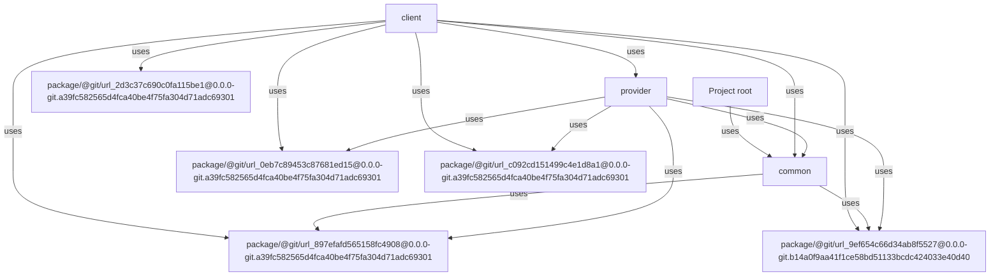

<!-- Generated by aug spec. Edit the August source, then regenerate. -->

# Project diagrams

Read the areas first, then open a module for its class interactions, API calls and sequences. Follow an operation to its specification and source.

These are checked static views. Arrows describe possible calls, not an execution trace. Interface implementations, callbacks and foreign internals are not guessed. Tests are described in the adjacent specifications.

## Areas

## Modules

#### View 1 of 3

```mermaid
flowchart TD
    n0["client/contracts.aug"]
    n1["client/endpoints.aug"]
    n2["client/login.aug"]
    n3["client/logout.aug"]
    n4["client/protocol.aug"]
    n5["client/session.aug"]
    n6["client/views.aug"]
    n7["common/headers.aug"]
    n8["common/keys.aug"]
    n9["common/settings.aug"]
    n10["package/@git/url_0eb7c89453c87681ed15@0.0.0-git.a39fc582565d4fca40be4f75fa304d71adc69301/store.aug"]
    n11["package/@git/url_2d3c37c690c0fa115be1@0.0.0-git.a39fc582565d4fca40be4f75fa304d71adc69301/contracts.aug"]
    n12["package/@git/url_897efafd565158fc4908@0.0.0-git.a39fc582565d4fca40be4f75fa304d71adc69301/contracts.aug"]
    n13["package/@git/url_9ef654c66d34ab8f5527@0.0.0-git.b14a0f9aa41f1ce58bd51133bcdc424033e40d40/contracts.aug"]
    n14["package/@git/url_9ef654c66d34ab8f5527@0.0.0-git.b14a0f9aa41f1ce58bd51133bcdc424033e40d40/jose.aug"]
    n15["package/@git/url_c092cd151499c4e1d8a1@0.0.0-git.a39fc582565d4fca40be4f75fa304d71adc69301/contracts.aug"]
    n16["provider/contracts.aug"]
    n1 -->|"uses"| n5
    n1 -->|"uses"| n6
    n1 -->|"uses"| n7
    n1 -->|"uses"| n8
    n1 -->|"uses"| n10
    n1 -->|"uses"| n13
    n1 -->|"uses"| n15
    n1 -->|"uses"| n16
    n2 -->|"uses"| n0
    n2 -->|"uses"| n4
    n2 -->|"uses"| n7
    n2 -->|"uses"| n8
    n2 -->|"uses"| n9
    n2 -->|"uses"| n10
    n2 -->|"uses"| n12
    n2 -->|"uses"| n13
    n2 -->|"uses"| n14
    n2 -->|"uses"| n15
    n3 -->|"uses"| n0
    n3 -->|"uses"| n5
    n3 -->|"uses"| n7
    n3 -->|"uses"| n8
    n3 -->|"uses"| n9
    n3 -->|"uses"| n10
    n3 -->|"uses"| n13
    n3 -->|"uses"| n15
    n4 -->|"uses"| n0
    n4 -->|"uses"| n9
    n4 -->|"uses"| n11
    n4 -->|"uses"| n12
```

#### View 2 of 3

```mermaid
flowchart TD
    n0["client/contracts.aug"]
    n1["client/logout.aug"]
    n2["client/protocol.aug"]
    n3["client/session.aug"]
    n4["client/views.aug"]
    n5["common/headers.aug"]
    n6["common/keys.aug"]
    n7["common/settings.aug"]
    n8["common/views.aug"]
    n9["main.aug"]
    n10["package/@git/url_0eb7c89453c87681ed15@0.0.0-git.a39fc582565d4fca40be4f75fa304d71adc69301/store.aug"]
    n11["package/@git/url_897efafd565158fc4908@0.0.0-git.a39fc582565d4fca40be4f75fa304d71adc69301/contracts.aug"]
    n12["package/@git/url_9ef654c66d34ab8f5527@0.0.0-git.b14a0f9aa41f1ce58bd51133bcdc424033e40d40/contracts.aug"]
    n13["package/@git/url_9ef654c66d34ab8f5527@0.0.0-git.b14a0f9aa41f1ce58bd51133bcdc424033e40d40/jose.aug"]
    n14["package/@git/url_c092cd151499c4e1d8a1@0.0.0-git.a39fc582565d4fca40be4f75fa304d71adc69301/contracts.aug"]
    n15["provider/authorization.aug"]
    n16["provider/contracts.aug"]
    n17["provider/credentials.aug"]
    n2 -->|"uses"| n12
    n2 -->|"uses"| n13
    n2 -->|"uses"| n16
    n3 -->|"uses"| n0
    n3 -->|"uses"| n6
    n3 -->|"uses"| n7
    n3 -->|"uses"| n10
    n3 -->|"uses"| n12
    n3 -->|"uses"| n13
    n3 -->|"uses"| n14
    n4 -->|"uses"| n1
    n4 -->|"uses"| n8
    n5 -->|"uses"| n11
    n6 -->|"uses"| n12
    n9 -->|"uses"| n6
    n15 -->|"uses"| n5
    n15 -->|"uses"| n7
    n15 -->|"uses"| n10
    n15 -->|"uses"| n11
    n15 -->|"uses"| n12
    n15 -->|"uses"| n14
    n15 -->|"uses"| n16
    n15 -->|"uses"| n17
```

#### View 3 of 3

```mermaid
flowchart TD
    n0["client/export.aug"]
    n1["common/export.aug"]
    n2["common/headers.aug"]
    n3["common/keys.aug"]
    n4["common/settings.aug"]
    n5["common/views.aug"]
    n6["package/@git/url_0eb7c89453c87681ed15@0.0.0-git.a39fc582565d4fca40be4f75fa304d71adc69301/store.aug"]
    n7["package/@git/url_9ef654c66d34ab8f5527@0.0.0-git.b14a0f9aa41f1ce58bd51133bcdc424033e40d40/contracts.aug"]
    n8["package/@git/url_9ef654c66d34ab8f5527@0.0.0-git.b14a0f9aa41f1ce58bd51133bcdc424033e40d40/jose.aug"]
    n9["package/@git/url_c092cd151499c4e1d8a1@0.0.0-git.a39fc582565d4fca40be4f75fa304d71adc69301/contracts.aug"]
    n10["provider/authorization.aug"]
    n11["provider/contracts.aug"]
    n12["provider/credentials.aug"]
    n13["provider/discovery.aug"]
    n14["provider/export.aug"]
    n15["provider/token.aug"]
    n16["provider/userinfo.aug"]
    n17["provider/views.aug"]
    n10 -->|"uses"| n17
    n12 -->|"uses"| n7
    n13 -->|"uses"| n3
    n13 -->|"uses"| n4
    n13 -->|"uses"| n7
    n13 -->|"uses"| n8
    n15 -->|"uses"| n2
    n15 -->|"uses"| n3
    n15 -->|"uses"| n4
    n15 -->|"uses"| n6
    n15 -->|"uses"| n7
    n15 -->|"uses"| n8
    n15 -->|"uses"| n9
    n15 -->|"uses"| n11
    n16 -->|"uses"| n2
    n16 -->|"uses"| n6
    n16 -->|"uses"| n9
    n16 -->|"uses"| n11
    n17 -->|"uses"| n5
```

## Open a module

| Module | Diagrams | Specification |
| --- | --- | --- |
| client/contracts.aug | [Interactions and sequences](../../client/contracts.aug.diagrams.md) | [Explanation](../../client/contracts.aug.md) |
| client/endpoints.aug | [Interactions and sequences](../../client/endpoints.aug.diagrams.md) | [Explanation](../../client/endpoints.aug.md) |
| client/export.aug | [Interactions and sequences](../../client/export.aug.diagrams.md) | [Explanation](../../client/export.aug.md) |
| client/login.aug | [Interactions and sequences](../../client/login.aug.diagrams.md) | [Explanation](../../client/login.aug.md) |
| client/logout.aug | [Interactions and sequences](../../client/logout.aug.diagrams.md) | [Explanation](../../client/logout.aug.md) |
| client/protocol.aug | [Interactions and sequences](../../client/protocol.aug.diagrams.md) | [Explanation](../../client/protocol.aug.md) |
| client/session.aug | [Interactions and sequences](../../client/session.aug.diagrams.md) | [Explanation](../../client/session.aug.md) |
| client/views.aug | [Interactions and sequences](../../client/views.aug.diagrams.md) | [Explanation](../../client/views.aug.md) |
| common/export.aug | [Interactions and sequences](../../common/export.aug.diagrams.md) | [Explanation](../../common/export.aug.md) |
| common/headers.aug | [Interactions and sequences](../../common/headers.aug.diagrams.md) | [Explanation](../../common/headers.aug.md) |
| common/keys.aug | [Interactions and sequences](../../common/keys.aug.diagrams.md) | [Explanation](../../common/keys.aug.md) |
| common/settings.aug | [Interactions and sequences](../../common/settings.aug.diagrams.md) | [Explanation](../../common/settings.aug.md) |
| common/views.aug | [Interactions and sequences](../../common/views.aug.diagrams.md) | [Explanation](../../common/views.aug.md) |
| main.aug | [Interactions and sequences](../../main.aug.diagrams.md) | [Explanation](../../main.aug.md) |
| provider/authorization.aug | [Interactions and sequences](../../provider/authorization.aug.diagrams.md) | [Explanation](../../provider/authorization.aug.md) |
| provider/contracts.aug | [Interactions and sequences](../../provider/contracts.aug.diagrams.md) | [Explanation](../../provider/contracts.aug.md) |
| provider/credentials.aug | [Interactions and sequences](../../provider/credentials.aug.diagrams.md) | [Explanation](../../provider/credentials.aug.md) |
| provider/discovery.aug | [Interactions and sequences](../../provider/discovery.aug.diagrams.md) | [Explanation](../../provider/discovery.aug.md) |
| provider/export.aug | [Interactions and sequences](../../provider/export.aug.diagrams.md) | [Explanation](../../provider/export.aug.md) |
| provider/token.aug | [Interactions and sequences](../../provider/token.aug.diagrams.md) | [Explanation](../../provider/token.aug.md) |
| provider/userinfo.aug | [Interactions and sequences](../../provider/userinfo.aug.diagrams.md) | [Explanation](../../provider/userinfo.aug.md) |
| provider/views.aug | [Interactions and sequences](../../provider/views.aug.diagrams.md) | [Explanation](../../provider/views.aug.md) |

## HTTP APIs

| API | Operation |
| --- | --- |
| GET / | [home](../../client/endpoints.aug.diagrams.md#sequence-home) |
| GET /me | [me](../../client/endpoints.aug.diagrams.md#sequence-me) |
| GET /login/start | [startLogin](../../client/login.aug.diagrams.md#sequence-startLogin) |
| GET /login/callback | [loginCallback](../../client/login.aug.diagrams.md#sequence-loginCallback) |
| POST /logout | [logout](../../client/logout.aug.diagrams.md#sequence-logout) |
| GET /provider/authorize | [authorize](../../provider/authorization.aug.diagrams.md#sequence-authorize) |
| POST /provider/login | [providerLogin](../../provider/authorization.aug.diagrams.md#sequence-providerLogin) |
| GET /provider/.well-known/openid-configuration | [discovery](../../provider/discovery.aug.diagrams.md#sequence-discovery) |
| GET /provider/jwks | [jwks](../../provider/discovery.aug.diagrams.md#sequence-jwks) |
| POST /provider/token | [token](../../provider/token.aug.diagrams.md#sequence-token) |
| GET /provider/userinfo | [userinfo](../../provider/userinfo.aug.diagrams.md#sequence-userinfo) |
