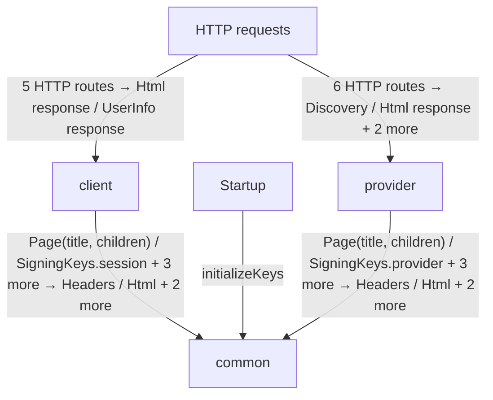
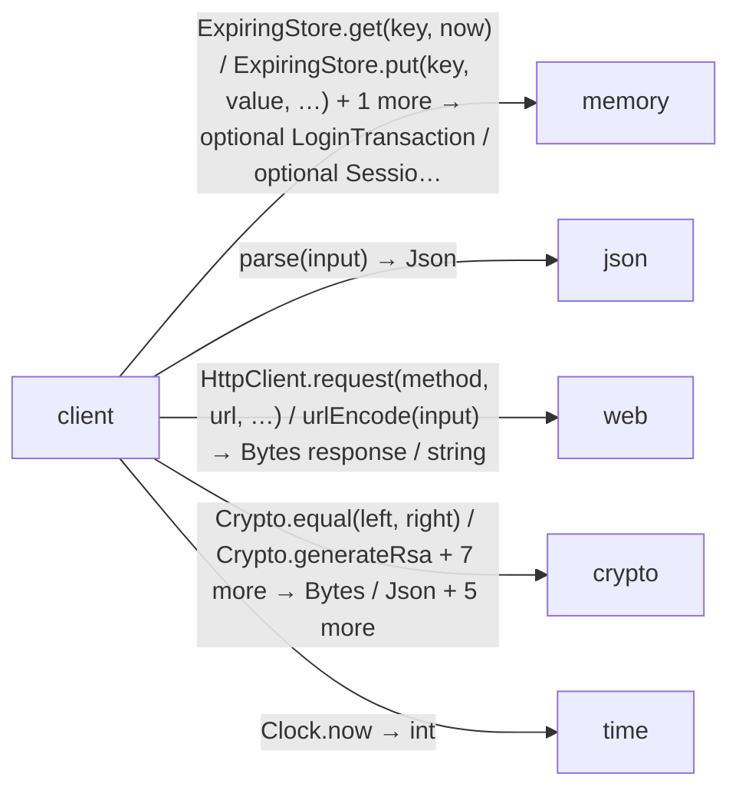
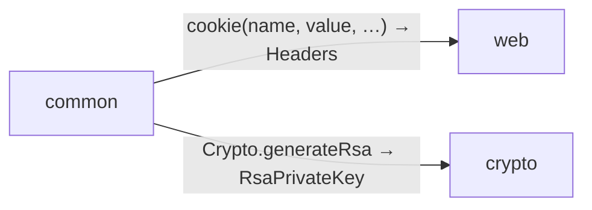
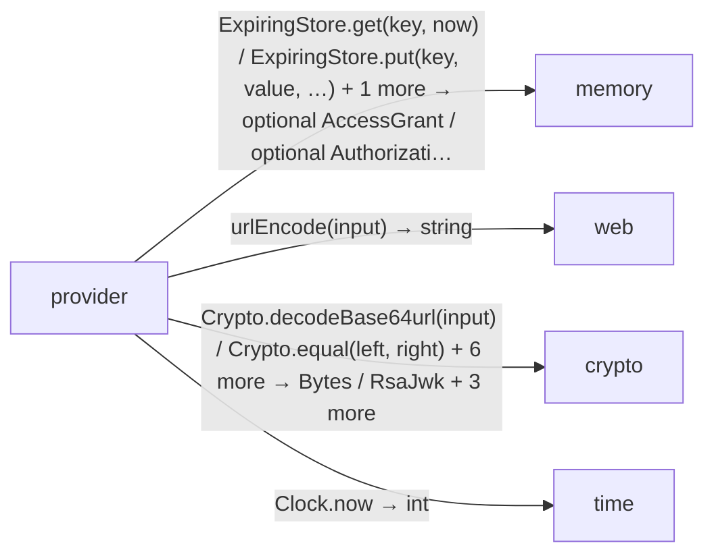

<!-- Generated by aug spec. Edit the August source, then regenerate. -->

# Project diagrams

Start here to see what moves between the application’s folders. Each arrow names an operation’s inputs and the result it returns to its caller. Open a folder for the next level of detail. Expand the contract list for complete types and dependency links.

## Data flow

### Package boundaries

client package calls

common package calls

provider package calls

Data crossing these boundaries (64 contracts)

| From | To | Operation and inputs | Result |
| --- | --- | --- | --- |
| HTTP requests | client | [GET /](../../client/endpoints.aug.md#symbol-home) · token: optional string from cookie · HTTP endpoint | HttpResponse\<Html\> |
| HTTP requests | client | [GET /login/callback](../../client/login.aug.md#symbol-loginCallback) · code: string from query, state: string from query, browser: optional string from cookie · HTTP endpoint | HttpResponse\<Html\> |
| HTTP requests | client | [GET /login/start](../../client/login.aug.md#symbol-startLogin) · HTTP endpoint | HttpResponse\<Html\> |
| HTTP requests | client | [GET /me](../../client/endpoints.aug.md#symbol-me) · token: optional string from cookie · HTTP endpoint | HttpResponse\<UserInfo\> |
| HTTP requests | client | [POST /logout](../../client/logout.aug.md#symbol-logout) · input: LogoutForm from form, token: optional string from cookie, origin: optional string from header · HTTP endpoint | HttpResponse\<Html\> |
| HTTP requests | provider | [GET /provider/.well-known/openid-configuration](../../provider/discovery.aug.md#symbol-discovery) · HTTP endpoint | Discovery |
| HTTP requests | provider | [GET /provider/authorize](../../provider/authorization.aug.md#symbol-authorize) · response\_type: string from query, client\_id: string from query, redirect\_uri: string from query, requestedScope: string from query, state: string from query, nonce: string from query, code\_challenge: string from query, code\_challenge\_method: string from query · HTTP endpoint | HttpResponse\<Html\> |
| HTTP requests | provider | [GET /provider/jwks](../../provider/discovery.aug.md#symbol-jwks) · HTTP endpoint | RsaJwks |
| HTTP requests | provider | [GET /provider/userinfo](../../provider/userinfo.aug.md#symbol-userinfo) · authorization: optional string from header · HTTP endpoint | HttpResponse\<Json\> |
| HTTP requests | provider | [POST /provider/login](../../provider/authorization.aug.md#symbol-providerLogin) · form: LoginForm from form, browser: optional string from cookie, origin: optional string from header · HTTP endpoint | HttpResponse\<Html\> |
| HTTP requests | provider | [POST /provider/token](../../provider/token.aug.md#symbol-token) · http: HttpRequest from request · HTTP endpoint | HttpResponse\<Json\> |
| client | common | [Page](../../common/views.aug.md#symbol-Page) · title: string, children: List\<Html\> | Html |
| client | common | [SigningKeys.session](../../common/keys.aug.md#symbol-SigningKeys.session) · interface dispatch | RsaPrivateKey |
| client | common | [securityHeaders](../../common/headers.aug.md#symbol-securityHeaders) | Headers |
| client | common | [settings](../../common/settings.aug.md#symbol-settings) | Settings |
| client | common | [withCookie](../../common/headers.aug.md#symbol-withCookie) · headers: Headers, name: string, value: string, path: string, maxAge: int, secure: bool | Headers |
| client | memory | [ExpiringStore.get](../packages/%40git/url_0eb7c89453c87681ed15/0.0.0-git.a39fc582565d4fca40be4f75fa304d71adc69301/store.aug.md#symbol-ExpiringStore.get) · key: string, now: int · interface dispatch | optional SessionClaims |
| client | memory | [ExpiringStore.put](../packages/%40git/url_0eb7c89453c87681ed15/0.0.0-git.a39fc582565d4fca40be4f75fa304d71adc69301/store.aug.md#symbol-ExpiringStore.put) · key: string, value: LoginTransaction, expires: int, now: int · interface dispatch | void |
| client | memory | [ExpiringStore.put](../packages/%40git/url_0eb7c89453c87681ed15/0.0.0-git.a39fc582565d4fca40be4f75fa304d71adc69301/store.aug.md#symbol-ExpiringStore.put) · key: string, value: SessionClaims, expires: int, now: int · interface dispatch | void |
| client | memory | [ExpiringStore.take](../packages/%40git/url_0eb7c89453c87681ed15/0.0.0-git.a39fc582565d4fca40be4f75fa304d71adc69301/store.aug.md#symbol-ExpiringStore.take) · key: string, now: int · interface dispatch | optional LoginTransaction |
| client | memory | [ExpiringStore.take](../packages/%40git/url_0eb7c89453c87681ed15/0.0.0-git.a39fc582565d4fca40be4f75fa304d71adc69301/store.aug.md#symbol-ExpiringStore.take) · key: string, now: int · interface dispatch | optional SessionClaims |
| client | json | [parse](../packages/%40git/url_2d3c37c690c0fa115be1/0.0.0-git.a39fc582565d4fca40be4f75fa304d71adc69301/contracts.aug.md#symbol-parse) · input: string | Json |
| client | web | [HttpClient.request](../packages/%40git/url_897efafd565158fc4908/0.0.0-git.a39fc582565d4fca40be4f75fa304d71adc69301/contracts.aug.md#symbol-HttpClient.request) · method: string, url: string, headers: Headers, body: Bytes · interface dispatch | HttpResponse\<Bytes\> |
| client | web | [HttpClient.request](../packages/%40git/url_897efafd565158fc4908/0.0.0-git.a39fc582565d4fca40be4f75fa304d71adc69301/contracts.aug.md#symbol-HttpClient.request) · method: string, url: string, headers: Headers, body: optional Bytes · interface dispatch | HttpResponse\<Bytes\> |
| client | web | [HttpClient.request](../packages/%40git/url_897efafd565158fc4908/0.0.0-git.a39fc582565d4fca40be4f75fa304d71adc69301/contracts.aug.md#symbol-HttpClient.request) · method: string, url: string, headers: optional Headers, body: optional Bytes · interface dispatch | HttpResponse\<Bytes\> |
| client | web | [urlEncode](../packages/%40git/url_897efafd565158fc4908/0.0.0-git.a39fc582565d4fca40be4f75fa304d71adc69301/contracts.aug.md#symbol-urlEncode) · input: string | string |
| client | crypto | [Crypto.equal](../packages/%40git/url_9ef654c66d34ab8f5527/0.0.0-git.b14a0f9aa41f1ce58bd51133bcdc424033e40d40/contracts.aug.md#symbol-Crypto.equal) · left: Bytes, right: Bytes · interface dispatch | bool |
| client | crypto | [Crypto.generateRsa](../packages/%40git/url_9ef654c66d34ab8f5527/0.0.0-git.b14a0f9aa41f1ce58bd51133bcdc424033e40d40/contracts.aug.md#symbol-Crypto.generateRsa) · interface dispatch | RsaPrivateKey |
| client | crypto | [Crypto.publicRsa](../packages/%40git/url_9ef654c66d34ab8f5527/0.0.0-git.b14a0f9aa41f1ce58bd51133bcdc424033e40d40/contracts.aug.md#symbol-Crypto.publicRsa) · key: RsaPrivateKey · interface dispatch | RsaPublicKey |
| client | crypto | [Crypto.random](../packages/%40git/url_9ef654c66d34ab8f5527/0.0.0-git.b14a0f9aa41f1ce58bd51133bcdc424033e40d40/contracts.aug.md#symbol-Crypto.random) · size: int · interface dispatch | Bytes |
| client | crypto | [Crypto.sha256](../packages/%40git/url_9ef654c66d34ab8f5527/0.0.0-git.b14a0f9aa41f1ce58bd51133bcdc424033e40d40/contracts.aug.md#symbol-Crypto.sha256) · input: Bytes · interface dispatch | Bytes |
| client | crypto | [RsaJwks](../packages/%40git/url_9ef654c66d34ab8f5527/0.0.0-git.b14a0f9aa41f1ce58bd51133bcdc424033e40d40/jose.aug.md#symbol-RsaJwks) · keys: List\<RsaJwk\> · value construction | RsaJwks |
| client | crypto | [importJwk](../packages/%40git/url_9ef654c66d34ab8f5527/0.0.0-git.b14a0f9aa41f1ce58bd51133bcdc424033e40d40/jose.aug.md#symbol-importJwk) · jwk: RsaJwk | RsaPublicKey |
| client | crypto | [rsaJwk](../packages/%40git/url_9ef654c66d34ab8f5527/0.0.0-git.b14a0f9aa41f1ce58bd51133bcdc424033e40d40/jose.aug.md#symbol-rsaJwk) · publicKey: RsaPublicKey, kid: string | RsaJwk |
| client | crypto | [signJwt](../packages/%40git/url_9ef654c66d34ab8f5527/0.0.0-git.b14a0f9aa41f1ce58bd51133bcdc424033e40d40/jose.aug.md#symbol-signJwt) · key: RsaPrivateKey, claims: Json, kid: string, tokenType: string | string |
| client | crypto | [verifyJwt](../packages/%40git/url_9ef654c66d34ab8f5527/0.0.0-git.b14a0f9aa41f1ce58bd51133bcdc424033e40d40/jose.aug.md#symbol-verifyJwt) · token: string, publicKey: RsaPublicKey, kid: string, tokenType: string | Json |
| client | time | [Clock.now](../packages/%40git/url_c092cd151499c4e1d8a1/0.0.0-git.a39fc582565d4fca40be4f75fa304d71adc69301/contracts.aug.md#symbol-Clock.now) · interface dispatch | int |
| client | provider | [IdClaims](../../provider/contracts.aug.md#symbol-IdClaims) · iss: string, sub: string, aud: string, exp: int, iat: int, nonce: string, name: string · value construction | IdClaims |
| client | provider | [UserInfo](../../provider/contracts.aug.md#symbol-UserInfo) · sub: string, name: string · value construction | UserInfo |
| common | web | [cookie](../packages/%40git/url_897efafd565158fc4908/0.0.0-git.a39fc582565d4fca40be4f75fa304d71adc69301/contracts.aug.md#symbol-cookie) · name: string, value: string, path: string, maxAge: int, secure: bool | Headers |
| common | crypto | [Crypto.generateRsa](../packages/%40git/url_9ef654c66d34ab8f5527/0.0.0-git.b14a0f9aa41f1ce58bd51133bcdc424033e40d40/contracts.aug.md#symbol-Crypto.generateRsa) · interface dispatch | RsaPrivateKey |
| Startup | common | [initializeKeys](../../common/keys.aug.md#symbol-initializeKeys) | void |
| provider | common | [Page](../../common/views.aug.md#symbol-Page) · title: string, children: List\<Html\> | Html |
| provider | common | [SigningKeys.provider](../../common/keys.aug.md#symbol-SigningKeys.provider) · interface dispatch | RsaPrivateKey |
| provider | common | [securityHeaders](../../common/headers.aug.md#symbol-securityHeaders) | Headers |
| provider | common | [settings](../../common/settings.aug.md#symbol-settings) | Settings |
| provider | common | [withCookie](../../common/headers.aug.md#symbol-withCookie) · headers: Headers, name: string, value: string, path: string, maxAge: int, secure: bool | Headers |
| provider | memory | [ExpiringStore.get](../packages/%40git/url_0eb7c89453c87681ed15/0.0.0-git.a39fc582565d4fca40be4f75fa304d71adc69301/store.aug.md#symbol-ExpiringStore.get) · key: string, now: int · interface dispatch | optional AccessGrant |
| provider | memory | [ExpiringStore.put](../packages/%40git/url_0eb7c89453c87681ed15/0.0.0-git.a39fc582565d4fca40be4f75fa304d71adc69301/store.aug.md#symbol-ExpiringStore.put) · key: string, value: AccessGrant, expires: int, now: int · interface dispatch | void |
| provider | memory | [ExpiringStore.put](../packages/%40git/url_0eb7c89453c87681ed15/0.0.0-git.a39fc582565d4fca40be4f75fa304d71adc69301/store.aug.md#symbol-ExpiringStore.put) · key: string, value: AuthorizationCode, expires: int, now: int · interface dispatch | void |
| provider | memory | [ExpiringStore.put](../packages/%40git/url_0eb7c89453c87681ed15/0.0.0-git.a39fc582565d4fca40be4f75fa304d71adc69301/store.aug.md#symbol-ExpiringStore.put) · key: string, value: AuthorizationRequest, expires: int, now: int · interface dispatch | void |
| provider | memory | [ExpiringStore.take](../packages/%40git/url_0eb7c89453c87681ed15/0.0.0-git.a39fc582565d4fca40be4f75fa304d71adc69301/store.aug.md#symbol-ExpiringStore.take) · key: string, now: int · interface dispatch | optional AuthorizationRequest |
| provider | memory | [ExpiringStore.take](../packages/%40git/url_0eb7c89453c87681ed15/0.0.0-git.a39fc582565d4fca40be4f75fa304d71adc69301/store.aug.md#symbol-ExpiringStore.take) · key: string, now: int · interface dispatch | optional AuthorizationCode |
| provider | web | [urlEncode](../packages/%40git/url_897efafd565158fc4908/0.0.0-git.a39fc582565d4fca40be4f75fa304d71adc69301/contracts.aug.md#symbol-urlEncode) · input: string | string |
| provider | crypto | [Crypto.decodeBase64url](../packages/%40git/url_9ef654c66d34ab8f5527/0.0.0-git.b14a0f9aa41f1ce58bd51133bcdc424033e40d40/contracts.aug.md#symbol-Crypto.decodeBase64url) · input: string · interface dispatch | Bytes |
| provider | crypto | [Crypto.equal](../packages/%40git/url_9ef654c66d34ab8f5527/0.0.0-git.b14a0f9aa41f1ce58bd51133bcdc424033e40d40/contracts.aug.md#symbol-Crypto.equal) · left: Bytes, right: Bytes · interface dispatch | bool |
| provider | crypto | [Crypto.passwordHash](../packages/%40git/url_9ef654c66d34ab8f5527/0.0.0-git.b14a0f9aa41f1ce58bd51133bcdc424033e40d40/contracts.aug.md#symbol-Crypto.passwordHash) · password: Bytes, salt: Bytes, iterations: int · interface dispatch | Bytes |
| provider | crypto | [Crypto.publicRsa](../packages/%40git/url_9ef654c66d34ab8f5527/0.0.0-git.b14a0f9aa41f1ce58bd51133bcdc424033e40d40/contracts.aug.md#symbol-Crypto.publicRsa) · key: RsaPrivateKey · interface dispatch | RsaPublicKey |
| provider | crypto | [Crypto.random](../packages/%40git/url_9ef654c66d34ab8f5527/0.0.0-git.b14a0f9aa41f1ce58bd51133bcdc424033e40d40/contracts.aug.md#symbol-Crypto.random) · size: int · interface dispatch | Bytes |
| provider | crypto | [Crypto.sha256](../packages/%40git/url_9ef654c66d34ab8f5527/0.0.0-git.b14a0f9aa41f1ce58bd51133bcdc424033e40d40/contracts.aug.md#symbol-Crypto.sha256) · input: Bytes · interface dispatch | Bytes |
| provider | crypto | [RsaJwks](../packages/%40git/url_9ef654c66d34ab8f5527/0.0.0-git.b14a0f9aa41f1ce58bd51133bcdc424033e40d40/jose.aug.md#symbol-RsaJwks) · keys: List\<RsaJwk\> · value construction | RsaJwks |
| provider | crypto | [rsaJwk](../packages/%40git/url_9ef654c66d34ab8f5527/0.0.0-git.b14a0f9aa41f1ce58bd51133bcdc424033e40d40/jose.aug.md#symbol-rsaJwk) · publicKey: RsaPublicKey, kid: string | RsaJwk |
| provider | crypto | [signJwt](../packages/%40git/url_9ef654c66d34ab8f5527/0.0.0-git.b14a0f9aa41f1ce58bd51133bcdc424033e40d40/jose.aug.md#symbol-signJwt) · key: RsaPrivateKey, claims: Json, kid: string, tokenType: string | string |
| provider | time | [Clock.now](../packages/%40git/url_c092cd151499c4e1d8a1/0.0.0-git.a39fc582565d4fca40be4f75fa304d71adc69301/contracts.aug.md#symbol-Clock.now) · interface dispatch | int |

## Open a folder

| Folder | Read |
| --- | --- |
| client | [Folder data flow](folders/client/index.md) |
| common | [Folder data flow](folders/common/index.md) |
| provider | [Folder data flow](folders/provider/index.md) |

## Open a module

| Module | Read |
| --- | --- |
| client/contracts.aug | [Flow and sequences](../../client/contracts.aug.diagrams.md) · [Explanation](../../client/contracts.aug.md) |
| client/endpoints.aug | [Flow and sequences](../../client/endpoints.aug.diagrams.md) · [Explanation](../../client/endpoints.aug.md) |
| client/export.aug | [Flow and sequences](../../client/export.aug.diagrams.md) · [Explanation](../../client/export.aug.md) |
| client/login.aug | [Flow and sequences](../../client/login.aug.diagrams.md) · [Explanation](../../client/login.aug.md) |
| client/logout.aug | [Flow and sequences](../../client/logout.aug.diagrams.md) · [Explanation](../../client/logout.aug.md) |
| client/protocol.aug | [Flow and sequences](../../client/protocol.aug.diagrams.md) · [Explanation](../../client/protocol.aug.md) |
| client/session.aug | [Flow and sequences](../../client/session.aug.diagrams.md) · [Explanation](../../client/session.aug.md) |
| client/views.aug | [Flow and sequences](../../client/views.aug.diagrams.md) · [Explanation](../../client/views.aug.md) |
| common/export.aug | [Flow and sequences](../../common/export.aug.diagrams.md) · [Explanation](../../common/export.aug.md) |
| common/headers.aug | [Flow and sequences](../../common/headers.aug.diagrams.md) · [Explanation](../../common/headers.aug.md) |
| common/keys.aug | [Flow and sequences](../../common/keys.aug.diagrams.md) · [Explanation](../../common/keys.aug.md) |
| common/settings.aug | [Flow and sequences](../../common/settings.aug.diagrams.md) · [Explanation](../../common/settings.aug.md) |
| common/views.aug | [Flow and sequences](../../common/views.aug.diagrams.md) · [Explanation](../../common/views.aug.md) |
| main.aug | [Flow and sequences](../../main.aug.diagrams.md) · [Explanation](../../main.aug.md) |
| provider/authorization.aug | [Flow and sequences](../../provider/authorization.aug.diagrams.md) · [Explanation](../../provider/authorization.aug.md) |
| provider/contracts.aug | [Flow and sequences](../../provider/contracts.aug.diagrams.md) · [Explanation](../../provider/contracts.aug.md) |
| provider/credentials.aug | [Flow and sequences](../../provider/credentials.aug.diagrams.md) · [Explanation](../../provider/credentials.aug.md) |
| provider/discovery.aug | [Flow and sequences](../../provider/discovery.aug.diagrams.md) · [Explanation](../../provider/discovery.aug.md) |
| provider/export.aug | [Flow and sequences](../../provider/export.aug.diagrams.md) · [Explanation](../../provider/export.aug.md) |
| provider/token.aug | [Flow and sequences](../../provider/token.aug.diagrams.md) · [Explanation](../../provider/token.aug.md) |
| provider/userinfo.aug | [Flow and sequences](../../provider/userinfo.aug.diagrams.md) · [Explanation](../../provider/userinfo.aug.md) |
| provider/views.aug | [Flow and sequences](../../provider/views.aug.diagrams.md) · [Explanation](../../provider/views.aug.md) |

These are static call boundaries, not a request trace. Interface implementations and foreign internals stop at their checked contracts. Dotted arrows defer a callback or browser action. Imports alone do not imply a call.

## HTTP APIs

| API | Operation |
| --- | --- |
| GET / | [home](../../client/endpoints.aug.diagrams.md#sequence-home) |
| GET /me | [me](../../client/endpoints.aug.diagrams.md#sequence-me) |
| GET /login/start | [startLogin](../../client/login.aug.diagrams.md#sequence-startLogin) |
| GET /login/callback | [loginCallback](../../client/login.aug.diagrams.md#sequence-loginCallback) |
| POST /logout | [logout](../../client/logout.aug.diagrams.md#sequence-logout) |
| GET /provider/authorize | [authorize](../../provider/authorization.aug.diagrams.md#sequence-authorize) |
| POST /provider/login | [providerLogin](../../provider/authorization.aug.diagrams.md#sequence-providerLogin) |
| GET /provider/.well-known/openid-configuration | [discovery](../../provider/discovery.aug.diagrams.md#sequence-discovery) |
| GET /provider/jwks | [jwks](../../provider/discovery.aug.diagrams.md#sequence-jwks) |
| POST /provider/token | [token](../../provider/token.aug.diagrams.md#sequence-token) |
| GET /provider/userinfo | [userinfo](../../provider/userinfo.aug.diagrams.md#sequence-userinfo) |
