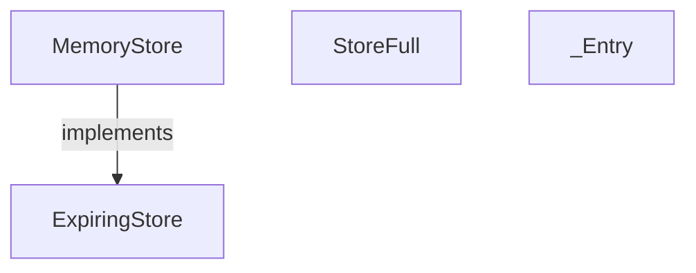
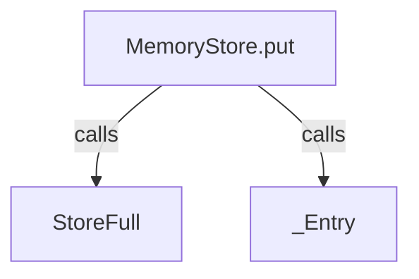
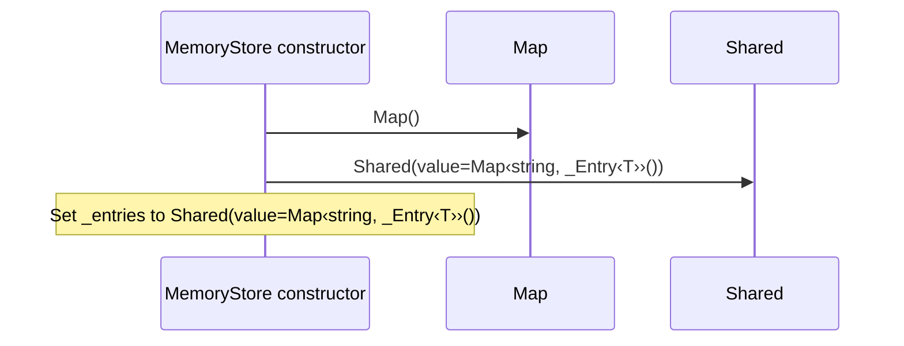
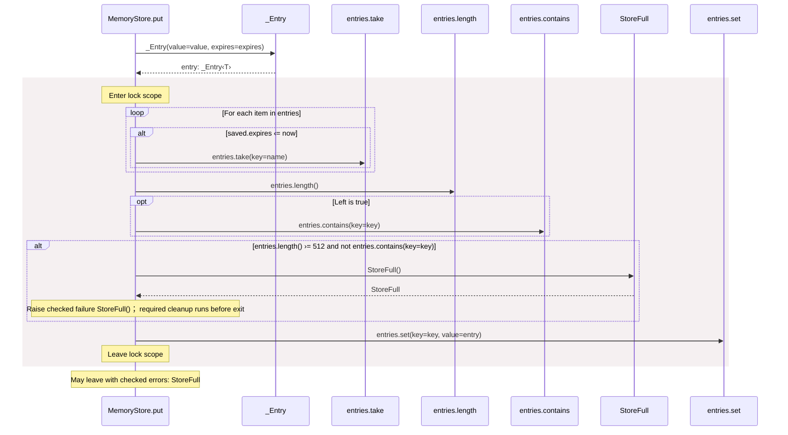
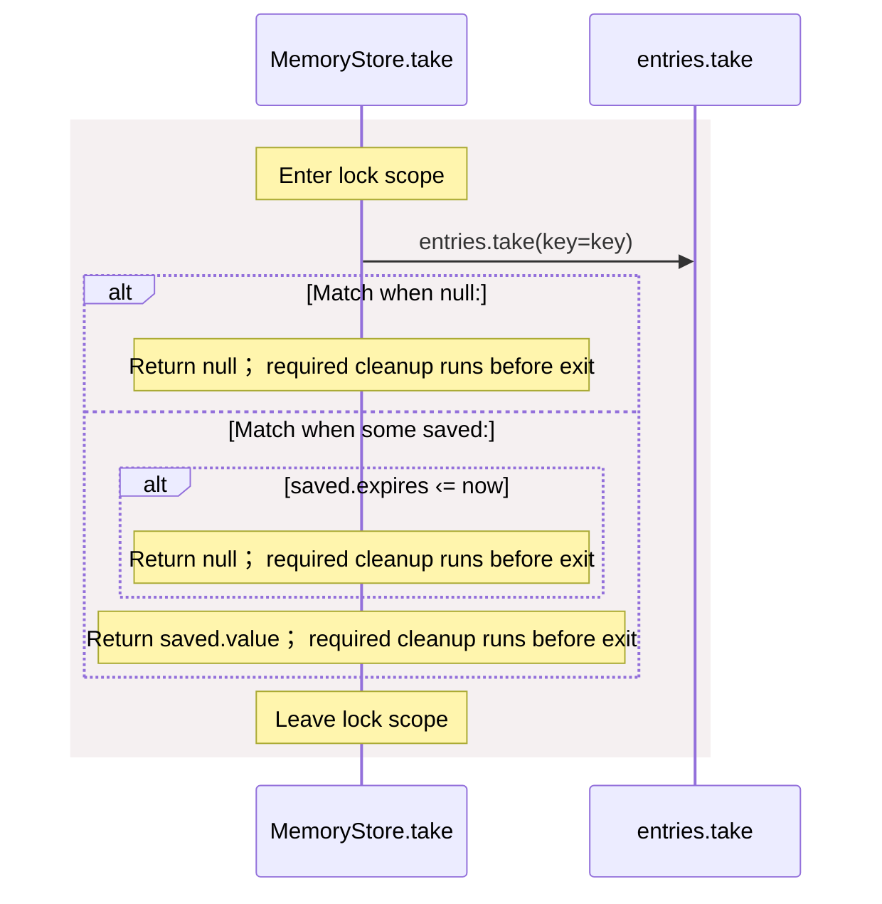

<!-- Generated by aug spec. Edit the August source, then regenerate. -->

# package/@git/url\_0eb7c89453c87681ed15@0.0.0-git.a39fc582565d4fca40be4f75fa304d71adc69301/store.aug diagrams

[Project overview](../../../../diagrams/index.md) · [Compiled explanation](store.aug.md)

## Class interactions

Call relationships

## Sequences

Call arrows identify checked targets; loop and branch frames determine when they run. Open that target’s module to follow its implementation. Branches describe alternatives; loops describe repeated work. Native calls and interface dispatch stop at their declared contracts. Exit notes end that path; enclosing recovery and cleanup remain visible.

### StoreFull constructor

[Source](store.aug#L3)

[Explanation](store.aug.md).

### \_Entry constructor

[Source](store.aug#L5)

Receive fields: value, expires. [Explanation](store.aug.md).

### ExpiringStore.put

[Source](store.aug#L10)

May leave with checked errors: StoreFull. Interface contract; implementation selected at runtime. [Explanation](store.aug.md).

### ExpiringStore.take

[Source](store.aug#L12)

Interface contract; implementation selected at runtime. [Explanation](store.aug.md).

### ExpiringStore.get

[Source](store.aug#L14)

Interface contract; implementation selected at runtime. [Explanation](store.aug.md).

### MemoryStore constructor

[Source](store.aug#L17)

### MemoryStore.put

[Source](store.aug#L19)

### MemoryStore.take

[Source](store.aug#L28)

### MemoryStore.get

[Source](store.aug#L37)

## Called contracts

- [ExpiringStore](store.aug.diagrams.md) — package/@git/url\_0eb7c89453c87681ed15@0.0.0-git.a39fc582565d4fca40be4f75fa304d71adc69301/store.aug
- [StoreFull](store.aug.diagrams.md#sequence-StoreFull-20-constructor) — package/@git/url\_0eb7c89453c87681ed15@0.0.0-git.a39fc582565d4fca40be4f75fa304d71adc69301/store.aug
- [\_Entry](store.aug.diagrams.md#sequence-_Entry-20-constructor) — package/@git/url\_0eb7c89453c87681ed15@0.0.0-git.a39fc582565d4fca40be4f75fa304d71adc69301/store.aug
