<!-- Generated by aug spec. Edit the August source, then regenerate. -->

# package/@git/url\_9ef654c66d34ab8f5527@0.0.0-git.b14a0f9aa41f1ce58bd51133bcdc424033e40d40/contracts.aug diagrams

[Project overview](../../../../diagrams/index.md) · [Compiled explanation](contracts.aug.md)

## Class interactions

```mermaid
flowchart TD
    n0["Crypto"]
    n1["GnuTlsCrypto"]
    n2["_aug_crypto_decode_base64url"]
    n3["_aug_crypto_equal"]
    n4["_aug_crypto_export_rsa"]
    n5["_aug_crypto_generate_rsa"]
    n6["_aug_crypto_import_rsa"]
    n7["_aug_crypto_password_hash"]
    n8["_aug_crypto_public_rsa"]
    n9["_aug_crypto_random"]
    n10["_aug_crypto_sha256"]
    n11["_aug_crypto_sign_rsa"]
    n12["_aug_crypto_verify_rsa"]
    n1 -->|"implements"| n0
    n1 -->|"calls"| n2
    n1 -->|"calls"| n3
    n1 -->|"calls"| n4
    n1 -->|"calls"| n5
    n1 -->|"calls"| n6
    n1 -->|"calls"| n7
    n1 -->|"calls"| n8
    n1 -->|"calls"| n9
    n1 -->|"calls"| n10
    n1 -->|"calls"| n11
    n1 -->|"calls"| n12
```

Call relationships

#### View 1 of 2

```mermaid
flowchart TD
    n0["GnuTlsCrypto.decodeBase64url"]
    n1["GnuTlsCrypto.equal"]
    n2["GnuTlsCrypto.exportRsa"]
    n3["GnuTlsCrypto.generateRsa"]
    n4["GnuTlsCrypto.importRsa"]
    n5["GnuTlsCrypto.passwordHash"]
    n6["GnuTlsCrypto.publicRsa"]
    n7["GnuTlsCrypto.random"]
    n8["GnuTlsCrypto.sha256"]
    n9["_aug_crypto_decode_base64url"]
    n10["_aug_crypto_equal"]
    n11["_aug_crypto_export_rsa"]
    n12["_aug_crypto_generate_rsa"]
    n13["_aug_crypto_import_rsa"]
    n14["_aug_crypto_password_hash"]
    n15["_aug_crypto_public_rsa"]
    n16["_aug_crypto_random"]
    n17["_aug_crypto_sha256"]
    n0 -->|"calls"| n9
    n1 -->|"calls"| n10
    n2 -->|"calls"| n11
    n3 -->|"calls"| n12
    n4 -->|"calls"| n13
    n5 -->|"calls"| n14
    n6 -->|"calls"| n15
    n7 -->|"calls"| n16
    n8 -->|"calls"| n17
```

#### View 2 of 2

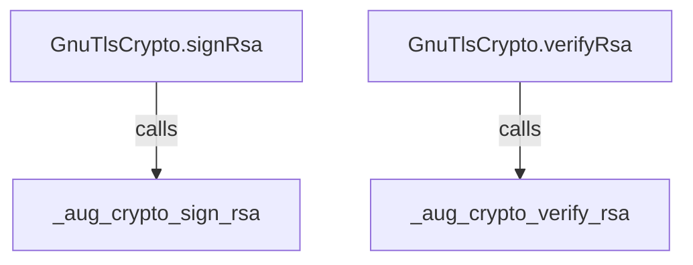

## Sequences

Call arrows identify checked targets; loop and branch frames determine when they run. Open that target’s module to follow its implementation. Branches describe alternatives; loops describe repeated work. Native calls and interface dispatch stop at their declared contracts. Exit notes end that path; enclosing recovery and cleanup remain visible.

### Crypto.random

[Source](contracts.aug#L6)

May leave with checked errors: CryptoError. Interface contract; implementation selected at runtime. [Explanation](contracts.aug.md).

### Crypto.sha256

[Source](contracts.aug#L8)

May leave with checked errors: CryptoError. Interface contract; implementation selected at runtime. [Explanation](contracts.aug.md).

### Crypto.generateRsa

[Source](contracts.aug#L10)

May leave with checked errors: CryptoError. Interface contract; implementation selected at runtime. [Explanation](contracts.aug.md).

### Crypto.publicRsa

[Source](contracts.aug#L12)

May leave with checked errors: CryptoError. Interface contract; implementation selected at runtime. [Explanation](contracts.aug.md).

### Crypto.signRsa

[Source](contracts.aug#L14)

May leave with checked errors: CryptoError. Interface contract; implementation selected at runtime. [Explanation](contracts.aug.md).

### Crypto.verifyRsa

[Source](contracts.aug#L16)

May leave with checked errors: CryptoError. Interface contract; implementation selected at runtime. [Explanation](contracts.aug.md).

### Crypto.decodeBase64url

[Source](contracts.aug#L18)

May leave with checked errors: CryptoError. Interface contract; implementation selected at runtime. [Explanation](contracts.aug.md).

### Crypto.equal

[Source](contracts.aug#L20)

Interface contract; implementation selected at runtime. [Explanation](contracts.aug.md).

### Crypto.exportRsa

[Source](contracts.aug#L22)

May leave with checked errors: CryptoError. Interface contract; implementation selected at runtime. [Explanation](contracts.aug.md).

### Crypto.importRsa

[Source](contracts.aug#L24)

May leave with checked errors: CryptoError. Interface contract; implementation selected at runtime. [Explanation](contracts.aug.md).

### Crypto.passwordHash

[Source](contracts.aug#L26)

May leave with checked errors: CryptoError. Interface contract; implementation selected at runtime. [Explanation](contracts.aug.md).

### \_aug\_crypto\_random

[Source](contracts.aug#L28)

May leave with checked errors: CryptoError. Native implementation; only the declared contract is known. [Explanation](contracts.aug.md).

### \_aug\_crypto\_sha256

[Source](contracts.aug#L29)

May leave with checked errors: CryptoError. Native implementation; only the declared contract is known. [Explanation](contracts.aug.md).

### \_aug\_crypto\_generate\_rsa

[Source](contracts.aug#L30)

May leave with checked errors: CryptoError. Native implementation; only the declared contract is known. [Explanation](contracts.aug.md).

### \_aug\_crypto\_public\_rsa

[Source](contracts.aug#L31)

May leave with checked errors: CryptoError. Native implementation; only the declared contract is known. [Explanation](contracts.aug.md).

### \_aug\_crypto\_sign\_rsa

[Source](contracts.aug#L32)

May leave with checked errors: CryptoError. Native implementation; only the declared contract is known. [Explanation](contracts.aug.md).

### \_aug\_crypto\_verify\_rsa

[Source](contracts.aug#L33)

May leave with checked errors: CryptoError. Native implementation; only the declared contract is known. [Explanation](contracts.aug.md).

### \_aug\_crypto\_decode\_base64url

[Source](contracts.aug#L34)

May leave with checked errors: CryptoError. Native implementation; only the declared contract is known. [Explanation](contracts.aug.md).

### \_aug\_crypto\_equal

[Source](contracts.aug#L35)

Native implementation; only the declared contract is known. [Explanation](contracts.aug.md).

### \_aug\_crypto\_export\_rsa

[Source](contracts.aug#L36)

May leave with checked errors: CryptoError. Native implementation; only the declared contract is known. [Explanation](contracts.aug.md).

### \_aug\_crypto\_import\_rsa

[Source](contracts.aug#L37)

May leave with checked errors: CryptoError. Native implementation; only the declared contract is known. [Explanation](contracts.aug.md).

### \_aug\_crypto\_password\_hash

[Source](contracts.aug#L38)

May leave with checked errors: CryptoError. Native implementation; only the declared contract is known. [Explanation](contracts.aug.md).

### GnuTlsCrypto constructor

[Source](contracts.aug#L41)

[Explanation](contracts.aug.md).

### GnuTlsCrypto.random

[Source](contracts.aug#L42)

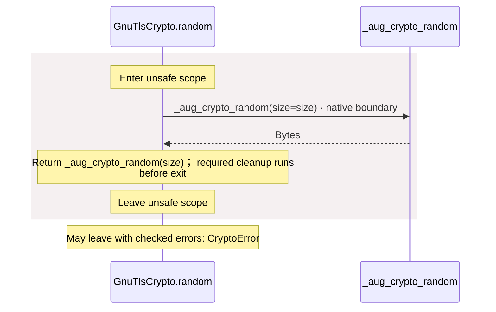

### GnuTlsCrypto.sha256

[Source](contracts.aug#L45)

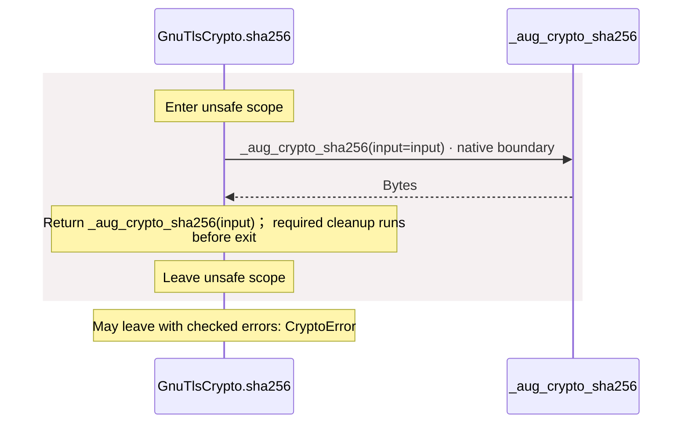

### GnuTlsCrypto.generateRsa

[Source](contracts.aug#L48)

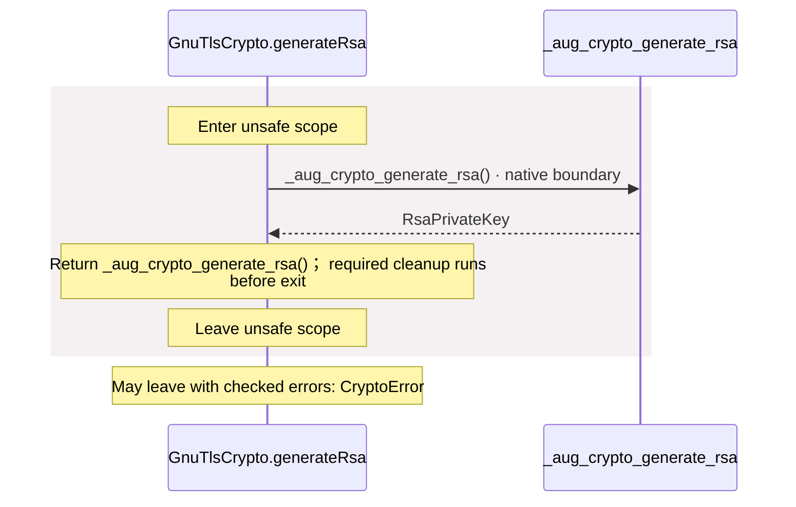

### GnuTlsCrypto.publicRsa

[Source](contracts.aug#L51)

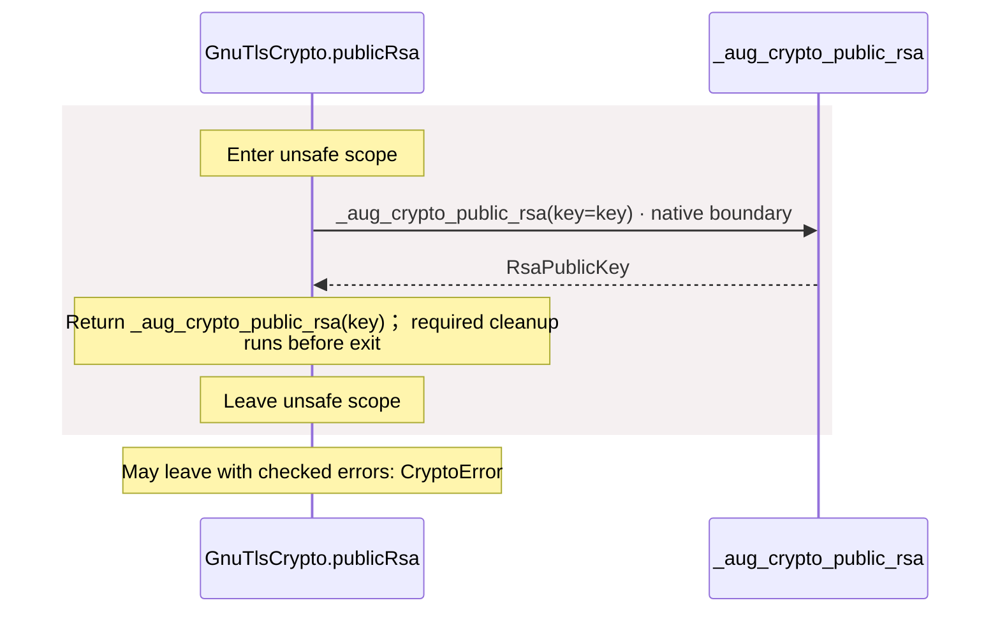

### GnuTlsCrypto.signRsa

[Source](contracts.aug#L54)

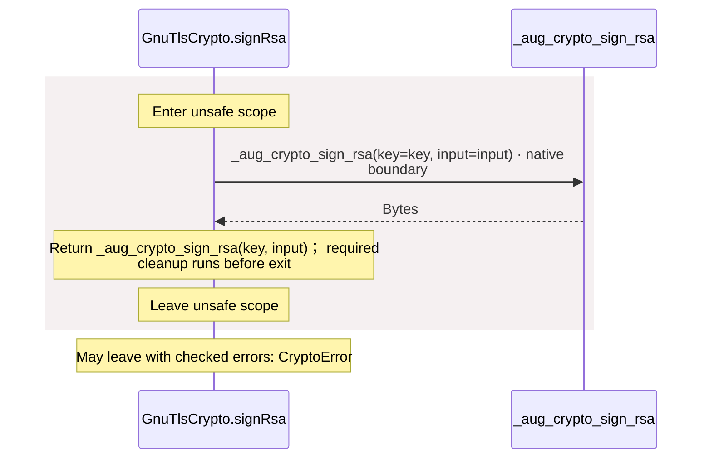

### GnuTlsCrypto.verifyRsa

[Source](contracts.aug#L57)

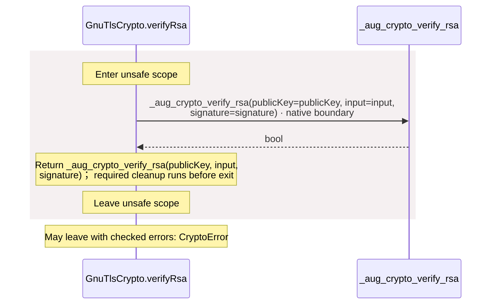

### GnuTlsCrypto.decodeBase64url

[Source](contracts.aug#L60)

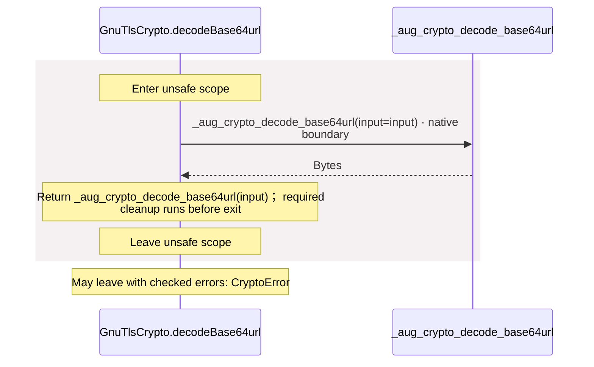

### GnuTlsCrypto.equal

[Source](contracts.aug#L63)

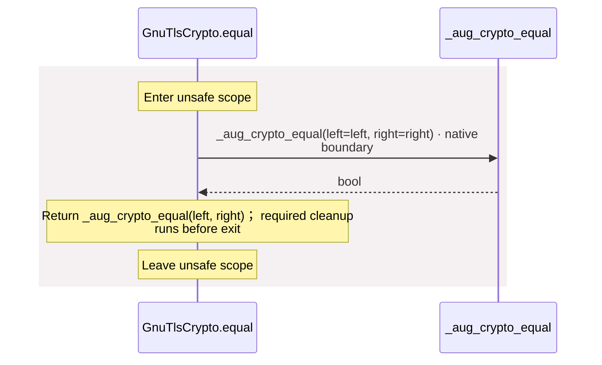

### GnuTlsCrypto.exportRsa

[Source](contracts.aug#L66)

### GnuTlsCrypto.importRsa

[Source](contracts.aug#L69)

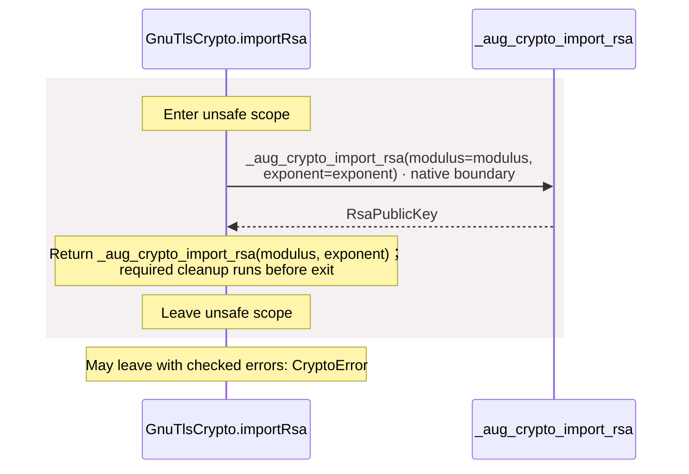

### GnuTlsCrypto.passwordHash

[Source](contracts.aug#L72)

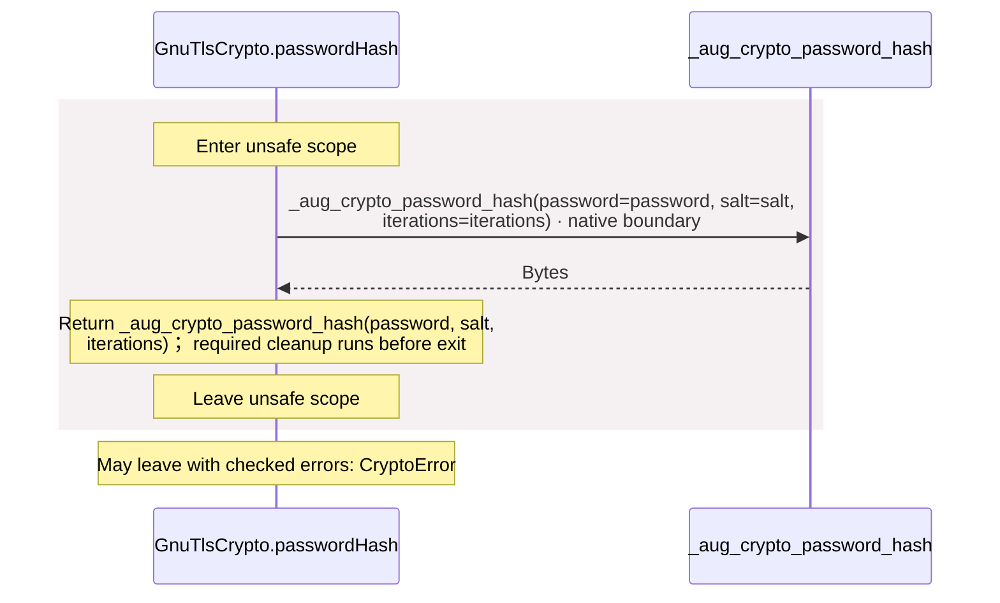

## Called contracts

- [Crypto](contracts.aug.diagrams.md) — package/@git/url\_9ef654c66d34ab8f5527@0.0.0-git.b14a0f9aa41f1ce58bd51133bcdc424033e40d40/contracts.aug
- [\_aug\_crypto\_decode\_base64url](contracts.aug.diagrams.md#sequence-_aug_crypto_decode_base64url) — package/@git/url\_9ef654c66d34ab8f5527@0.0.0-git.b14a0f9aa41f1ce58bd51133bcdc424033e40d40/contracts.aug
- [\_aug\_crypto\_equal](contracts.aug.diagrams.md#sequence-_aug_crypto_equal) — package/@git/url\_9ef654c66d34ab8f5527@0.0.0-git.b14a0f9aa41f1ce58bd51133bcdc424033e40d40/contracts.aug
- [\_aug\_crypto\_export\_rsa](contracts.aug.diagrams.md#sequence-_aug_crypto_export_rsa) — package/@git/url\_9ef654c66d34ab8f5527@0.0.0-git.b14a0f9aa41f1ce58bd51133bcdc424033e40d40/contracts.aug
- [\_aug\_crypto\_generate\_rsa](contracts.aug.diagrams.md#sequence-_aug_crypto_generate_rsa) — package/@git/url\_9ef654c66d34ab8f5527@0.0.0-git.b14a0f9aa41f1ce58bd51133bcdc424033e40d40/contracts.aug
- [\_aug\_crypto\_import\_rsa](contracts.aug.diagrams.md#sequence-_aug_crypto_import_rsa) — package/@git/url\_9ef654c66d34ab8f5527@0.0.0-git.b14a0f9aa41f1ce58bd51133bcdc424033e40d40/contracts.aug
- [\_aug\_crypto\_password\_hash](contracts.aug.diagrams.md#sequence-_aug_crypto_password_hash) — package/@git/url\_9ef654c66d34ab8f5527@0.0.0-git.b14a0f9aa41f1ce58bd51133bcdc424033e40d40/contracts.aug
- [\_aug\_crypto\_public\_rsa](contracts.aug.diagrams.md#sequence-_aug_crypto_public_rsa) — package/@git/url\_9ef654c66d34ab8f5527@0.0.0-git.b14a0f9aa41f1ce58bd51133bcdc424033e40d40/contracts.aug
- [\_aug\_crypto\_random](contracts.aug.diagrams.md#sequence-_aug_crypto_random) — package/@git/url\_9ef654c66d34ab8f5527@0.0.0-git.b14a0f9aa41f1ce58bd51133bcdc424033e40d40/contracts.aug
- [\_aug\_crypto\_sha256](contracts.aug.diagrams.md#sequence-_aug_crypto_sha256) — package/@git/url\_9ef654c66d34ab8f5527@0.0.0-git.b14a0f9aa41f1ce58bd51133bcdc424033e40d40/contracts.aug
- [\_aug\_crypto\_sign\_rsa](contracts.aug.diagrams.md#sequence-_aug_crypto_sign_rsa) — package/@git/url\_9ef654c66d34ab8f5527@0.0.0-git.b14a0f9aa41f1ce58bd51133bcdc424033e40d40/contracts.aug
- [\_aug\_crypto\_verify\_rsa](contracts.aug.diagrams.md#sequence-_aug_crypto_verify_rsa) — package/@git/url\_9ef654c66d34ab8f5527@0.0.0-git.b14a0f9aa41f1ce58bd51133bcdc424033e40d40/contracts.aug
