<!-- Generated by aug spec. Edit the August source, then regenerate. -->

# package/@git/url\_9ef654c66d34ab8f5527@0.0.0-git.b14a0f9aa41f1ce58bd51133bcdc424033e40d40/contracts.aug diagrams

[Project overview](../../../../diagrams/index.md) · [Compiled explanation](contracts.aug.md)

## Class interactions

### GnuTlsCrypto

#### View 1 of 2

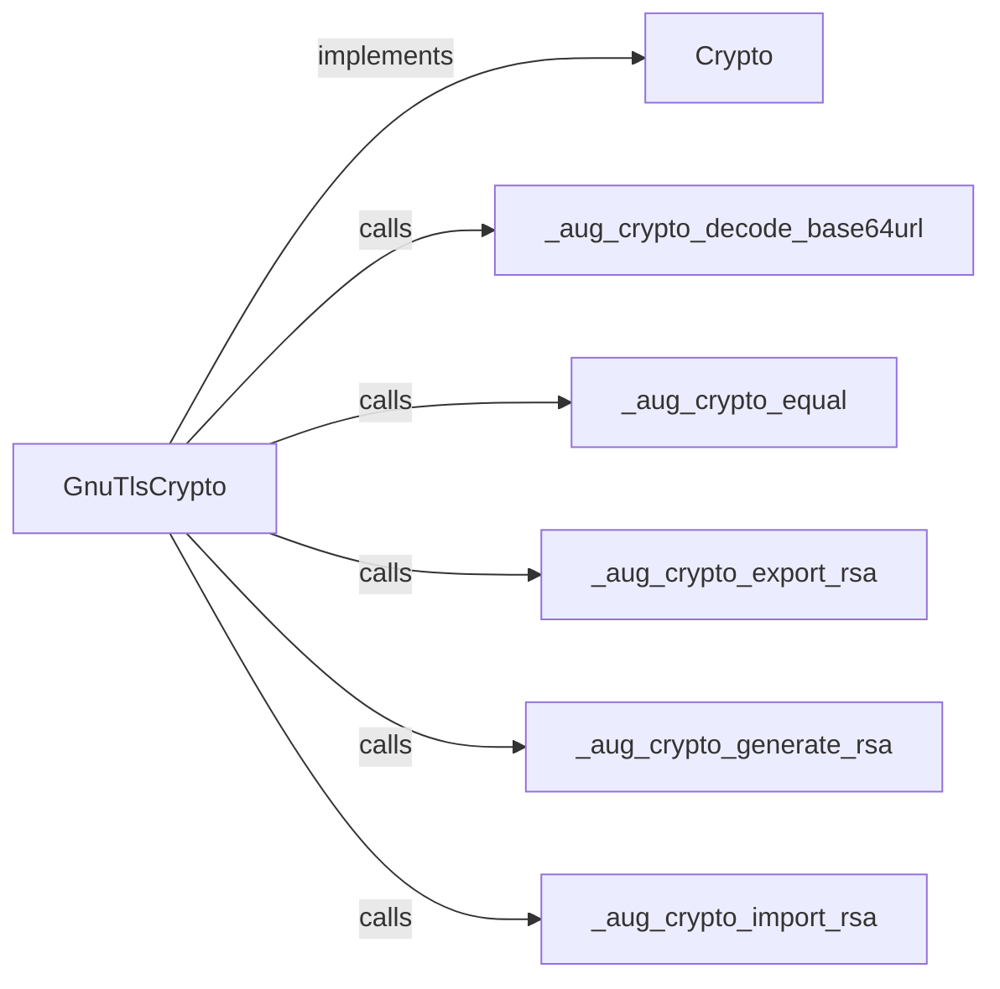
```mermaid
flowchart LR
    n0["Crypto"]
    n1["GnuTlsCrypto"]
    n2["_aug_crypto_decode_base64url"]
    n3["_aug_crypto_equal"]
    n4["_aug_crypto_export_rsa"]
    n5["_aug_crypto_generate_rsa"]
    n6["_aug_crypto_import_rsa"]
    n1 -->|"implements"| n0
    n1 -->|"calls"| n2
    n1 -->|"calls"| n3
    n1 -->|"calls"| n4
    n1 -->|"calls"| n5
    n1 -->|"calls"| n6
```

#### View 2 of 2

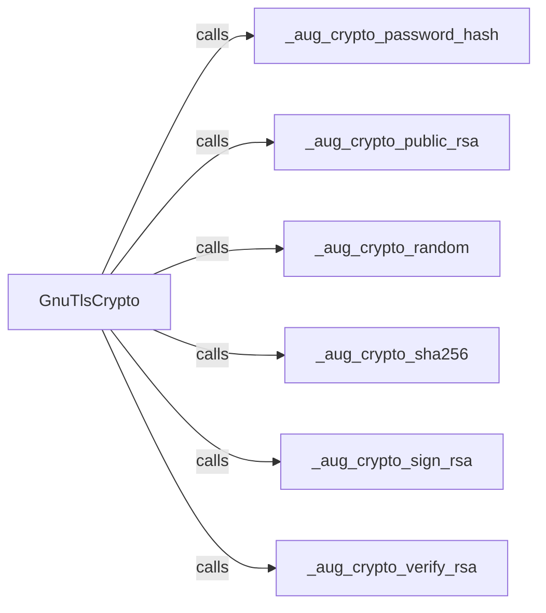
```mermaid
flowchart LR
    n0["GnuTlsCrypto"]
    n1["_aug_crypto_password_hash"]
    n2["_aug_crypto_public_rsa"]
    n3["_aug_crypto_random"]
    n4["_aug_crypto_sha256"]
    n5["_aug_crypto_sign_rsa"]
    n6["_aug_crypto_verify_rsa"]
    n0 -->|"calls"| n1
    n0 -->|"calls"| n2
    n0 -->|"calls"| n3
    n0 -->|"calls"| n4
    n0 -->|"calls"| n5
    n0 -->|"calls"| n6
```

## Sequences

Call arrows identify checked targets; loop and branch frames determine when they run. Open that target’s module to follow its implementation. Branches describe alternatives; loops describe repeated work. Native calls and interface dispatch stop at their declared contracts. Exit notes end that path; enclosing recovery and cleanup remain visible.

### Crypto.random

[Source](contracts.aug#L6)

Generate unpredictable bytes with the operating-system-backed GnuTLS RNG.

It takes `size` as an integer.

It returns `Bytes`. It can call [`Crypto.random`](contracts.aug.md#symbol-Crypto.random). Failures can raise `CryptoError`.

May leave with checked errors: CryptoError. Interface contract; implementation selected at runtime. [Explanation](contracts.aug.md).

### Crypto.sha256

[Source](contracts.aug#L8)

Hash the complete input using SHA-256.

It takes `input` as `Bytes`.

It returns `Bytes`. It can call [`Crypto.sha256`](contracts.aug.md#symbol-Crypto.sha256). Failures can raise `CryptoError`.

May leave with checked errors: CryptoError. Interface contract; implementation selected at runtime. [Explanation](contracts.aug.md).

### Crypto.generateRsa

[Source](contracts.aug#L10)

Create a fresh 3072-bit RSA private key. Private material is opaque and scrubbed on reclamation.

It returns `RsaPrivateKey`. It can call [`Crypto.generateRsa`](contracts.aug.md#symbol-Crypto.generateRsa). Failures can raise `CryptoError`.

May leave with checked errors: CryptoError. Interface contract; implementation selected at runtime. [Explanation](contracts.aug.md).

### Crypto.publicRsa

[Source](contracts.aug#L12)

Export the corresponding public key as an opaque immutable value.

It takes `key` as `RsaPrivateKey`.

It returns `RsaPublicKey`. It can call [`Crypto.publicRsa`](contracts.aug.md#symbol-Crypto.publicRsa). Failures can raise `CryptoError`.

May leave with checked errors: CryptoError. Interface contract; implementation selected at runtime. [Explanation](contracts.aug.md).

### Crypto.signRsa

[Source](contracts.aug#L14)

Sign bytes using RSASSA-PKCS1-v1_5 with SHA-256 (JOSE RS256).

It takes `key` as `RsaPrivateKey` and `input` as `Bytes`.

It returns `Bytes`. It can call [`Crypto.signRsa`](contracts.aug.md#symbol-Crypto.signRsa). Failures can raise `CryptoError`.

May leave with checked errors: CryptoError. Interface contract; implementation selected at runtime. [Explanation](contracts.aug.md).

### Crypto.verifyRsa

[Source](contracts.aug#L16)

Verify only RS256. Invalid signatures return false; invalid keys raise CryptoError.

It takes `publicKey` as `RsaPublicKey` and `input` and `signature` as `Bytes`.

It returns `bool`. It can call [`Crypto.verifyRsa`](contracts.aug.md#symbol-Crypto.verifyRsa). Failures can raise `CryptoError`.

May leave with checked errors: CryptoError. Interface contract; implementation selected at runtime. [Explanation](contracts.aug.md).

### Crypto.decodeBase64url

[Source](contracts.aug#L18)

Decode canonical unpadded URL-safe base64, rejecting invalid characters and unused bits.

It takes `input` as a string.

It returns `Bytes`. It can call [`Crypto.decodeBase64url`](contracts.aug.md#symbol-Crypto.decodeBase64url). Failures can raise `CryptoError`.

May leave with checked errors: CryptoError. Interface contract; implementation selected at runtime. [Explanation](contracts.aug.md).

### Crypto.equal

[Source](contracts.aug#L20)

Compare bytes without early exit on their contents. Length remains observable.

It takes `left` and `right` as `Bytes`.

It returns `bool`. It can call [`Crypto.equal`](contracts.aug.md#symbol-Crypto.equal).

Interface contract; implementation selected at runtime. [Explanation](contracts.aug.md).

### Crypto.exportRsa

[Source](contracts.aug#L22)

Export unsigned big-endian modulus and exponent for an RSA JWK.

It takes `publicKey` as `RsaPublicKey`.

It returns `Tuple<Bytes,Bytes>`. It can call [`Crypto.exportRsa`](contracts.aug.md#symbol-Crypto.exportRsa). Failures can raise `CryptoError`.

May leave with checked errors: CryptoError. Interface contract; implementation selected at runtime. [Explanation](contracts.aug.md).

### Crypto.importRsa

[Source](contracts.aug#L24)

Import canonical public RSA parameters. Keys must have 2048 to 8192 bits.

It takes `modulus` and `exponent` as `Bytes`.

It returns `RsaPublicKey`. It can call [`Crypto.importRsa`](contracts.aug.md#symbol-Crypto.importRsa). Failures can raise `CryptoError`.

May leave with checked errors: CryptoError. Interface contract; implementation selected at runtime. [Explanation](contracts.aug.md).

### Crypto.passwordHash

[Source](contracts.aug#L26)

PBKDF2-HMAC-SHA256, producing 32 bytes. Use a unique 16–64 byte salt; supported work factors are 100,000–2,000,000.

It takes `password` and `salt` as `Bytes` and `iterations` as an integer.

It returns `Bytes`. It can call [`Crypto.passwordHash`](contracts.aug.md#symbol-Crypto.passwordHash). Failures can raise `CryptoError`.

May leave with checked errors: CryptoError. Interface contract; implementation selected at runtime. [Explanation](contracts.aug.md).

### \_aug\_crypto\_random

[Source](contracts.aug#L28)

It is private to its defining scope.

It takes `size` as an integer.

It returns `Bytes`. It can call [`Crypto.random`](contracts.aug.md#symbol-Crypto.random). Failures can raise `CryptoError`.

Native C implementation; only its declared contract is visible here.

May leave with checked errors: CryptoError. Native implementation; only the declared contract is known. [Explanation](contracts.aug.md).

### \_aug\_crypto\_sha256

[Source](contracts.aug#L29)

It is private to its defining scope.

It takes `input` as `Bytes`.

It returns `Bytes`. It can call [`Crypto.sha256`](contracts.aug.md#symbol-Crypto.sha256). Failures can raise `CryptoError`.

Native C implementation; only its declared contract is visible here.

May leave with checked errors: CryptoError. Native implementation; only the declared contract is known. [Explanation](contracts.aug.md).

### \_aug\_crypto\_generate\_rsa

[Source](contracts.aug#L30)

It is private to its defining scope.

It returns `RsaPrivateKey`. It can call [`Crypto.generateRsa`](contracts.aug.md#symbol-Crypto.generateRsa). Failures can raise `CryptoError`.

Native C implementation; only its declared contract is visible here.

May leave with checked errors: CryptoError. Native implementation; only the declared contract is known. [Explanation](contracts.aug.md).

### \_aug\_crypto\_public\_rsa

[Source](contracts.aug#L31)

It is private to its defining scope.

It takes `key` as `RsaPrivateKey`.

It returns `RsaPublicKey`. It can call [`Crypto.publicRsa`](contracts.aug.md#symbol-Crypto.publicRsa). Failures can raise `CryptoError`.

Native C implementation; only its declared contract is visible here.

May leave with checked errors: CryptoError. Native implementation; only the declared contract is known. [Explanation](contracts.aug.md).

### \_aug\_crypto\_sign\_rsa

[Source](contracts.aug#L32)

It is private to its defining scope.

It takes `key` as `RsaPrivateKey` and `input` as `Bytes`.

It returns `Bytes`. It can call [`Crypto.signRsa`](contracts.aug.md#symbol-Crypto.signRsa). Failures can raise `CryptoError`.

Native C implementation; only its declared contract is visible here.

May leave with checked errors: CryptoError. Native implementation; only the declared contract is known. [Explanation](contracts.aug.md).

### \_aug\_crypto\_verify\_rsa

[Source](contracts.aug#L33)

It is private to its defining scope.

It takes `publicKey` as `RsaPublicKey` and `input` and `signature` as `Bytes`.

It returns `bool`. It can call [`Crypto.verifyRsa`](contracts.aug.md#symbol-Crypto.verifyRsa). Failures can raise `CryptoError`.

Native C implementation; only its declared contract is visible here.

May leave with checked errors: CryptoError. Native implementation; only the declared contract is known. [Explanation](contracts.aug.md).

### \_aug\_crypto\_decode\_base64url

[Source](contracts.aug#L34)

It is private to its defining scope.

It takes `input` as a string.

It returns `Bytes`. It can call [`Crypto.decodeBase64url`](contracts.aug.md#symbol-Crypto.decodeBase64url). Failures can raise `CryptoError`.

Native C implementation; only its declared contract is visible here.

May leave with checked errors: CryptoError. Native implementation; only the declared contract is known. [Explanation](contracts.aug.md).

### \_aug\_crypto\_equal

[Source](contracts.aug#L35)

It is private to its defining scope.

It takes `left` and `right` as `Bytes`.

It returns `bool`. It can call [`Crypto.equal`](contracts.aug.md#symbol-Crypto.equal).

Native C implementation; only its declared contract is visible here.

Native implementation; only the declared contract is known. [Explanation](contracts.aug.md).

### \_aug\_crypto\_export\_rsa

[Source](contracts.aug#L36)

It is private to its defining scope.

It takes `publicKey` as `RsaPublicKey`.

It returns `Tuple<Bytes,Bytes>`. It can call [`Crypto.exportRsa`](contracts.aug.md#symbol-Crypto.exportRsa). Failures can raise `CryptoError`.

Native C implementation; only its declared contract is visible here.

May leave with checked errors: CryptoError. Native implementation; only the declared contract is known. [Explanation](contracts.aug.md).

### \_aug\_crypto\_import\_rsa

[Source](contracts.aug#L37)

It is private to its defining scope.

It takes `modulus` and `exponent` as `Bytes`.

It returns `RsaPublicKey`. It can call [`Crypto.importRsa`](contracts.aug.md#symbol-Crypto.importRsa). Failures can raise `CryptoError`.

Native C implementation; only its declared contract is visible here.

May leave with checked errors: CryptoError. Native implementation; only the declared contract is known. [Explanation](contracts.aug.md).

### \_aug\_crypto\_password\_hash

[Source](contracts.aug#L38)

It is private to its defining scope.

It takes `password` and `salt` as `Bytes` and `iterations` as an integer.

It returns `Bytes`. It can call [`Crypto.passwordHash`](contracts.aug.md#symbol-Crypto.passwordHash). Failures can raise `CryptoError`.

Native C implementation; only its declared contract is visible here.

May leave with checked errors: CryptoError. Native implementation; only the declared contract is known. [Explanation](contracts.aug.md).

### GnuTlsCrypto constructor

[Source](contracts.aug#L41)

GnuTLS-backed capability adapter. Its constructor performs no I/O or key generation. It implements [`Crypto`](contracts.aug.md#symbol-Crypto).

[Explanation](contracts.aug.md).

### GnuTlsCrypto.random

[Source](contracts.aug#L42)

Generate unpredictable bytes with the operating-system-backed GnuTLS RNG.

It takes `size` as an integer.

It can call [`Crypto.random`](contracts.aug.md#symbol-Crypto.random). Failures can raise `CryptoError`.

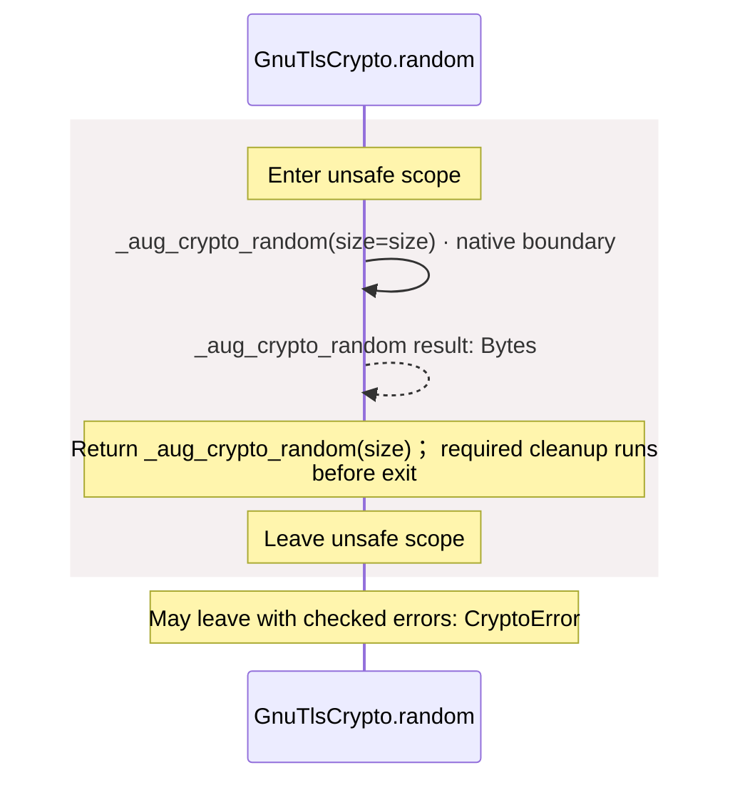
```mermaid
sequenceDiagram
    participant p0 as GnuTlsCrypto.random

    rect rgb(245, 240, 241)
    Note over p0: Enter unsafe scope
    p0->>p0: _aug_crypto_random(size=size) · native boundary
    p0-->>p0: _aug_crypto_random result: Bytes
    Note over p0: Return _aug_crypto_random(size)； required cleanup runs<br/>before exit
    Note over p0: Leave unsafe scope
    end
    Note over p0: May leave with checked errors: CryptoError
```

### GnuTlsCrypto.sha256

[Source](contracts.aug#L45)

Hash the complete input using SHA-256.

It takes `input` as `Bytes`.

It can call [`Crypto.sha256`](contracts.aug.md#symbol-Crypto.sha256). Failures can raise `CryptoError`.

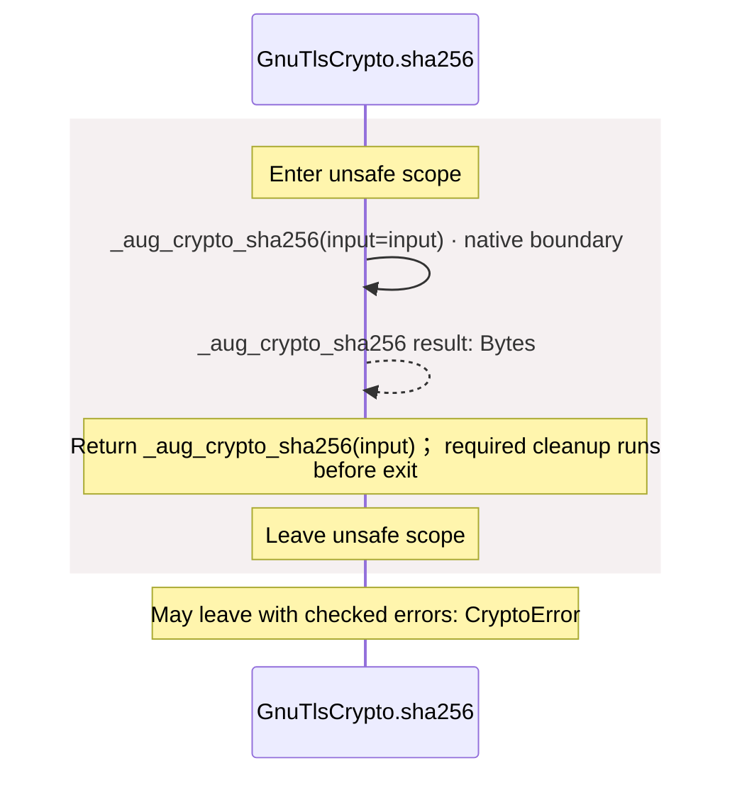
```mermaid
sequenceDiagram
    participant p0 as GnuTlsCrypto.sha256

    rect rgb(245, 240, 241)
    Note over p0: Enter unsafe scope
    p0->>p0: _aug_crypto_sha256(input=input) · native boundary
    p0-->>p0: _aug_crypto_sha256 result: Bytes
    Note over p0: Return _aug_crypto_sha256(input)； required cleanup runs<br/>before exit
    Note over p0: Leave unsafe scope
    end
    Note over p0: May leave with checked errors: CryptoError
```

### GnuTlsCrypto.generateRsa

[Source](contracts.aug#L48)

Create a fresh 3072-bit RSA private key. Private material is opaque and scrubbed on reclamation.

It can call [`Crypto.generateRsa`](contracts.aug.md#symbol-Crypto.generateRsa). Failures can raise `CryptoError`.

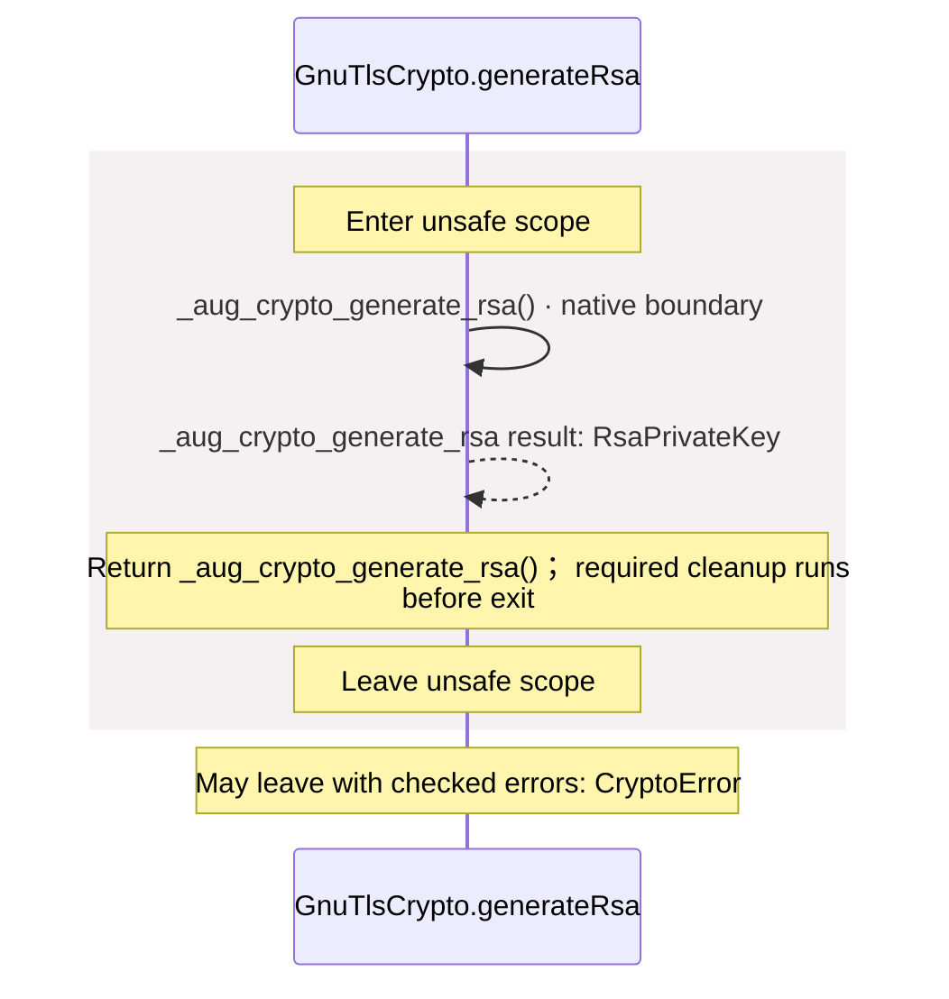
```mermaid
sequenceDiagram
    participant p0 as GnuTlsCrypto.generateRsa

    rect rgb(245, 240, 241)
    Note over p0: Enter unsafe scope
    p0->>p0: _aug_crypto_generate_rsa() · native boundary
    p0-->>p0: _aug_crypto_generate_rsa result: RsaPrivateKey
    Note over p0: Return _aug_crypto_generate_rsa()； required cleanup runs<br/>before exit
    Note over p0: Leave unsafe scope
    end
    Note over p0: May leave with checked errors: CryptoError
```

### GnuTlsCrypto.publicRsa

[Source](contracts.aug#L51)

Export the corresponding public key as an opaque immutable value.

It takes `key` as `RsaPrivateKey`.

It can call [`Crypto.publicRsa`](contracts.aug.md#symbol-Crypto.publicRsa). Failures can raise `CryptoError`.

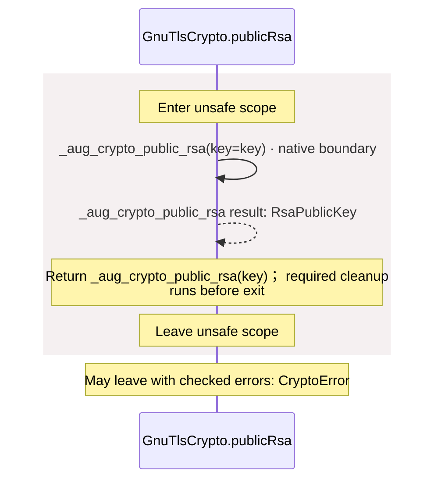
```mermaid
sequenceDiagram
    participant p0 as GnuTlsCrypto.publicRsa

    rect rgb(245, 240, 241)
    Note over p0: Enter unsafe scope
    p0->>p0: _aug_crypto_public_rsa(key=key) · native boundary
    p0-->>p0: _aug_crypto_public_rsa result: RsaPublicKey
    Note over p0: Return _aug_crypto_public_rsa(key)； required cleanup<br/>runs before exit
    Note over p0: Leave unsafe scope
    end
    Note over p0: May leave with checked errors: CryptoError
```

### GnuTlsCrypto.signRsa

[Source](contracts.aug#L54)

Sign bytes using RSASSA-PKCS1-v1_5 with SHA-256 (JOSE RS256).

It takes `key` as `RsaPrivateKey` and `input` as `Bytes`.

It can call [`Crypto.signRsa`](contracts.aug.md#symbol-Crypto.signRsa). Failures can raise `CryptoError`.

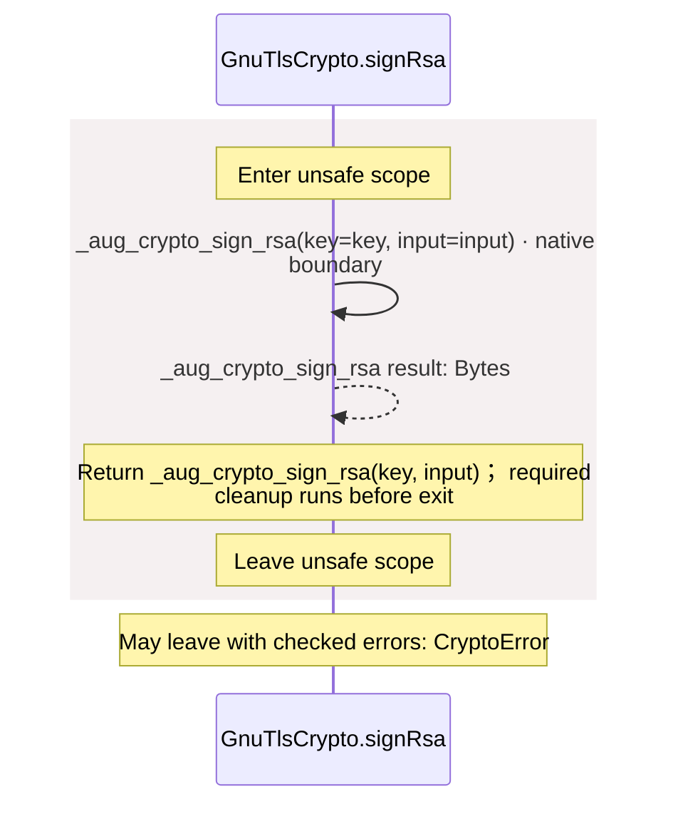
```mermaid
sequenceDiagram
    participant p0 as GnuTlsCrypto.signRsa

    rect rgb(245, 240, 241)
    Note over p0: Enter unsafe scope
    p0->>p0: _aug_crypto_sign_rsa(key=key, input=input) · native<br/>boundary
    p0-->>p0: _aug_crypto_sign_rsa result: Bytes
    Note over p0: Return _aug_crypto_sign_rsa(key, input)； required<br/>cleanup runs before exit
    Note over p0: Leave unsafe scope
    end
    Note over p0: May leave with checked errors: CryptoError
```

### GnuTlsCrypto.verifyRsa

[Source](contracts.aug#L57)

Verify only RS256. Invalid signatures return false; invalid keys raise CryptoError.

It takes `publicKey` as `RsaPublicKey` and `input` and `signature` as `Bytes`.

It can call [`Crypto.verifyRsa`](contracts.aug.md#symbol-Crypto.verifyRsa). Failures can raise `CryptoError`.

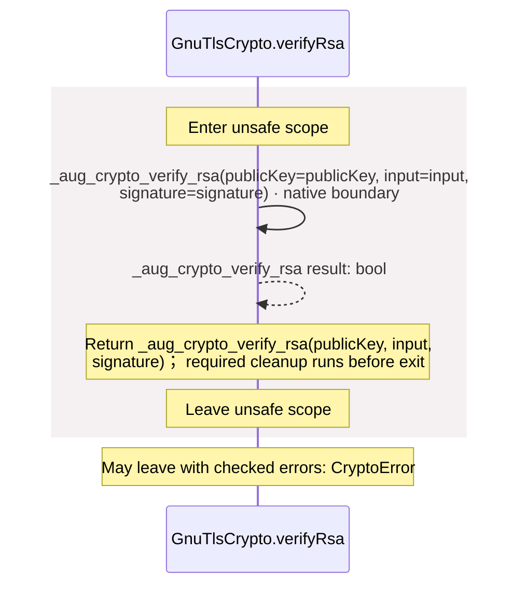
```mermaid
sequenceDiagram
    participant p0 as GnuTlsCrypto.verifyRsa

    rect rgb(245, 240, 241)
    Note over p0: Enter unsafe scope
    p0->>p0: _aug_crypto_verify_rsa(publicKey=publicKey, input=input,<br/>signature=signature) · native boundary
    p0-->>p0: _aug_crypto_verify_rsa result: bool
    Note over p0: Return _aug_crypto_verify_rsa(publicKey, input,<br/>signature)； required cleanup runs before exit
    Note over p0: Leave unsafe scope
    end
    Note over p0: May leave with checked errors: CryptoError
```

### GnuTlsCrypto.decodeBase64url

[Source](contracts.aug#L60)

Decode canonical unpadded URL-safe base64, rejecting invalid characters and unused bits.

It takes `input` as a string.

It can call [`Crypto.decodeBase64url`](contracts.aug.md#symbol-Crypto.decodeBase64url). Failures can raise `CryptoError`.

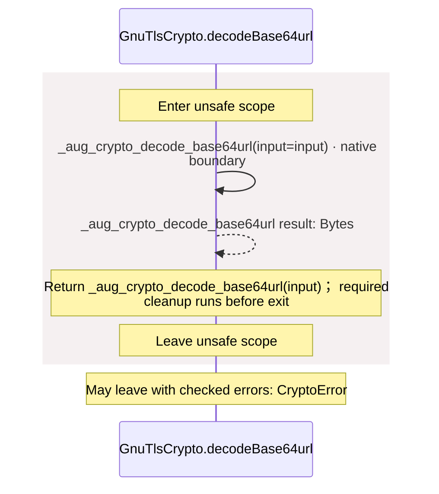
```mermaid
sequenceDiagram
    participant p0 as GnuTlsCrypto.decodeBase64url

    rect rgb(245, 240, 241)
    Note over p0: Enter unsafe scope
    p0->>p0: _aug_crypto_decode_base64url(input=input) · native<br/>boundary
    p0-->>p0: _aug_crypto_decode_base64url result: Bytes
    Note over p0: Return _aug_crypto_decode_base64url(input)； required<br/>cleanup runs before exit
    Note over p0: Leave unsafe scope
    end
    Note over p0: May leave with checked errors: CryptoError
```

### GnuTlsCrypto.equal

[Source](contracts.aug#L63)

Compare bytes without early exit on their contents. Length remains observable.

It takes `left` and `right` as `Bytes`.

It can call [`Crypto.equal`](contracts.aug.md#symbol-Crypto.equal).

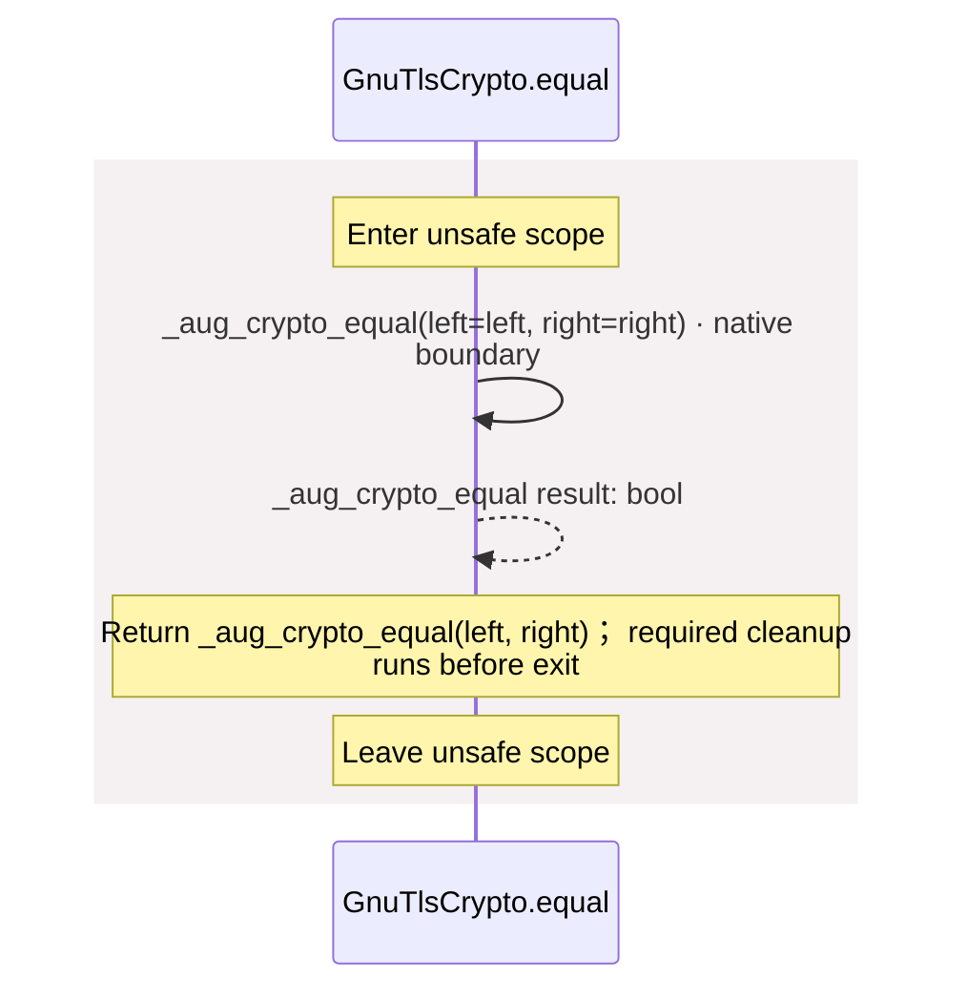
```mermaid
sequenceDiagram
    participant p0 as GnuTlsCrypto.equal

    rect rgb(245, 240, 241)
    Note over p0: Enter unsafe scope
    p0->>p0: _aug_crypto_equal(left=left, right=right) · native<br/>boundary
    p0-->>p0: _aug_crypto_equal result: bool
    Note over p0: Return _aug_crypto_equal(left, right)； required cleanup<br/>runs before exit
    Note over p0: Leave unsafe scope
    end
```

### GnuTlsCrypto.exportRsa

[Source](contracts.aug#L66)

Export unsigned big-endian modulus and exponent for an RSA JWK.

It takes `publicKey` as `RsaPublicKey`.

It can call [`Crypto.exportRsa`](contracts.aug.md#symbol-Crypto.exportRsa). Failures can raise `CryptoError`.

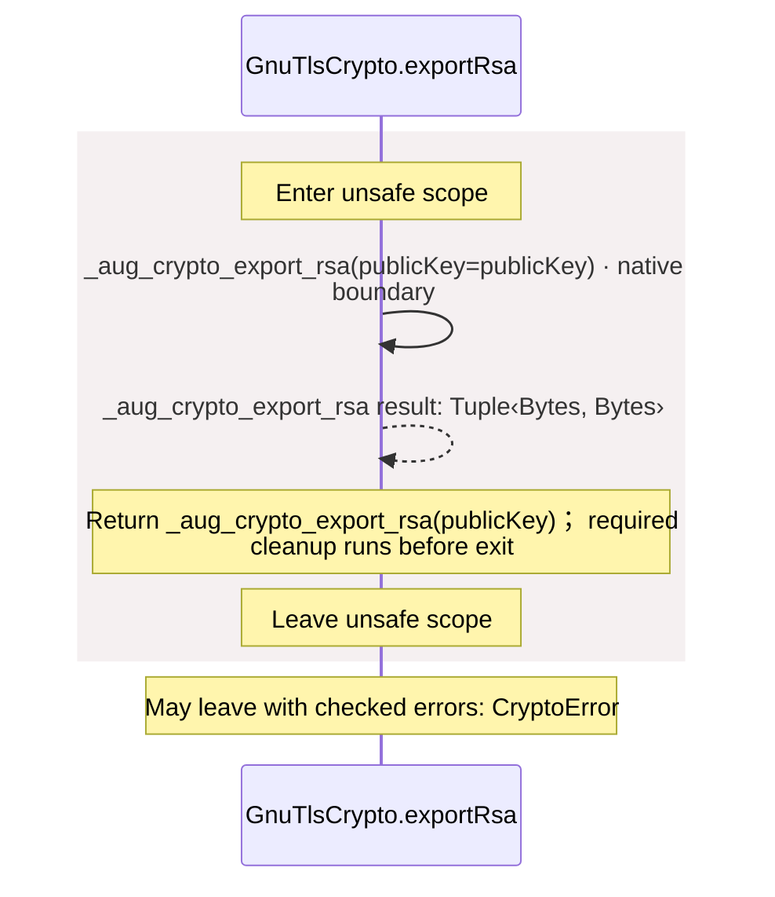
```mermaid
sequenceDiagram
    participant p0 as GnuTlsCrypto.exportRsa

    rect rgb(245, 240, 241)
    Note over p0: Enter unsafe scope
    p0->>p0: _aug_crypto_export_rsa(publicKey=publicKey) · native<br/>boundary
    p0-->>p0: _aug_crypto_export_rsa result: Tuple‹Bytes, Bytes›
    Note over p0: Return _aug_crypto_export_rsa(publicKey)； required<br/>cleanup runs before exit
    Note over p0: Leave unsafe scope
    end
    Note over p0: May leave with checked errors: CryptoError
```

### GnuTlsCrypto.importRsa

[Source](contracts.aug#L69)

Import canonical public RSA parameters. Keys must have 2048 to 8192 bits.

It takes `modulus` and `exponent` as `Bytes`.

It can call [`Crypto.importRsa`](contracts.aug.md#symbol-Crypto.importRsa). Failures can raise `CryptoError`.

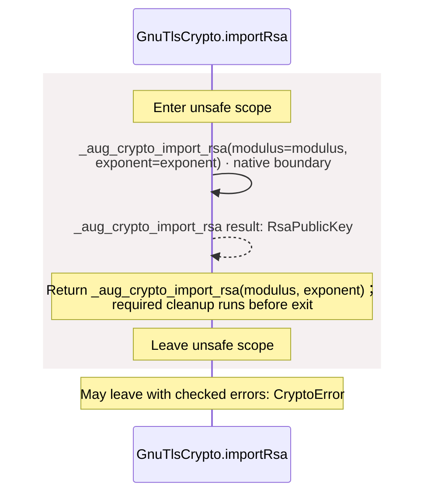
```mermaid
sequenceDiagram
    participant p0 as GnuTlsCrypto.importRsa

    rect rgb(245, 240, 241)
    Note over p0: Enter unsafe scope
    p0->>p0: _aug_crypto_import_rsa(modulus=modulus,<br/>exponent=exponent) · native boundary
    p0-->>p0: _aug_crypto_import_rsa result: RsaPublicKey
    Note over p0: Return _aug_crypto_import_rsa(modulus, exponent)；<br/>required cleanup runs before exit
    Note over p0: Leave unsafe scope
    end
    Note over p0: May leave with checked errors: CryptoError
```

### GnuTlsCrypto.passwordHash

[Source](contracts.aug#L72)

PBKDF2-HMAC-SHA256, producing 32 bytes. Use a unique 16–64 byte salt; supported work factors are 100,000–2,000,000.

It takes `password` and `salt` as `Bytes` and `iterations` as an integer.

It can call [`Crypto.passwordHash`](contracts.aug.md#symbol-Crypto.passwordHash). Failures can raise `CryptoError`.

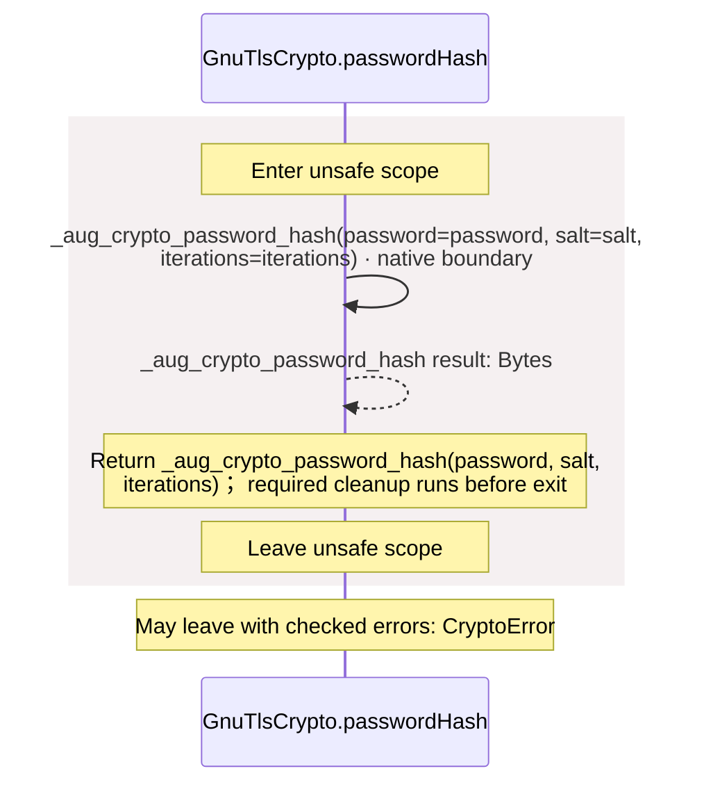
```mermaid
sequenceDiagram
    participant p0 as GnuTlsCrypto.passwordHash

    rect rgb(245, 240, 241)
    Note over p0: Enter unsafe scope
    p0->>p0: _aug_crypto_password_hash(password=password, salt=salt,<br/>iterations=iterations) · native boundary
    p0-->>p0: _aug_crypto_password_hash result: Bytes
    Note over p0: Return _aug_crypto_password_hash(password, salt,<br/>iterations)； required cleanup runs before exit
    Note over p0: Leave unsafe scope
    end
    Note over p0: May leave with checked errors: CryptoError
```

## Called contracts

- [Crypto](contracts.aug.diagrams.md) — package/@git/url\_9ef654c66d34ab8f5527@0.0.0-git.b14a0f9aa41f1ce58bd51133bcdc424033e40d40/contracts.aug
- [\_aug\_crypto\_decode\_base64url](contracts.aug.diagrams.md#sequence-_aug_crypto_decode_base64url) — package/@git/url\_9ef654c66d34ab8f5527@0.0.0-git.b14a0f9aa41f1ce58bd51133bcdc424033e40d40/contracts.aug
- [\_aug\_crypto\_equal](contracts.aug.diagrams.md#sequence-_aug_crypto_equal) — package/@git/url\_9ef654c66d34ab8f5527@0.0.0-git.b14a0f9aa41f1ce58bd51133bcdc424033e40d40/contracts.aug
- [\_aug\_crypto\_export\_rsa](contracts.aug.diagrams.md#sequence-_aug_crypto_export_rsa) — package/@git/url\_9ef654c66d34ab8f5527@0.0.0-git.b14a0f9aa41f1ce58bd51133bcdc424033e40d40/contracts.aug
- [\_aug\_crypto\_generate\_rsa](contracts.aug.diagrams.md#sequence-_aug_crypto_generate_rsa) — package/@git/url\_9ef654c66d34ab8f5527@0.0.0-git.b14a0f9aa41f1ce58bd51133bcdc424033e40d40/contracts.aug
- [\_aug\_crypto\_import\_rsa](contracts.aug.diagrams.md#sequence-_aug_crypto_import_rsa) — package/@git/url\_9ef654c66d34ab8f5527@0.0.0-git.b14a0f9aa41f1ce58bd51133bcdc424033e40d40/contracts.aug
- [\_aug\_crypto\_password\_hash](contracts.aug.diagrams.md#sequence-_aug_crypto_password_hash) — package/@git/url\_9ef654c66d34ab8f5527@0.0.0-git.b14a0f9aa41f1ce58bd51133bcdc424033e40d40/contracts.aug
- [\_aug\_crypto\_public\_rsa](contracts.aug.diagrams.md#sequence-_aug_crypto_public_rsa) — package/@git/url\_9ef654c66d34ab8f5527@0.0.0-git.b14a0f9aa41f1ce58bd51133bcdc424033e40d40/contracts.aug
- [\_aug\_crypto\_random](contracts.aug.diagrams.md#sequence-_aug_crypto_random) — package/@git/url\_9ef654c66d34ab8f5527@0.0.0-git.b14a0f9aa41f1ce58bd51133bcdc424033e40d40/contracts.aug
- [\_aug\_crypto\_sha256](contracts.aug.diagrams.md#sequence-_aug_crypto_sha256) — package/@git/url\_9ef654c66d34ab8f5527@0.0.0-git.b14a0f9aa41f1ce58bd51133bcdc424033e40d40/contracts.aug
- [\_aug\_crypto\_sign\_rsa](contracts.aug.diagrams.md#sequence-_aug_crypto_sign_rsa) — package/@git/url\_9ef654c66d34ab8f5527@0.0.0-git.b14a0f9aa41f1ce58bd51133bcdc424033e40d40/contracts.aug
- [\_aug\_crypto\_verify\_rsa](contracts.aug.diagrams.md#sequence-_aug_crypto_verify_rsa) — package/@git/url\_9ef654c66d34ab8f5527@0.0.0-git.b14a0f9aa41f1ce58bd51133bcdc424033e40d40/contracts.aug
