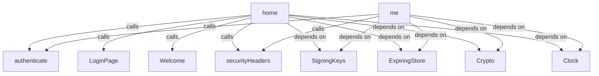
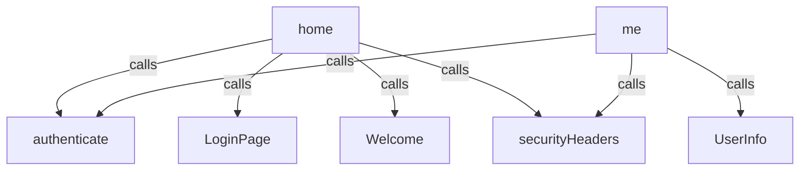
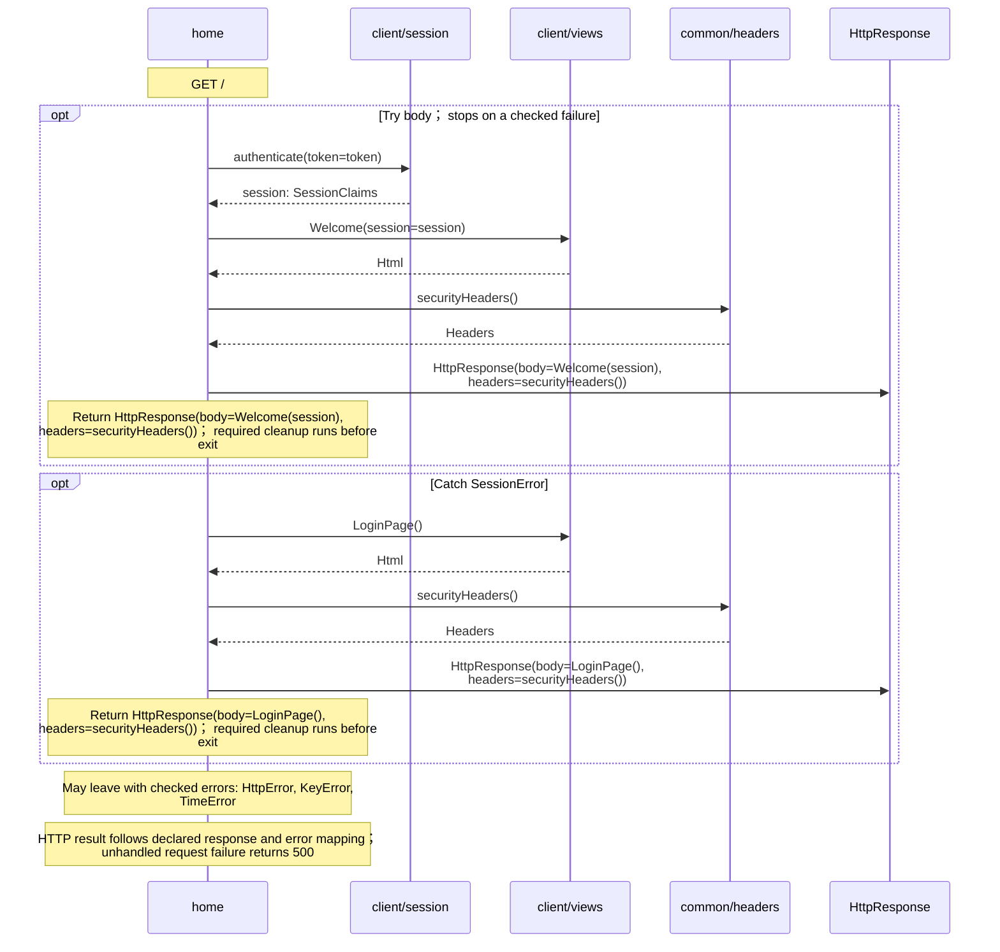
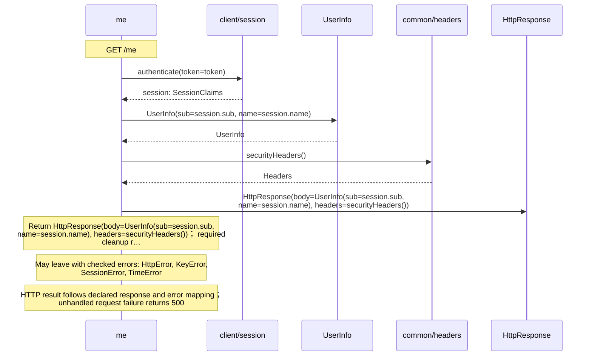

<!-- Generated by aug spec. Edit the August source, then regenerate. -->

# client/endpoints.aug diagrams

[Project overview](../.aug-spec/diagrams/index.md) · [Compiled explanation](endpoints.aug.md)

## Class interactions

Call relationships

## Sequences

Call arrows identify checked targets; loop and branch frames determine when they run. Open that target’s module to follow its implementation. Branches describe alternatives; loops describe repeated work. Native calls and interface dispatch stop at their declared contracts. Exit notes end that path; enclosing recovery and cleanup remain visible.

### home

[Source](endpoints.aug#L12)

### me

[Source](endpoints.aug#L20)

## Called contracts

- [authenticate](session.aug.diagrams.md#sequence-authenticate) — client/session.aug
- [LoginPage](views.aug.diagrams.md#sequence-LoginPage) — client/views.aug
- [Welcome](views.aug.diagrams.md#sequence-Welcome) — client/views.aug
- [securityHeaders](../common/headers.aug.diagrams.md#sequence-securityHeaders) — common/headers.aug
- [SigningKeys](../common/keys.aug.diagrams.md) — common/keys.aug
- [ExpiringStore](../.aug-spec/packages/%40git/url_0eb7c89453c87681ed15/0.0.0-git.a39fc582565d4fca40be4f75fa304d71adc69301/store.aug.diagrams.md) — package/@git/url\_0eb7c89453c87681ed15@0.0.0-git.a39fc582565d4fca40be4f75fa304d71adc69301/store.aug
- [Crypto](../.aug-spec/packages/%40git/url_9ef654c66d34ab8f5527/0.0.0-git.b14a0f9aa41f1ce58bd51133bcdc424033e40d40/contracts.aug.diagrams.md) — package/@git/url\_9ef654c66d34ab8f5527@0.0.0-git.b14a0f9aa41f1ce58bd51133bcdc424033e40d40/contracts.aug
- [Clock](../.aug-spec/packages/%40git/url_c092cd151499c4e1d8a1/0.0.0-git.a39fc582565d4fca40be4f75fa304d71adc69301/contracts.aug.diagrams.md) — package/@git/url\_c092cd151499c4e1d8a1@0.0.0-git.a39fc582565d4fca40be4f75fa304d71adc69301/contracts.aug
- [UserInfo](../provider/contracts.aug.diagrams.md#sequence-UserInfo-20-constructor) — provider/contracts.aug
